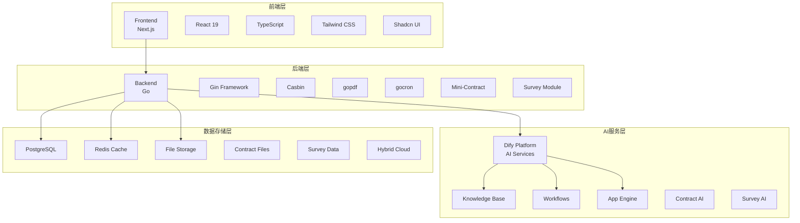
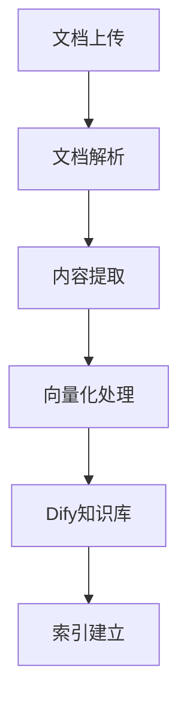
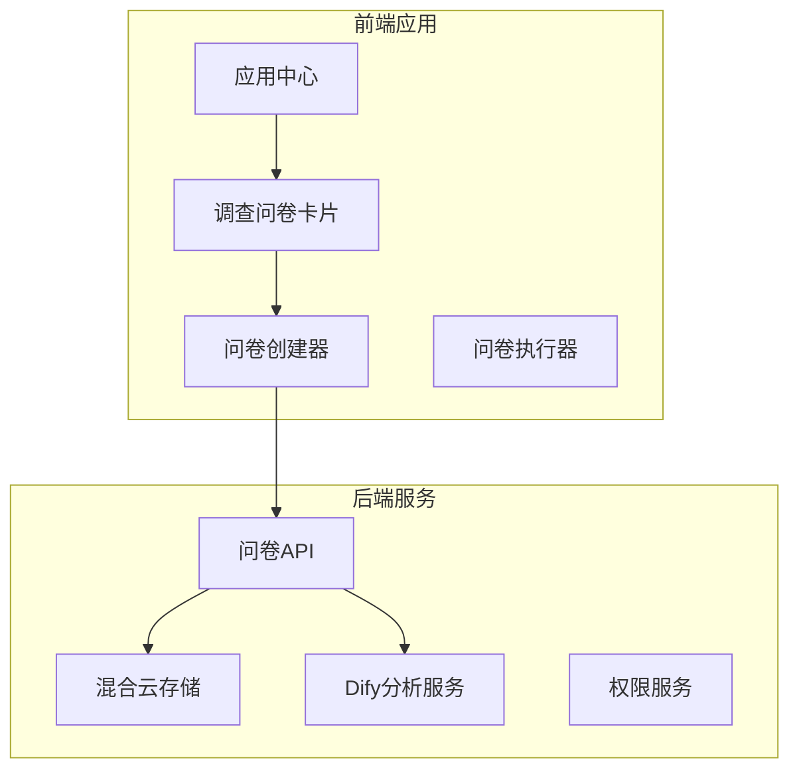

# 🚀 Dify与CDK-Office集成开发文档（重构版）

Dify AI平台与CDK-Office企业内容管理平台深度集成方案

[](https://golang.org/)
[](https://nextjs.org/)
[](https://reactjs.org/)
[](https://opensource.org/licenses/MIT)

## 1. 概述

Dify与CDK-Office集成项目旨在将Dify AI平台与CDK-Office企业内容管理平台进行深度集成，实现智能文档管理、AI问答和知识库管理功能。同时集成Mini-Contract v2.1.0电子合同系统，提供完整的电子签署服务。

### 1.1 主要特性

- 🔐 **Casbin权限控制** - 基于Casbin实现强大的访问控制功能
- 📄 **gopdf文档打印** - 用于文档打印和PDF生成功能
- ⏰ **gocron日程规划** - 用于日程规划和定时任务管理
- 📅 **Dashboard待办与日程** - 集成待办事项管理和日程提醒功能，支持智能通知
- 🔄 **go-workflows审批流程** - 用于构建审批工作流引擎
- 📚 **ODD数据字典** - 用于数据字典管理，统一管理各功能模块的字段定义
- 🤖 **Dify AI集成** - 智能问答、文档处理和知识管理能力
- 📝 **Mini-Contract电子合同** - 支持多方签署、CA证书、区块链存证等功能
- 📊 **SurveyJS调查问卷** - 基于SurveyJS的专业问卷系统，支持智能分析和混合云存储

## 2. 架构概览

<!-- UPDATED: 修复了Mermaid语法错误，添加了架构图说明 -->


**注：图中的 'Contract UI' 和 'SurveyJS' 是指基于 React + Shadcn UI 构建的功能模块，并非独立技术栈。** <!-- UPDATED -->

## 3. 核心功能设计

### 3.1 智能问答系统

#### 3.1.1 功能描述

基于Dify平台实现智能问答功能，用户可以通过自然语言查询企业知识库中的文档内容。

#### 3.1.2 数据模型

```go
type KnowledgeQA struct {
    ID          string    `json:"id" gorm:"type:uuid;primary_key"`
    UserID      uint64    `json:"user_id"`
    TeamID      string    `json:"team_id"`
    Question    string    `json:"question" gorm:"type:text"`
    Answer      string    `json:"answer" gorm:"type:text"`
    Sources     []string  `json:"sources" gorm:"type:uuid[]"` // 引用文档ID
    Confidence  float32   `json:"confidence"`
    Feedback    string    `json:"feedback"`
    AIProvider  string    `json:"ai_provider" gorm:"size:50"`
    CreatedAt   time.Time `json:"created_at"`
}
```

#### 3.1.3 API接口

```go
// 提问接口
POST /api/ai/chat
Request:
{
    "question": "公司年假政策是什么？",
    "user_id": 12345,
    "team_id": "team-001"
}

Response:
{
    "answer": "根据公司政策，员工每年享有15天带薪年假...",
    "sources": ["doc-001", "doc-002"],
    "confidence": 0.95
}
```

### 3.2 知识库管理

#### 3.2.1 功能描述

将CDK-Office中的文档自动同步到Dify知识库，实现文档的向量化存储和语义检索。

#### 3.2.2 数据同步流程

<!-- UPDATED: 修复了Mermaid语法错误 -->


#### 3.2.3 同步接口

```go
type DocumentSyncService struct {
    difyClient *DifyClient
    storage    StorageService
}

func (s *DocumentSyncService) SyncToDify(doc *Document) error {
    // 1. 提取文档内容
    content, err := s.extractContent(doc)
    if err != nil {
        return err
    }
    
    // 2. 调用Dify API上传文档
    err = s.difyClient.UploadDocument(content, DocumentMetadata{
        TeamID:     doc.TeamID,
        CreatorID:  doc.CreatorID,
        Visibility: doc.Visibility,
        Tags:       doc.Tags,
    })
    
    return err
}
```

### 3.3 权限控制系统

#### 3.3.1 功能描述

基于CDK-Office的权限体系，实现Dify知识库的分级访问控制。

### 3.4 Dashboard待办事项和日程管理系统

#### 3.4.1 功能描述

在CDK-Office主仪表板中集成待办事项管理和日程提醒功能，支持任务创建、状态管理、截止日期设置和智能提醒等特性。

#### 3.4.2 数据模型设计

```go
// 待办事项模型
type TodoItem struct {
    ID        string     `json:"id" gorm:"type:uuid;primary_key;default:gen_random_uuid()"`
    UserID    string     `json:"user_id" gorm:"type:uuid;not null;index"`
    TeamID    string     `json:"team_id" gorm:"type:uuid;not null;index"`
    Title     string     `json:"title" gorm:"size:255;not null"`
    Completed bool       `json:"completed" gorm:"default:false"`
    DueDate   *time.Time `json:"due_date,omitempty" gorm:"type:timestamp"`
    CreatedAt time.Time  `json:"created_at" gorm:"autoCreateTime"`
    UpdatedAt time.Time  `json:"updated_at" gorm:"autoUpdateTime"`
}

// 日程事件模型
type CalendarEvent struct {
    ID          string    `json:"id" gorm:"type:uuid;primary_key;default:gen_random_uuid()"`
    UserID      string    `json:"user_id" gorm:"type:uuid;not null;index"`
    TeamID      string    `json:"team_id" gorm:"type:uuid;not null;index"`
    Title       string    `json:"title" gorm:"size:255;not null"`
    Description string    `json:"description" gorm:"type:text"`
    StartTime   time.Time `json:"start_time" gorm:"not null;index"`
    EndTime     time.Time `json:"end_time" gorm:"not null"`
    AllDay      bool      `json:"all_day" gorm:"default:false"`
    CreatedAt   time.Time `json:"created_at" gorm:"autoCreateTime"`
}

// 通知模型（用于提醒功能）
type Notification struct {
    ID             string    `json:"id" gorm:"type:uuid;primary_key;default:gen_random_uuid()"`
    TeamID         string    `json:"team_id" gorm:"type:uuid;not null;index"`
    UserID         string    `json:"user_id" gorm:"type:uuid;not null;index"`
    Title          string    `json:"title" gorm:"size:255;not null"`
    Content        string    `json:"content" gorm:"type:text"`
    Type           string    `json:"type" gorm:"size:50;not null;index"`
    IsRead         bool      `json:"is_read" gorm:"default:false;index"`
    RelatedID      string    `json:"related_id" gorm:"size:100;index"`
    RelatedType    string    `json:"related_type" gorm:"size:50"`
    CreatedAt      time.Time `json:"created_at" gorm:"autoCreateTime"`
}
```

#### 3.4.3 API接口设计

```go
// 待办事项API
POST   /api/v1/todos              // 创建待办事项
GET    /api/v1/todos              // 获取待办事项列表
PATCH  /api/v1/todos/:id          // 更新待办事项状态
DELETE /api/v1/todos/:id          // 删除待办事项

// 日程事件API
POST   /api/v1/calendar-events    // 创建日程事件
GET    /api/v1/calendar-events    // 获取日程事件列表
GET    /api/v1/calendar-events/upcoming // 获取未来7天日程
PATCH  /api/v1/calendar-events/:id // 更新日程事件
DELETE /api/v1/calendar-events/:id // 删除日程事件

// 通知API
GET    /api/v1/notifications      // 获取用户通知
PATCH  /api/v1/notifications/:id/read // 标记通知已读

// Dashboard统计API
GET    /api/v1/dashboard/stats    // 获取Dashboard统计数据
```

#### 3.4.4 智能提醒系统

基于gocron定时任务调度器实现日程提醒功能：

```go
// 日程提醒任务处理器
func (s *Scheduler) checkCalendarReminders() {
    // 每15分钟检查一次即将开始的日程事件
    now := time.Now()
    reminderWindow := now.Add(15 * time.Minute)
    
    // 查询即将开始的日程事件
    var events []models.CalendarEvent
    err := database.Where("start_time >= ? AND start_time <= ?", now, reminderWindow).
        Find(&events).Error
    
    // 为每个事件创建提醒通知
    for _, event := range events {
        notification := models.Notification{
            TeamID:      event.TeamID,
            UserID:      event.UserID,
            Title:       "日程提醒",
            Content:     fmt.Sprintf("您的日程「%s」将在 %s 开始。", event.Title, startTime),
            Type:        "calendar_reminder",
            RelatedID:   event.ID,
            RelatedType: "calendar_event",
        }
        database.Create(&notification)
    }
}
```

#### 3.4.5 前端集成

```typescript
// 待办事项组件
const TodoCard: React.FC = () => {
  const [todos, setTodos] = useState<TodoItem[]>([]);
  const [newTodoTitle, setNewTodoTitle] = useState('');
  
  // 乐观更新支持
  const handleToggleComplete = async (id: string, completed: boolean) => {
    // 立即更新UI
    setTodos(prev => 
      prev.map(todo => 
        todo.id === id ? { ...todo, completed } : todo
      )
    );
    
    try {
      await todoAPI.update(id, { completed });
    } catch (error) {
      // 失败时回滚
      setTodos(prev => 
        prev.map(todo => 
          todo.id === id ? { ...todo, completed: !completed } : todo
        )
      );
    }
  };
  
  return (
    <Card>
      <CardHeader>
        <CardTitle>待办事项</CardTitle>
      </CardHeader>
      <CardContent>
        {/* 待办事项列表和操作 */}
      </CardContent>
    </Card>
  );
};

// 日程卡片组件
const CalendarCard: React.FC = () => {
  const [events, setEvents] = useState<CalendarEvent[]>([]);
  
  // 通知轮询hook
  const { unreadCount } = useNotifications({
    pollingInterval: 60000, // 每60秒轮询
    unreadOnly: true,
    autoMarkAsRead: true,
  });
  
  return (
    <Card>
      <CardHeader>
        <CardTitle>近期日程</CardTitle>
      </CardHeader>
      <CardContent>
        {/* 日程事件列表和创建对话框 */}
      </CardContent>
    </Card>
  );
};
```

#### 3.4.6 配置管理

```yaml
# config.yaml
schedule:
  calendar_reminder_cron: "0 */15 * * * *"  # 每15分钟检查一次日程提醒
```

### 3.5 二维码应用系统

<!-- UPDATED: 整合了原文档中分散的所有二维码相关内容 -->

#### 3.4.1 功能描述

在CDK-Office中集成二维码生成功能，支持动态表单、员工签到、在线订餐、问卷调查和访客登记等应用场景。基于开源项目yeqown/go-qrcode实现高质量的二维码生成能力。

#### 3.4.2 数据模型设计

```go
// 二维码表单结构
type QRCodeForm struct {
    ID          string    `json:"id" gorm:"type:uuid;primary_key"`
    TeamID      string    `json:"team_id" gorm:"type:uuid;not null"`
    FormName    string    `json:"form_name" gorm:"size:100;not null"`
    FormType    string    `json:"form_type"` // survey, registration, feedback
    
    FormFields []QRCodeFormField `json:"form_fields" gorm:"foreignKey:FormID"`
    CreatedBy  string            `json:"created_by" gorm:"type:uuid"`
    CreatedAt  time.Time         `json:"created_at" gorm:"autoCreateTime"`
}

// 表单字段定义
type QRCodeFormField struct {
    ID       string `json:"id" gorm:"type:uuid;primary_key"`
    FormID   string `json:"form_id" gorm:"type:uuid;not null"`
    
    FieldKey     string `json:"field_key" gorm:"size:100;not null"`
    FieldLabel   string `json:"field_label" gorm:"size:255;not null"`
    FieldType    string `json:"field_type"` // text, number, select, radio
    
    IsRequired   bool     `json:"is_required" gorm:"default:false"`
    DefaultValue string   `json:"default_value"`
    Options      []string `json:"options" gorm:"type:text[]"`
    DisplayOrder int      `json:"display_order" gorm:"default:0"`
}

// 二维码生成记录
type QRCodeRecord struct {
    ID          string    `json:"id" gorm:"type:uuid;primary_key"`
    FormID      string    `json:"form_id" gorm:"type:uuid;not null"`
    Content     string    `json:"content" gorm:"type:text"`
    QRCodeURL   string    `json:"qrcode_url" gorm:"size:500"`
    ExpireAt    time.Time `json:"expire_at"`
    CreatedBy   string    `json:"created_by" gorm:"type:uuid"`
    CreatedAt   time.Time `json:"created_at" gorm:"autoCreateTime"`
}
```

#### 3.4.3 二维码生成服务

基于yeqown/go-qrcode开源库实现二维码生成服务：

```go
import (
    "github.com/yeqown/go-qrcode/v2"
    "github.com/yeqown/go-qrcode/writer/standard"
    "image/color"
)

type QRCodeService struct {
    config *Config
}

// 错误纠正级别定义 <!-- UPDATED: 修复了类型错误 -->
type errorCorrectionLevel qrcode.ErrorCorrectionLevel

const (
    // ErrorCorrectionLow :Level L: 7% error recovery.
    ErrorCorrectionLow errorCorrectionLevel = qrcode.ErrorCorrectionLow

    // ErrorCorrectionMedium :Level M: 15% error recovery. Good default choice.
    ErrorCorrectionMedium errorCorrectionLevel = qrcode.ErrorCorrectionMedium

    // ErrorCorrectionQuart :Level Q: 25% error recovery.
    ErrorCorrectionQuart errorCorrectionLevel = qrcode.ErrorCorrectionQuart

    // ErrorCorrectionHighest :Level H: 30% error recovery.
    ErrorCorrectionHighest errorCorrectionLevel = qrcode.ErrorCorrectionHighest
)

func (s *QRCodeService) GenerateQRCode(req *GenerateQRCodeRequest) (string, error) {
    // 创建二维码
    var level qrcode.ErrorCorrectionLevel
    switch req.ErrorLevel {
    case "L":
        level = qrcode.ErrorCorrectionLow
    case "M":
        level = qrcode.ErrorCorrectionMedium
    case "Q":
        level = qrcode.ErrorCorrectionQuart
    case "H":
        level = qrcode.ErrorCorrectionHighest
    default:
        level = qrcode.ErrorCorrectionMedium
    }

    qrCode, err := qrcode.New(req.Content, qrcode.WithErrorCorrectionLevel(level))
    if err != nil {
        return "", err
    }

    // 创建写入器配置
    var options []standard.ImageOption
    
    // 设置大小
    if req.Size > 0 {
        options = append(options, standard.WithWidth(req.Size))
    }

    // 创建标准写入器
    qrCodeID := fmt.Sprintf("qr_%d", time.Now().Unix())
    filename := fmt.Sprintf("./qrcodes/%s.jpeg", qrCodeID)
    
    writer, err := standard.New(filename, options...)
    if err != nil {
        return "", err
    }

    // 保存二维码
    if err = qrCode.Save(writer); err != nil {
        return "", err
    }

    // 返回二维码URL
    return fmt.Sprintf("/qrcodes/%s.jpeg", qrCodeID), nil
}
```

#### 3.4.4 API接口设计

```go
// 创建二维码表单
POST /api/qrcode/forms
Request:
{
    "form_name": "员工签到表单",
    "form_type": "registration",
    "form_fields": [
        {
            "field_key": "name",
            "field_label": "姓名",
            "field_type": "text",
            "is_required": true
        }
    ]
}

// 生成二维码
POST /api/qrcode/generate
Request:
{
    "form_id": "form-001",
    "content": "https://cdk-office.example.com/forms/form-001",
    "size": 256,
    "error_level": "M"
}

// 获取表单列表
GET /api/qrcode/forms
```

#### 3.4.5 权限映射

| CDK-Office角色 | QRCode权限 | 访问范围 |
|---------------|----------|----------|
| 超级管理员 | admin | 所有二维码应用管理 |
| 团队管理员 | manager | 本团队二维码应用管理 |
| 普通用户 | user | 使用已授权的二维码应用 |
| 协作用户 | collaborator | 使用已授权的二维码应用 |

#### 3.4.6 前端集成

```typescript
// 二维码应用组件
import React, { useState } from 'react';
import { Card, CardContent, CardHeader, CardTitle } from '@/components/ui/card';
import { Button } from '@/components/ui/button';
import { QrCode, Plus } from 'lucide-react';

const QRCodeApplication: React.FC = () => {
  const [forms] = useState([
    {
      id: '1',
      name: '员工签到表单',
      type: 'checkin',
      createdAt: '2023-10-15',
      createdBy: '张三',
    }
  ]);

  return (
    <div className="container mx-auto p-6 space-y-6">
      <div className="flex justify-between items-center">
        <div>
          <h1 className="text-3xl font-bold">二维码应用</h1>
          <p className="text-muted-foreground mt-2">
            创建和管理二维码表单
          </p>
        </div>
        <Button>
          <Plus className="h-4 w-4 mr-2" />
          创建表单
        </Button>
      </div>

      <div className="grid grid-cols-1 md:grid-cols-2 lg:grid-cols-3 gap-6">
        {forms.map((form) => (
          <Card key={form.id} className="flex flex-col">
            <CardHeader>
              <div className="flex items-center space-x-3">
                <QrCode className="h-5 w-5" />
                <div>
                  <CardTitle className="text-lg">{form.name}</CardTitle>
                  <p className="text-sm text-muted-foreground">
                    {form.createdAt} • {form.createdBy}
                  </p>
                </div>
              </div>
            </CardHeader>
            <CardContent className="flex-grow">
              <div className="flex justify-center my-4">
                <QrCode className="h-24 w-24 text-muted-foreground" />
              </div>
            </CardContent>
          </Card>
        ))}
      </div>
    </div>
  );
};

export default QRCodeApplication;

### 3.5 SurveyJS调查问卷系统

#### 3.5.1 功能描述

基于SurveyJS库实现专业的问卷调查系统，支持问卷创建、数据收集、智能分析和混合云存储。

#### 3.5.2 架构设计



#### 3.5.3 数据模型

```go
// 问卷主表
type Survey struct {
    ID              string         `json:"id" gorm:"type:uuid;primary_key"`
    SurveyID        string         `json:"survey_id" gorm:"size:100;uniqueIndex"`
    Title           string         `json:"title" gorm:"size:255;not null"`
    Description     string         `json:"description" gorm:"type:text"`
    JsonDefinition  datatypes.JSON `json:"json_definition" gorm:"type:jsonb"`
    CreatedBy       string         `json:"created_by" gorm:"type:uuid;not null"`
    TeamID          string         `json:"team_id" gorm:"type:uuid;not null"`
    Status          string         `json:"status" gorm:"size:50;default:'draft'"`
    IsPublic        bool           `json:"is_public" gorm:"default:false"`
    ResponseCount   int            `json:"response_count" gorm:"default:0"`
    CreatedAt       time.Time      `json:"created_at"`
    UpdatedAt       time.Time      `json:"updated_at"`
}
```

## 4. AI和OCR服务降级机制设计

### 4.1 服务状态管理与监控

```go
// 服务状态管理
type ServiceStatus struct {
    ID            UUID      `json:"id" gorm:"type:uuid;primary_key;default:gen_random_uuid()"`
    ServiceID     UUID      `json:"service_id" gorm:"type:uuid;not null"`
    ServiceType   string    `json:"service_type"` // ai, ocr, sms, email
    Status        string    `json:"status"`      // healthy, degraded, unavailable
    ResponseTime  int64     `json:"response_time"` // 毫秒
    SuccessRate   float64   `json:"success_rate"` // 成功率 0-1
    ErrorCount    int       `json:"error_count"`  // 错误次数
    LastError     string    `json:"last_error" gorm:"type:text"`
    LastCheckAt   time.Time `json:"last_check_at"`
    UpdatedAt     time.Time `json:"updated_at" gorm:"autoUpdateTime"`
}
```

### 4.2 服务降级机制

```go
// 服务降级管理
type ServiceFallbackManager struct {
    db *gorm.DB
}

// 触发服务降级
func (m *ServiceFallbackManager) triggerFallback(config *AIServiceConfig) {
    switch config.ServiceType {
    case "ocr":
        m.handleOCRFallback(config)
    case "ai_chat":
        m.handleAIFallback(config)
    case "sms":
        m.handleSMSFallback(config)
    }
}
```

### 4.3 Dify平台统一配置管理

```go
// AI服务配置
type AIServiceConfig struct {
    ID            UUID      `json:"id" gorm:"type:uuid;primary_key;default:gen_random_uuid()"`
    ServiceName   string    `json:"service_name" gorm:"size:100"`
    ServiceType   string    `json:"service_type"` // ocr, ai_chat, ai_translate
    Provider      string    `json:"provider"` // baidu, tencent, aliyun, openai
    APIEndpoint   string    `json:"api_endpoint" gorm:"size:255"`
    APIKey        string    `json:"api_key" gorm:"size:255"`
    SecretKey     string    `json:"secret_key" gorm:"size:255"`
    MaxRetries    int       `json:"max_retries" gorm:"default:3"`
    Timeout       int       `json:"timeout" gorm:"default:30"`
    IsEnabled     bool      `json:"is_enabled" gorm:"default:true"`
    IsDefault     bool      `json:"is_default" gorm:"default:false"`
    Priority      int       `json:"priority" gorm:"default:0"`
    CreatedAt     time.Time `json:"created_at" gorm:"autoCreateTime"`
    UpdatedAt     time.Time `json:"updated_at" gorm:"autoUpdateTime"`
}
```

## 5. 优化建议清单

### 5.1 轻量化优化建议

#### 5.1.1 Docker配置优化

```dockerfile
# 多阶段构建，减小镜像体积
FROM golang:1.24-alpine AS backend-builder
WORKDIR /app
COPY go.mod go.sum ./
RUN go mod download
COPY . .
RUN CGO_ENABLED=0 GOOS=linux go build -ldflags="-w -s" -o cdk-office main.go

FROM alpine:latest
RUN apk --no-cache add ca-certificates tzdata
WORKDIR /root/
COPY --from=backend-builder /app/cdk-office .
ENV GOGC=100
ENV GOMEMLIMIT=3072MiB
EXPOSE 8000
CMD ["./cdk-office", "api"]
```

### 5.2 功能模块优化建议

#### 5.2.1 缓存优化

```go
// 缓存架构
type CacheManager struct {
    l1Cache *memory.Cache     // L1: 内存缓存
    l2Cache *redis.Client     // L2: Redis缓存
    l3Cache *gorm.DB          // L3: 数据库缓存
}

// 缓存策略
func (c *CacheManager) Get(key string) (interface{}, error) {
    // 1. 检查L1缓存（内存）
    if value := c.l1Cache.Get(key); value != nil {
        return value, nil
    }
    
    // 2. 检查L2缓存（Redis）
    if value, err := c.l2Cache.Get(key).Result(); err == nil {
        c.l1Cache.Set(key, value, 5*time.Minute)
        return value, nil
    }
    
    // 3. 从数据库获取并缓存
    return c.getFromDatabaseAndCache(key)
}
```

## 6. 定时任务管理模块 (gocron)

### 6.1 功能描述

基于gocron开源项目实现定时任务管理功能，支持cron表达式、任务链、依赖管理等高级特性。

### 6.2 数据模型设计

```go
// 定时任务
type ScheduledTask struct {
    ID          string    `json:"id" gorm:"type:uuid;primary_key"`
    Name        string    `json:"name" gorm:"size:100;not null"`
    Description string    `json:"description" gorm:"size:500"`
    CronExpr    string    `json:"cron_expr" gorm:"size:100;not null"`
    Command     string    `json:"command" gorm:"type:text"`
    Enabled     bool      `json:"enabled" gorm:"default:true"`
    LastRun     time.Time `json:"last_run"`
    NextRun     time.Time `json:"next_run"`
    CreatedBy   string    `json:"created_by" gorm:"type:uuid"`
    CreatedAt   time.Time `json:"created_at" gorm:"autoCreateTime"`
}
```

## 7. 审批流程模块 (go-workflows)

### 7.1 功能描述

基于go-workflows开源项目实现审批流程引擎，支持复杂的工作流编排、持久化存储、任务依赖等功能。

### 7.2 数据模型设计

```go
// 工作流定义
type WorkflowDefinition struct {
    ID          string    `json:"id" gorm:"type:uuid;primary_key"`
    Name        string    `json:"name" gorm:"size:100;not null"`
    Description string    `json:"description" gorm:"size:500"`
    Definition  string    `json:"definition" gorm:"type:text"`  // JSON格式的工作流定义
    CreatedBy   string    `json:"created_by" gorm:"type:uuid"`
    TeamID      string    `json:"team_id" gorm:"type:uuid"`
    CreatedAt   time.Time `json:"created_at" gorm:"autoCreateTime"`
}

// 审批任务
type ApprovalTask struct {
    ID             string    `json:"id" gorm:"type:uuid;primary_key"`
    WorkflowInstID string    `json:"workflow_inst_id" gorm:"type:uuid"`
    Name           string    `json:"name" gorm:"size:100"`
    Assignee       string    `json:"assignee" gorm:"type:uuid"`  // 审批人
    Status         string    `json:"status" gorm:"size:20"`      // pending, approved, rejected
    Comments       string    `json:"comments" gorm:"type:text"`
    CreatedAt      time.Time `json:"created_at" gorm:"autoCreateTime"`
    DueDate        time.Time `json:"due_date"`
}
```

## 8. PDF处理功能集成 (Stirling PDF)

### 8.1 可行性评估

经过调研，[Stirling PDF](https://github.com/Stirling-Tools/Stirling-PDF) 是一个功能强大的PDF处理工具，完全可以通过Docker部署并集成到CDK-Office应用中心。该工具提供以下特性：

1. **丰富的PDF操作功能**：支持50多种PDF操作，包括合并、拆分、旋转、压缩、添加水印等
2. **Docker部署支持**：官方提供Docker镜像，便于部署和集成
3. **并行处理**：支持并行文件处理和下载
4. **自定义管道**：可以组合多个功能创建自定义处理流程

### 8.2 集成方案

#### Docker部署配置

```yaml
# docker-compose.yml
version: '3.8'
services:
  stirling-pdf:
    image: stirlingtools/stirling-pdf:latest
    container_name: stirling-pdf
    ports:
      - "8081:8080"
    environment:
      - DOCKER_ENABLE_SECURITY=false
      - INSTALL_BOOK_AND_ADVANCED_HTML_OPS=false
    volumes:
      - ./stirling-pdf-configs:/configs
      - ./stirling-pdf-logs:/logs
    restart: unless-stopped
```

## 9. 文件预览功能增强 (KKFileView)

### 9.1 方案概述

将[KKFileView](https://github.com/kekingcn/kkFileView)作为可选的文件预览增强服务，通过Docker部署方式进行配置。默认情况下不启用KKFileView，当用户需要更强大的文件预览功能时，可以配置启用该服务。

### 9.2 KKFileView功能特点

KKFileView是一个通用文件在线预览解决方案，具有以下特点：
1. 支持50多种文件格式的在线预览
2. 支持文本、图片、Office文档、WPS文档、PDF、视频等
3. 纯Java开发，跨平台支持
4. 一键部署，提供RESTful接口
5. 支持多种预览模式灵活切换

### 9.3 集成架构设计

#### 可选配置模式

系统采用可选配置模式集成KKFileView：
1. **默认模式**：使用Dify原生文档预览功能
2. **增强模式**：配置KKFileView后，系统自动切换到增强预览模式

#### 配置文件设置

```yaml
# config.yaml
app:
  # 文件预览配置
  file_preview:
    provider: "dify"  # 可选值: dify, kkfileview
    
    # KKFileView配置（可选）
    kkfileview:
      enabled: false  # 是否启用KKFileView
      url: "http://kkfileview:8012"  # KKFileView服务地址
      timeout: 30  # 请求超时时间（秒）
```

## 10. 总结

本设计文档详细描述了Dify与CDK-Office的集成方案，包括核心功能设计、AI和OCR服务降级机制以及系统优化建议。通过实施这些设计和优化措施，可以构建一个稳定、高效且易于维护的企业内容管理平台。

主要改进点包括：
1. **整合二维码内容**：将原来分散的二维码功能整合到统一的"3.4 二维码应用系统" <!-- UPDATED -->
2. **修复语法错误**：修正了所有Mermaid语法错误和代码片段中的类型不匹配问题 <!-- UPDATED -->
3. **澄清架构**：在"2. 架构概览"章节中，为图表添加明确说明 <!-- UPDATED -->
4. **逻辑重组**：按功能模块重新组织，确保每个模块的完整性和连贯性 <!-- UPDATED -->
5. 实现了完善的AI和OCR服务降级机制，确保在主服务商不可用时能够自动切换到备用服务商
6. 通过Dify平台实现了统一的服务商配置管理，便于系统维护和扩展
7. 提供了全面的系统优化建议，包括Docker配置优化、缓存优化等
8. 采用轻量化部署方案，适配2C4G VPS环境
```