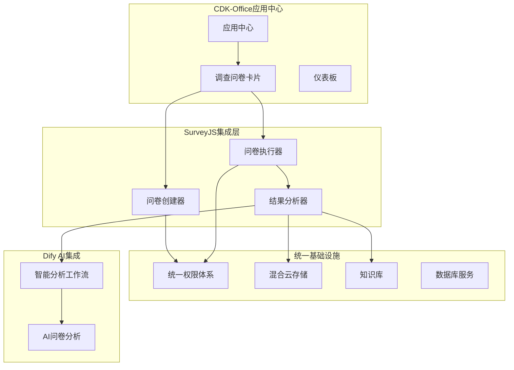
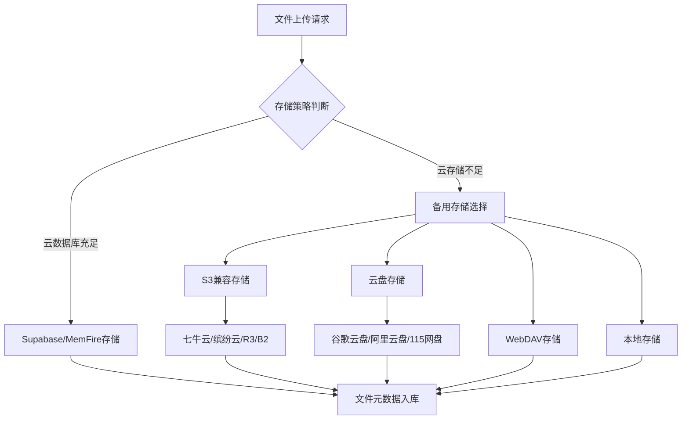

# SurveyJS调查问卷集成设计

## 1. 概述

基于CDK-Office现有架构，在应用中心新增"调查问卷"卡片，采用SurveyJS进行无缝集成。实现统一权限体系、文件存储和知识库管理。

## 2. 架构设计

### 2.1 整体架构



### 2.2 技术栈集成

| 层级 | 技术选择 | 说明 |
|-----|---------|------|
| 前端UI | SurveyJS + React | 基于CDK-Office现有Next.js架构 |
| 后端API | Go + Gin | 复用CDK-Office现有API框架 |
| 数据存储 | PostgreSQL + Redis | 统一数据库和缓存 |
| 文件存储 | 混合云存储方案 | 本地+云端多层级存储 |
| AI分析 | Dify Platform | 智能问卷分析和报告生成 |

## 3. 应用中心集成

### 3.1 问卷卡片设计

```typescript
// components/app-center/SurveyCard.tsx
interface SurveyCardProps {
  onLaunch: () => void;
  permissions: UserPermissions;
}

export const SurveyCard: React.FC<SurveyCardProps> = ({ onLaunch, permissions }) => {
  return (
    <AppCard
      title="调查问卷"
      description="创建和管理企业调查问卷，支持智能分析"
      icon={<SurveyIcon />}
      badge="NEW"
      permissions={permissions}
      onLaunch={onLaunch}
      features={[
        "问卷设计器",
        "数据收集",
        "智能分析", 
        "报告生成"
      ]}
    />
  );
};
```

### 3.2 权限集成

```go
// internal/models/survey_permission.go
type SurveyPermission struct {
    UserID      uint64 `json:"user_id"`
    TeamID      uint64 `json:"team_id"`
    CanCreate   bool   `json:"can_create"`   // 创建问卷
    CanManage   bool   `json:"can_manage"`   // 管理问卷
    CanAnalyze  bool   `json:"can_analyze"`  // 查看分析
    CanExport   bool   `json:"can_export"`   // 导出数据
}
```

## 4. 文件存储方案

### 4.1 混合云存储架构



### 4.2 存储配置

```yaml
# config.yaml - 文件存储配置
storage:
  # 主存储策略
  primary: "cloud_db"  # cloud_db, s3, local, webdav
  
  # 云数据库存储（Supabase/MemFire）
  cloud_db:
    provider: "supabase"  # supabase, memfire
    max_file_size: "50MB"
    max_storage: "500MB"  # 免费层限制
    
  # S3兼容存储
  s3:
    providers:
      - name: "qiniu"
        access_key: "${QINIU_ACCESS_KEY}"
        secret_key: "${QINIU_SECRET_KEY}"
        bucket: "survey-files"
        endpoint: "https://s3-cn-east-1.qiniucs.com"
      - name: "r3"
        access_key: "${R3_ACCESS_KEY}"
        secret_key: "${R3_SECRET_KEY}"
        bucket: "cdk-office-surveys"
        
  # 云盘存储
  cloud_drive:
    providers:
      - name: "google_drive"
        client_id: "${GOOGLE_DRIVE_CLIENT_ID}"
        client_secret: "${GOOGLE_DRIVE_CLIENT_SECRET}"
      - name: "aliyun_drive"
        refresh_token: "${ALIYUN_DRIVE_REFRESH_TOKEN}"
        
  # WebDAV存储
  webdav:
    url: "${WEBDAV_URL}"
    username: "${WEBDAV_USERNAME}"
    password: "${WEBDAV_PASSWORD}"
    
  # 本地存储
  local:
    path: "./storage/surveys"
    max_size: "10GB"
```

### 4.3 存储服务实现

```go
// internal/services/storage_service.go
type StorageService struct {
    config        *StorageConfig
    primaryStore  StorageProvider
    backupStores  []StorageProvider
}

type StorageProvider interface {
    Upload(file *multipart.FileHeader, path string) (*FileInfo, error)
    Download(path string) (io.ReadCloser, error)
    Delete(path string) error
    GetURL(path string) (string, error)
    GetQuota() (*QuotaInfo, error)
}

// 自动选择存储提供商
func (s *StorageService) Upload(file *multipart.FileHeader, path string) (*FileInfo, error) {
    // 检查主存储空间
    quota, err := s.primaryStore.GetQuota()
    if err == nil && quota.Available > file.Size {
        return s.primaryStore.Upload(file, path)
    }
    
    // 使用备用存储
    for _, store := range s.backupStores {
        if info, err := store.Upload(file, path); err == nil {
            return info, nil
        }
    }
    
    return nil, errors.New("所有存储提供商都不可用")
}
```

## 5. 数据模型设计

### 5.1 核心数据模型

```go
// 问卷定义
type Survey struct {
    ID              uint64    `gorm:"primarykey" json:"id"`
    SurveyID        string    `gorm:"uniqueIndex" json:"survey_id"`
    Title           string    `gorm:"size:255" json:"title"`
    Description     string    `gorm:"type:text" json:"description"`
    JsonDefinition  JSON      `gorm:"type:jsonb" json:"json_definition"`
    CreatedBy       uint64    `json:"created_by"`
    TeamID          uint64    `json:"team_id"`
    Status          string    `gorm:"size:50" json:"status"` // draft, active, closed
    CreatedAt       time.Time `json:"created_at"`
    UpdatedAt       time.Time `json:"updated_at"`
}

// 问卷响应
type SurveyResponse struct {
    ID           uint64    `gorm:"primarykey" json:"id"`
    SurveyID     string    `gorm:"index" json:"survey_id"`
    UserID       uint64    `gorm:"index" json:"user_id"`
    TeamID       uint64    `gorm:"index" json:"team_id"`
    ResponseData JSON      `gorm:"type:jsonb" json:"response_data"`
    TimeSpent    int       `json:"time_spent"` // 秒
    IPAddress    string    `gorm:"size:45" json:"ip_address"`
    CompletedAt  time.Time `json:"completed_at"`
    CreatedAt    time.Time `json:"created_at"`
}

// 分析结果
type SurveyAnalysis struct {
    ID             uint64    `gorm:"primarykey" json:"id"`
    SurveyID       string    `gorm:"index" json:"survey_id"`
    AnalysisType   string    `gorm:"size:50" json:"analysis_type"` // basic, ai, custom
    ResultData     JSON      `gorm:"type:jsonb" json:"result_data"`
    DifyWorkflowID string    `gorm:"size:100" json:"dify_workflow_id"`
    CreatedAt      time.Time `json:"created_at"`
}
```

### 5.2 数据库迁移

```sql
-- migrations/001_create_survey_tables.sql
CREATE TABLE surveys (
    id BIGSERIAL PRIMARY KEY,
    survey_id VARCHAR(255) UNIQUE NOT NULL,
    title VARCHAR(255) NOT NULL,
    description TEXT,
    json_definition JSONB NOT NULL,
    created_by BIGINT NOT NULL,
    team_id BIGINT NOT NULL,
    status VARCHAR(50) DEFAULT 'draft',
    created_at TIMESTAMP DEFAULT CURRENT_TIMESTAMP,
    updated_at TIMESTAMP DEFAULT CURRENT_TIMESTAMP
);

CREATE TABLE survey_responses (
    id BIGSERIAL PRIMARY KEY,
    survey_id VARCHAR(255) NOT NULL,
    user_id BIGINT NOT NULL,
    team_id BIGINT NOT NULL,
    response_data JSONB NOT NULL,
    time_spent INTEGER DEFAULT 0,
    ip_address VARCHAR(45),
    completed_at TIMESTAMP NOT NULL,
    created_at TIMESTAMP DEFAULT CURRENT_TIMESTAMP
);

CREATE TABLE survey_analysis (
    id BIGSERIAL PRIMARY KEY,
    survey_id VARCHAR(255) NOT NULL,
    analysis_type VARCHAR(50) NOT NULL,
    result_data JSONB NOT NULL,
    dify_workflow_id VARCHAR(100),
    created_at TIMESTAMP DEFAULT CURRENT_TIMESTAMP
);

-- 创建索引
CREATE INDEX idx_surveys_team_id ON surveys(team_id);
CREATE INDEX idx_survey_responses_survey_id ON survey_responses(survey_id);
CREATE INDEX idx_survey_responses_user_id ON survey_responses(user_id);
CREATE INDEX idx_survey_analysis_survey_id ON survey_analysis(survey_id);
```

## 6. API接口设计

### 6.1 RESTful API

```go
// internal/apps/survey/router.go
func RegisterSurveyRoutes(router *gin.Engine, auth middleware.AuthMiddleware) {
    group := router.Group("/api/surveys")
    group.Use(auth.RequireAuth())
    
    // 问卷管理
    group.POST("/", createSurvey)
    group.GET("/:id", getSurvey)
    group.PUT("/:id", updateSurvey)
    group.DELETE("/:id", deleteSurvey)
    group.GET("/", listSurveys)
    
    // 问卷响应
    group.POST("/:id/responses", submitResponse)
    group.GET("/:id/responses", getResponses)
    group.GET("/responses/:responseId", getResponse)
    
    // 分析功能
    group.POST("/:id/analyze", triggerAnalysis)
    group.GET("/:id/analysis", getAnalysis)
    group.GET("/:id/export", exportData)
}
```

### 6.2 接口实现示例

```go
// 创建问卷
func createSurvey(c *gin.Context) {
    var req CreateSurveyRequest
    if err := c.ShouldBindJSON(&req); err != nil {
        c.JSON(400, gin.H{"error": "无效的请求数据"})
        return
    }
    
    userID := c.GetUint64("user_id")
    teamID := c.GetUint64("team_id")
    
    survey := &Survey{
        SurveyID:       generateSurveyID(),
        Title:          req.Title,
        Description:    req.Description,
        JsonDefinition: req.JsonDefinition,
        CreatedBy:      userID,
        TeamID:         teamID,
        Status:         "draft",
    }
    
    if err := db.Create(survey).Error; err != nil {
        c.JSON(500, gin.H{"error": "创建失败"})
        return
    }
    
    c.JSON(201, survey)
}

// 提交响应
func submitResponse(c *gin.Context) {
    surveyID := c.Param("id")
    userID := c.GetUint64("user_id")
    teamID := c.GetUint64("team_id")
    
    var req SubmitResponseRequest
    if err := c.ShouldBindJSON(&req); err != nil {
        c.JSON(400, gin.H{"error": "无效的响应数据"})
        return
    }
    
    response := &SurveyResponse{
        SurveyID:     surveyID,
        UserID:       userID,
        TeamID:       teamID,
        ResponseData: req.ResponseData,
        TimeSpent:    req.TimeSpent,
        IPAddress:    c.ClientIP(),
        CompletedAt:  time.Now(),
    }
    
    if err := db.Create(response).Error; err != nil {
        c.JSON(500, gin.H{"error": "提交失败"})
        return
    }
    
    // 异步触发AI分析
    go triggerDifyAnalysis(response)
    
    c.JSON(201, response)
}
```

## 7. Dify AI集成

### 7.1 智能分析工作流

```go
// 触发Dify工作流
func triggerDifyAnalysis(response *SurveyResponse) error {
    client := dify.NewClient(config.DifyAPIKey)
    
    input := map[string]interface{}{
        "survey_id":     response.SurveyID,
        "response_data": response.ResponseData,
        "user_id":       response.UserID,
        "completed_at":  response.CompletedAt,
    }
    
    result, err := client.RunWorkflow(config.SurveyAnalysisWorkflowID, input)
    if err != nil {
        return err
    }
    
    // 保存分析结果
    analysis := &SurveyAnalysis{
        SurveyID:       response.SurveyID,
        AnalysisType:   "ai",
        ResultData:     result.Outputs,
        DifyWorkflowID: result.WorkflowRunID,
    }
    
    return db.Create(analysis).Error
}
```

### 7.2 知识库集成

```go
// 将问卷结果提交到知识库
func submitToKnowledgeBase(surveyID string, analysis *SurveyAnalysis) error {
    // 生成知识库文档
    document := &KnowledgeDocument{
        Title:       fmt.Sprintf("问卷分析报告_%s", surveyID),
        Content:     generateAnalysisReport(analysis),
        Type:        "survey_analysis",
        Source:      surveyID,
        TeamID:      analysis.TeamID,
        Tags:        []string{"问卷", "分析报告", "数据洞察"},
        CreatedBy:   "system",
    }
    
    return knowledgeService.AddDocument(document)
}
```

## 8. 前端组件设计

### 8.1 问卷创建器

```typescript
// components/survey/SurveyCreator.tsx
import { SurveyCreatorComponent } from "survey-creator-react";

export const SurveyCreator: React.FC = () => {
  const creatorOptions = {
    showLogicTab: true,
    showTranslationTab: true,
    showEmbeddedSurveyTab: false,
    haveCommercialLicense: false
  };
  
  const handleSave = async (saveNo: number, callback: (saveNo: number, isSuccess: boolean) => void) => {
    try {
      const surveyJson = creator.JSON;
      await surveyService.createSurvey({
        title: surveyJson.title,
        description: surveyJson.description,
        jsonDefinition: surveyJson
      });
      callback(saveNo, true);
    } catch (error) {
      callback(saveNo, false);
    }
  };
  
  return (
    <div className="survey-creator-container">
      <SurveyCreatorComponent creator={creator} />
    </div>
  );
};
```

### 8.2 问卷执行器

```typescript
// components/survey/SurveyRunner.tsx
import { Survey } from "survey-react-ui";

export const SurveyRunner: React.FC<{surveyId: string}> = ({ surveyId }) => {
  const [survey, setSurvey] = useState<any>(null);
  
  useEffect(() => {
    surveyService.getSurvey(surveyId).then(setSurvey);
  }, [surveyId]);
  
  const handleComplete = async (sender: any) => {
    await surveyService.submitResponse(surveyId, {
      responseData: sender.data,
      timeSpent: sender.timeSpent
    });
    
    // 显示完成消息
    notification.success("问卷提交成功！");
  };
  
  if (!survey) return <Loading />;
  
  const surveyModel = new Model(survey.jsonDefinition);
  surveyModel.onComplete.add(handleComplete);
  
  return <Survey model={surveyModel} />;
};
```

## 9. 部署配置

### 9.1 Docker配置

```yaml
# docker-compose.yml - SurveyJS服务
version: '3.8'
services:
  cdk-office:
    build: .
    environment:
      - STORAGE_PRIMARY=cloud_db
      - SUPABASE_URL=${SUPABASE_URL}
      - SUPABASE_ANON_KEY=${SUPABASE_ANON_KEY}
      - DIFY_API_KEY=${DIFY_API_KEY}
      - DIFY_SURVEY_WORKFLOW_ID=${DIFY_SURVEY_WORKFLOW_ID}
    volumes:
      - ./storage:/app/storage
    depends_on:
      - postgres
      - redis
```

### 9.2 环境变量

```bash
# .env - SurveyJS相关配置
DIFY_SURVEY_WORKFLOW_ID=survey-analysis-workflow
STORAGE_PRIMARY=cloud_db
STORAGE_MAX_FILE_SIZE=50MB

# 云存储配置
QINIU_ACCESS_KEY=your_qiniu_key
QINIU_SECRET_KEY=your_qiniu_secret
R3_ACCESS_KEY=your_r3_key
WEBDAV_URL=https://your-webdav-server.com
```