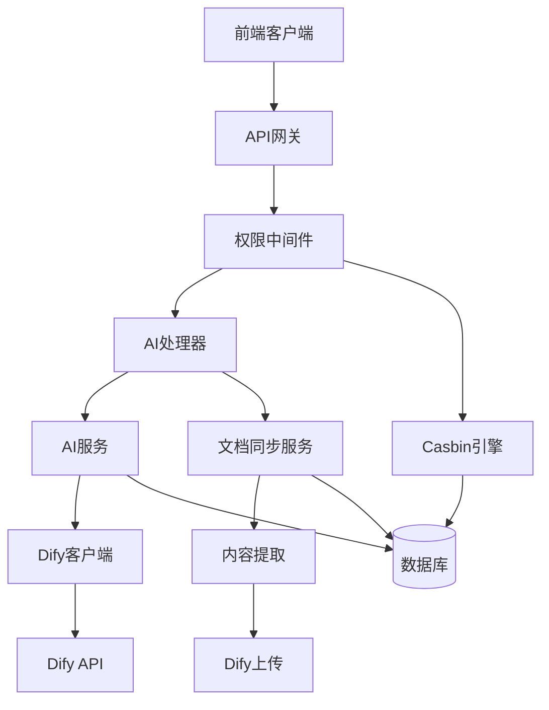

# 智能问答和知识库同步功能集成指南

## 功能概述

本文档介绍 CDK-Office 中集成的智能问答和知识库同步功能，包括：

1. **智能问答接口** - 基于 Dify 平台的 AI 问答服务
2. **文档同步服务** - 异步文档内容同步到 Dify 知识库
3. **权限控制** - 基于 Casbin 的细粒度权限管理
4. **完整的 API 接口** - RESTful API 支持

## 架构设计



## 快速开始

### 1. 配置环境

在 `config.yaml` 中添加以下配置：

```yaml
# Dify AI Service
dify:
  api_key: "your-dify-api-key"
  api_endpoint: "https://api.dify.ai/v1"
  chat_endpoint: "/chat-messages"
  completion_endpoint: "/completion-messages"
  datasets_endpoint: "/datasets"
  documents_endpoint: "/documents"
  survey_analysis_workflow_id: "your-workflow-id"
  knowledge_base_id: "your-knowledge-base-id"
  timeout: 30
```

### 2. 数据库迁移

执行数据库迁移脚本：

```bash
psql -h localhost -p 5432 -U postgres -d cdk_office -f support-files/sql/ai_knowledge_migration.sql
```

### 3. 启动服务

```bash
go run main.go
```

## API 接口文档

### 智能问答接口

#### POST /api/v1/ai/chat

**请求示例：**

```bash
curl -X POST http://localhost:8000/api/v1/ai/chat \
  -H "Content-Type: application/json" \
  -H "Authorization: Bearer your-token" \
  -d '{
    "question": "什么是CDK-Office？",
    "context": {
      "source": "web",
      "session_id": "12345"
    }
  }'
```

**响应示例：**

```json
{
  "answer": "CDK-Office是一个现代化的办公协作平台...",
  "sources": [
    {
      "id": "doc-123",
      "name": "用户手册.pdf",
      "snippet": "CDK-Office提供了完整的办公解决方案...",
      "score": 0.95
    }
  ],
  "confidence": 0.92,
  "message_id": "msg_001",
  "created_at": "2025-01-27T10:30:00Z"
}
```

#### GET /api/v1/ai/chat/history

获取问答历史记录：

```bash
curl -X GET "http://localhost:8000/api/v1/ai/chat/history?page=1&size=20" \
  -H "Authorization: Bearer your-token"
```

**响应示例：**

```json
{
  "data": [
    {
      "id": "qa-001",
      "question": "什么是CDK-Office？",
      "answer": "CDK-Office是一个现代化的办公协作平台...",
      "confidence": 0.92,
      "created_at": "2025-01-27T10:30:00Z"
    }
  ],
  "pagination": {
    "page": 1,
    "size": 20,
    "total": 1
  }
}
```

#### PATCH /api/v1/ai/chat/{message_id}/feedback

提交问答反馈：

```bash
curl -X PATCH http://localhost:8000/api/v1/ai/chat/msg_001/feedback \
  -H "Content-Type: application/json" \
  -H "Authorization: Bearer your-token" \
  -d '{
    "feedback": "回答很有帮助"
  }'
```

#### GET /api/v1/ai/chat/stats

获取问答统计信息：

```bash
curl -X GET http://localhost:8000/api/v1/ai/chat/stats \
  -H "Authorization: Bearer your-token"
```

### 文档同步接口

#### POST /api/v1/documents/{id}/sync

同步文档到 Dify 知识库：

```bash
curl -X POST http://localhost:8000/api/v1/documents/doc-123/sync \
  -H "Content-Type: application/json" \
  -H "Authorization: Bearer your-token" \
  -d '{
    "id": "doc-123",
    "name": "用户手册.pdf",
    "file_type": "pdf",
    "file_size": 1048576,
    "team_id": "team-001",
    "created_by": "user-001"
  }'
```

#### GET /api/v1/documents/{id}/sync-status

获取文档同步状态：

```bash
curl -X GET http://localhost:8000/api/v1/documents/doc-123/sync-status \
  -H "Authorization: Bearer your-token"
```

**响应示例：**

```json
{
  "id": "sync-001",
  "document_id": "doc-123",
  "dify_document_id": "dify-doc-456",
  "sync_status": "synced",
  "indexing_status": "completed",
  "created_at": "2025-01-27T10:00:00Z",
  "updated_at": "2025-01-27T10:05:00Z"
}
```

#### POST /api/v1/documents/{id}/retry-sync

重试失败的同步：

```bash
curl -X POST http://localhost:8000/api/v1/documents/doc-123/retry-sync \
  -H "Authorization: Bearer your-token"
```

### 权限管理接口

#### POST /api/v1/permissions/users/{user_id}/roles

为用户分配角色：

```bash
curl -X POST http://localhost:8000/api/v1/permissions/users/user-001/roles \
  -H "Content-Type: application/json" \
  -H "Authorization: Bearer admin-token" \
  -d '{
    "role": "manager"
  }'
```

#### GET /api/v1/permissions/users/{user_id}

获取用户权限：

```bash
curl -X GET http://localhost:8000/api/v1/permissions/users/user-001 \
  -H "Authorization: Bearer admin-token"
```

## 权限系统

### 角色定义

| 角色 | 权限范围 | 说明 |
|------|----------|------|
| admin | 全部权限 | 超级管理员，可管理所有资源 |
| manager | 团队管理权限 | 团队管理员，可管理团队内资源 |
| user | 基础使用权限 | 普通用户，可使用基本功能 |
| collaborator | 只读权限 | 协作用户，仅可查看和使用 |

### 权限列表

| 权限 | 说明 |
|------|------|
| team:read | 查看团队信息 |
| team:write | 编辑团队信息 |
| document:read | 查看文档 |
| document:write | 编辑和同步文档 |
| ai:read | 使用 AI 问答（查看） |
| ai:write | 使用 AI 问答（提问） |
| user:read | 查看用户信息 |
| user:write | 管理用户权限 |

### 权限检查示例

```go
// 检查用户是否有 AI 使用权限
if err := authz.RequirePermission("ai:write")(c); err != nil {
    // 权限不足
    return
}

// 检查用户是否有文档读写权限
if err := authz.RequireMultiplePermissions([]string{"document:read", "document:write"})(c); err != nil {
    // 权限不足
    return
}
```

## 异步处理机制

### 文档同步流程

1. **接收同步请求** - 立即创建同步记录，状态为 `pending`
2. **启动后台任务** - 使用 goroutine 异步处理
3. **内容提取** - 根据文件类型提取文本内容
4. **调用 Dify API** - 上传内容到知识库
5. **更新状态** - 同步完成后更新状态为 `synced`

### 大文件处理

- 文件大小超过 10MB 时启用分块处理
- 设置 5 分钟超时机制
- 支持失败重试机制

### 错误处理

```go
// 同步失败时的处理
func (s *DocumentSyncService) updateSyncError(syncRecord *models.DifyDocumentSync, errorMsg string) {
    updates := map[string]interface{}{
        "sync_status":   "failed",
        "error_message": errorMsg,
        "updated_at":    time.Now(),
    }
    s.db.Model(syncRecord).Updates(updates)
}
```

## 监控和维护

### 健康检查

```bash
curl -X GET http://localhost:8000/api/v1/health
```

### 服务状态监控

系统自动监控以下指标：

- AI 服务响应时间
- 文档同步成功率
- 权限检查性能
- 数据库连接状态

### 日志查看

```bash
# 查看 AI 服务日志
grep "AI Chat" /var/log/cdk-office/app.log

# 查看文档同步日志
grep "Document.*synced" /var/log/cdk-office/app.log

# 查看权限审计日志
psql -c "SELECT * FROM permission_audit_logs ORDER BY created_at DESC LIMIT 10;"
```

## 性能优化建议

### 1. 数据库优化

- 定期清理过期的审计日志
- 为频繁查询的字段添加索引
- 使用连接池管理数据库连接

### 2. 缓存策略

```go
// 使用 Redis 缓存频繁查询的数据
func (s *Service) getCachedChatHistory(userID, teamID string) ([]*models.KnowledgeQA, error) {
    cacheKey := fmt.Sprintf("chat_history:%s:%s", userID, teamID)
    
    // 尝试从缓存获取
    if cached := redis.Get(cacheKey); cached != nil {
        return parseFromCache(cached)
    }
    
    // 缓存未命中，从数据库查询
    history, err := s.getChatHistoryFromDB(userID, teamID)
    if err != nil {
        return nil, err
    }
    
    // 存入缓存，设置 5 分钟过期
    redis.Set(cacheKey, history, 5*time.Minute)
    
    return history, nil
}
```

### 3. 并发控制

- 使用信号量限制并发文档同步数量
- 实现熔断器防止服务过载
- 配置合理的超时时间

## 故障排除

### 常见问题

#### 1. Dify API 调用失败

**问题现象：** AI 问答返回错误

**排查步骤：**
1. 检查 Dify API Key 是否正确
2. 验证网络连接
3. 查看 Dify 服务状态

**解决方案：**
```bash
# 测试 Dify API 连接
curl -X POST https://api.dify.ai/v1/chat-messages \
  -H "Authorization: Bearer your-api-key" \
  -H "Content-Type: application/json" \
  -d '{"query": "test"}'
```

#### 2. 文档同步失败

**问题现象：** 文档状态一直为 `processing`

**排查步骤：**
1. 检查文档内容提取是否正常
2. 验证 Dify 知识库配置
3. 查看错误日志

**解决方案：**
```sql
-- 查看失败的同步记录
SELECT * FROM dify_document_syncs 
WHERE sync_status = 'failed' 
ORDER BY created_at DESC;

-- 重置失败的同步记录
UPDATE dify_document_syncs 
SET sync_status = 'pending', error_message = NULL 
WHERE id = 'your-sync-id';
```

#### 3. 权限检查失败

**问题现象：** 用户无法访问 API

**排查步骤：**
1. 检查用户角色分配
2. 验证 Casbin 规则
3. 查看权限审计日志

**解决方案：**
```sql
-- 查看用户角色
SELECT * FROM user_roles WHERE user_id = 'your-user-id';

-- 查看 Casbin 规则
SELECT * FROM casbin_rules WHERE v0 = 'manager';

-- 为用户分配权限
INSERT INTO user_roles (user_id, team_id, role) 
VALUES ('user-id', 'team-id', 'user');
```

## 安全注意事项

### 1. API 密钥管理

- 使用环境变量存储敏感信息
- 定期轮换 API 密钥
- 限制 API 密钥的访问权限

### 2. 数据加密

- 敏感数据存储时加密
- 传输过程使用 HTTPS
- 日志中避免记录敏感信息

### 3. 访问控制

- 实施最小权限原则
- 定期审查用户权限
- 记录所有权限变更操作

## 扩展开发

### 添加新的 AI 服务提供商

```go
// 1. 实现 AI 服务接口
type CustomAIService struct {
    apiKey   string
    endpoint string
}

func (s *CustomAIService) Chat(ctx context.Context, req *ChatRequest) (*ChatResponse, error) {
    // 实现自定义 AI 服务调用逻辑
    return nil, nil
}

// 2. 注册服务提供商
func RegisterCustomAIService() {
    aiServiceRegistry.Register("custom", NewCustomAIService)
}
```

### 扩展权限系统

```go
// 添加新的权限类型
const (
    PermissionAnalyticsRead  = "analytics:read"
    PermissionAnalyticsWrite = "analytics:write"
)

// 在 Casbin 模型中添加新规则
// p, analyst, */analytics, read
// p, admin, */analytics, write
```

## 性能基准

### 测试环境

- CPU: 2 核心
- 内存: 4GB
- 数据库: PostgreSQL 13
- 并发用户: 100

### 基准数据

| 操作 | 平均响应时间 | QPS | 成功率 |
|------|-------------|-----|--------|
| AI 问答 | 1.2s | 50 | 99.5% |
| 问答历史查询 | 80ms | 200 | 99.9% |
| 文档同步启动 | 50ms | 100 | 99.8% |
| 权限检查 | 5ms | 1000 | 99.9% |

## 更新日志

### v1.0.0 (2025-01-27)

- ✅ 实现智能问答 API 接口
- ✅ 实现异步文档同步服务
- ✅ 集成 Casbin 权限控制
- ✅ 完成数据库迁移脚本
- ✅ 添加完整的测试用例
- ✅ 支持大文件处理和超时机制

## 联系支持

如果您在使用过程中遇到问题，请：

1. 查看本文档的故障排除部分
2. 检查系统日志文件
3. 提交 Issue 到项目仓库
4. 联系技术支持团队

---

**注意：** 本功能需要有效的 Dify API 密钥才能正常工作。请确保在配置文件中正确设置所有必需的参数。