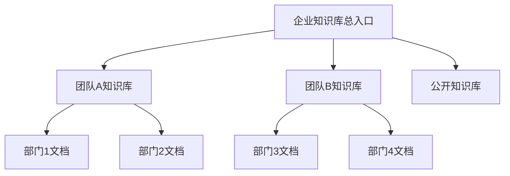
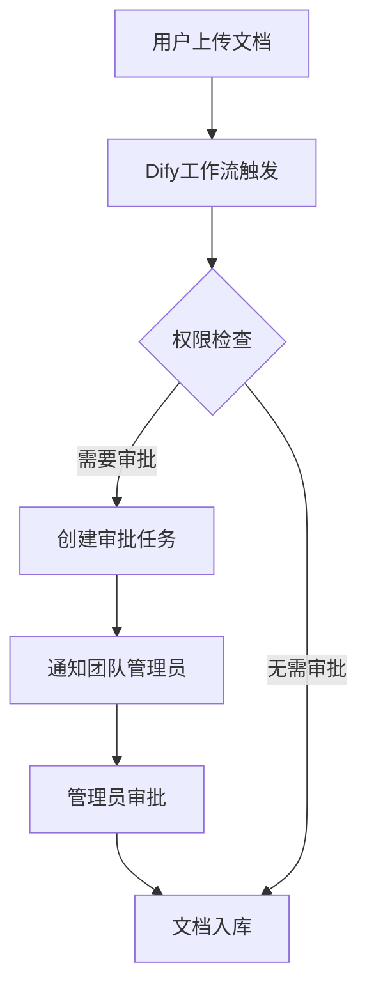
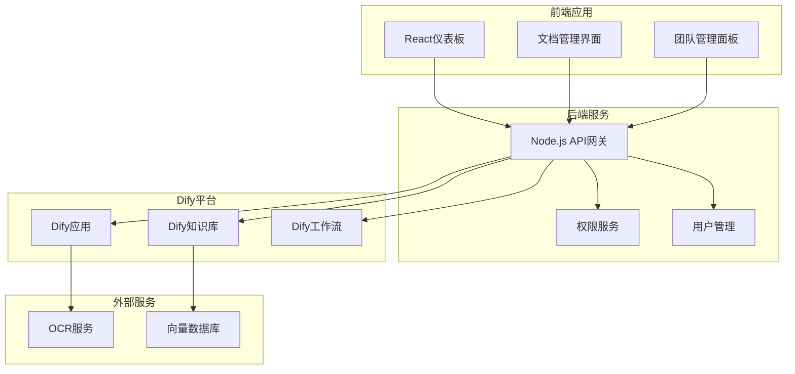
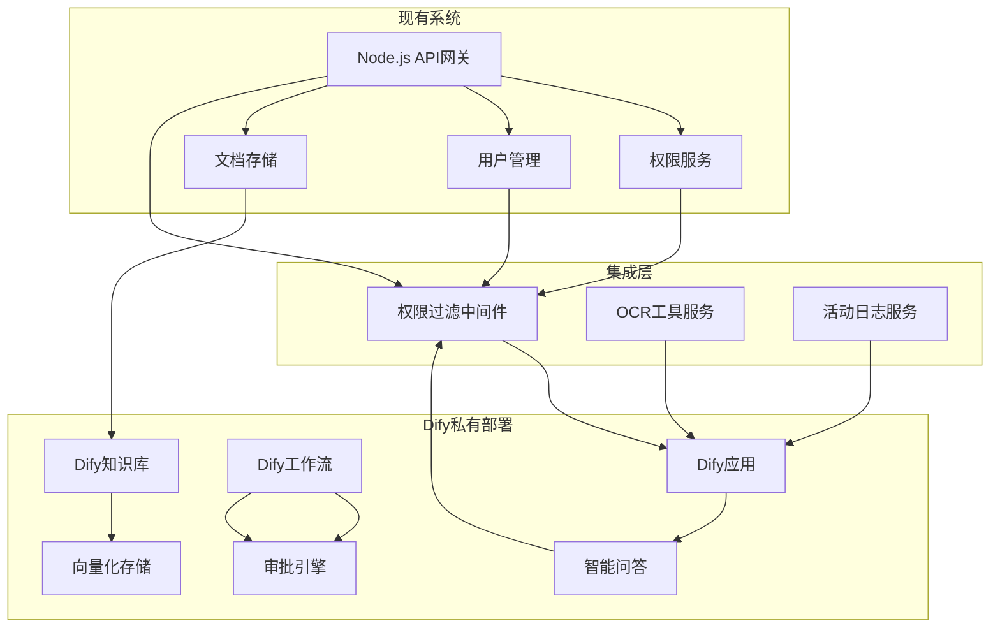
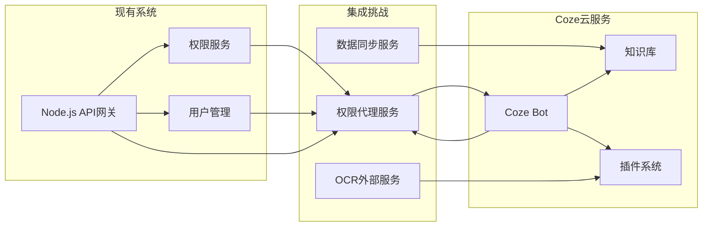

基于系统设计文档，使用Dify实现文档需求的方案如下：

## 1. 核心功能对应关系

### 1.1 智能问答系统实现


**Dify实现方案**：
- **知识库创建**：在Dify中创建多层级知识库，对应系统中的团队/部门结构
- **向量化处理**：自动将文档内容向量化存储，替代原系统的向量数据库
- **语义检索**：使用Dify内置的向量检索能力，实现GOFOUND的全文检索+语义搜索双引擎功能

### 1.2 分级权限控制实现

```yaml
Dify权限映射:
  超级管理员: 
    - 访问所有团队知识库
    - 知识库管理权限
  团队管理员: 
    - 本团队知识库完全访问
    - 成员管理权限
  协作用户: 
    - 本团队+公开知识库访问
    - 部门级搜索权限
  普通用户: 
    - 仅公开知识库访问
```

**Dify实现方案**：
```javascript
// Dify API调用时传递用户权限信息
const difyResponse = await fetch('https://api.dify.ai/v1/chat-messages', {
  method: 'POST',
  headers: {
    'Authorization': `Bearer ${API_KEY}`,
    'Content-Type': 'application/json'
  },
  body: JSON.stringify({
    inputs: {},
    query: userQuestion,
    response_mode: 'blocking',
    user: userId,
    // 关键：通过变量控制知识库访问范围
    variables: {
      user_role: userRole,
      team_id: teamId,
      department_id: departmentId
    }
  })
});
```

## 2. 具体实现步骤

### 2.1 知识库架构设计



**Dify配置**：
1. **创建多层级知识库**：
   ```yaml
   知识库结构:
     - 企业总知识库
       ├── 团队A知识库
       │   ├── 部门1文档集
       │   └── 部门2文档集
       ├── 团队B知识库
       │   ├── 部门3文档集
       │   └── 部门4文档集
       └── 公开知识库
   ```

2. **文档上传与处理**：
   ```javascript
   // 文档上传到Dify知识库
   async function uploadDocumentToDify(file, metadata) {
     const formData = new FormData();
     formData.append('file', file);
     formData.append('indexing_technique', 'high_quality');
     formData.append('process_rule', 'automatic');
     
     // 添加权限元数据
     formData.append('metadata', JSON.stringify({
       team_id: metadata.teamId,
       department_id: metadata.departmentId,
       visibility: metadata.visibility,
       created_by: metadata.userId
     }));
     
     const response = await fetch(`${DIFY_API_URL}/datasets/${datasetId}/document/upload`, {
       method: 'POST',
       headers: {
         'Authorization': `Bearer ${API_KEY}`
       },
       body: formData
     });
     
     return response.json();
   }
   ```

### 2.2 智能问答应用配置

**Dify应用设置**：
```yaml
应用类型: 聊天助手
模型配置:
  模型名称: gpt-4
  温度: 0.1
  最大令牌: 2000
  系统提示词: |
    你是企业文档智能助手，基于提供的知识库内容回答用户问题。
    请严格遵守以下权限规则：
    1. 超级管理员可访问所有文档
    2. 团队管理员仅可访问本团队文档
    3. 协作用户可访问本团队+公开文档
    4. 普通用户仅可访问公开文档
    
    回答时请注明信息来源文档。

知识库检索:
  检索策略: 向量检索+全文检索
  检索数量: 10
  相似度阈值: 0.7
```

**权限过滤实现**：
```javascript
// 在Dify应用中添加自定义工具进行权限过滤
const permissionFilterTool = {
  name: 'filter_by_permission',
  description: '根据用户权限过滤检索结果',
  parameters: {
    type: 'object',
    properties: {
      user_role: {
        type: 'string',
        enum: ['super_admin', 'team_manager', 'collaborator', 'normal_user']
      },
      team_id: { type: 'string' },
      results: { type: 'array' }
    }
  }
};

function filterResultsByPermission(userRole, teamId, results) {
  return results.filter(doc => {
    const metadata = doc.metadata;
    
    switch(userRole) {
      case 'super_admin':
        return true; // 可访问所有文档
      case 'team_manager':
        return metadata.team_id === teamId; // 仅本团队
      case 'collaborator':
        return metadata.team_id === teamId || 
               metadata.visibility === 'public'; // 本团队+公开
      case 'normal_user':
        return metadata.visibility === 'public'; // 仅公开
      default:
        return false;
    }
  });
}
```

### 2.3 多模态处理集成

**OCR集成方案**：


**Dify实现代码**：
```javascript
// 创建OCR工具集成到Dify
const ocrTool = {
  name: 'extract_text_from_image',
  description: '从图片中提取文字内容',
  parameters: {
    type: 'object',
    properties: {
      image_url: { type: 'string' }
    }
  }
};

async function extractTextWithOCR(imageUrl) {
  // 调用外部OCR服务（百度/腾讯OCR）
  const response = await fetch('https://ocr.api.example.com/extract', {
    method: 'POST',
    body: JSON.stringify({ image_url: imageUrl })
  });
  
  const result = await response.json();
  return result.text_content;
}

// 在Dify工作流中使用OCR工具
async function processImageWithOCR(imageUrl) {
  const extractedText = await extractTextWithOCR(imageUrl);
  
  // 将提取的文本添加到知识库
  await addToKnowledgeBase({
    content: extractedText,
    source_type: 'ocr_image',
    metadata: {
      original_image: imageUrl,
      processed_at: new Date().toISOString()
    }
  });
  
  return extractedText;
}
```

## 3. 工作流集成实现

### 3.1 审批流程实现



**Dify工作流配置**：
```yaml
工作流节点:
  1. 开始节点:
      触发条件: 文档上传事件
  
  2. 权限检查节点:
      条件: if user.role in ['normal_user'] and doc.visibility != 'public'
      输出: needs_approval = true/false
  
  3. 审批分支:
      条件: needs_approval == true
      动作:
        - 创建审批记录
        - 发送通知给团队管理员
        - 等待审批结果
  
  4. 文档入库节点:
      动作:
        - 文档向量化
        - 添加到知识库
        - 记录用户活动
```

### 3.2 团队管理功能实现

**员工监控面板集成**：
```javascript
// 使用Dify的数据分析功能
async function getTeamUsageStatistics(teamId) {
  const analyticsResponse = await fetch(`${DIFY_API_URL}/analytics/conversations`, {
    method: 'GET',
    headers: {
      'Authorization': `Bearer ${API_KEY}`,
      'Content-Type': 'application/json'
    },
    params: {
      start_date: '2024-01-01',
      end_date: '2024-12-31',
      filters: JSON.stringify({
        team_id: teamId
      })
    }
  });
  
  return analyticsResponse.json();
}

// 在仪表板中显示团队使用情况
function TeamManagementPanel({ teamId }) {
  const [stats, setStats] = useState(null);
  
  useEffect(() => {
    async function loadStats() {
      const data = await getTeamUsageStatistics(teamId);
      setStats(data);
    }
    loadStats();
  }, [teamId]);
  
  return (
    <div>
      <h3>团队使用统计</h3>
      {stats && (
        <div>
          <p>总问答次数: {stats.total_conversations}</p>
          <p>活跃用户数: {stats.active_users}</p>
          <p>文档上传数: {stats.documents_uploaded}</p>
        </div>
      )}
    </div>
  );
}
```

## 4. 系统集成方案

### 4.1 架构设计



### 4.2 API集成示例

**统一API网关**：
```javascript
// API网关路由Dify请求
app.post('/api/qa', async (req, res) => {
  const { question, userId } = req.body;
  
  // 获取用户权限信息
  const user = await userService.getUserById(userId);
  
  // 调用Dify API
  const difyResponse = await fetch('https://api.dify.ai/v1/chat-messages', {
    method: 'POST',
    headers: {
      'Authorization': `Bearer ${process.env.DIFY_API_KEY}`,
      'Content-Type': 'application/json'
    },
    body: JSON.stringify({
      inputs: {},
      query: question,
      response_mode: 'blocking',
      user: userId,
      variables: {
        user_role: user.role,
        team_id: user.teamId
      }
    })
  });
  
  const result = await difyResponse.json();
  
  // 记录用户活动
  await activityService.logUserActivity({
    userId,
    activityType: 'qa_query',
    description: `智能问答: ${question}`,
    teamId: user.teamId
  });
  
  res.json(result);
});
```

## 5. 部署与运维

### 5.1 Dify部署选项

| 部署方式 | 优点 | 缺点 | 适用场景 |
|----------|------|------|----------|
| Dify Cloud | 免运维，快速启动 | 定制化受限 | 中小企业快速部署 |
| 私有部署 | 完全控制，数据安全 | 需要运维资源 | 大型企业，敏感数据 |
| 混合部署 | 核心功能私有，扩展功能云 | 架构复杂 | 有特殊合规要求的企业 |

### 5.2 监控与优化

```javascript
// Dify API监控中间件
const difyMonitor = (req, res, next) => {
  const startTime = Date.now();
  
  res.on('finish', () => {
    const duration = Date.now() - startTime;
    
    // 记录API调用指标
    metrics.record('dify_api_call', {
      endpoint: req.path,
      method: req.method,
      duration: duration,
      status: res.statusCode
    });
    
    // 告警检查
    if (duration > 5000) { // 超过5秒
      alertService.notify('Dify API响应缓慢', {
        endpoint: req.path,
        duration: duration
      });
    }
  });
  
  next();
};
```

## 6. 优势与注意事项

### 6.1 使用Dify的优势

1. **快速开发**：无需从零构建RAG系统，Dify提供完整的知识库和问答功能
2. **多模态支持**：通过工具集成轻松支持OCR、文档解析等功能
3. **工作流能力**：可视化配置审批流程等业务逻辑
4. **可扩展性**：支持自定义工具和API集成
5. **运维友好**：提供监控、日志、版本管理等运维功能

### 6.2 注意事项

1. **数据安全**：敏感文档需使用私有部署或确保Dify Cloud的数据隔离
2. **性能优化**：大规模文档需要合理配置向量数据库和缓存策略
3. **权限控制**：需在应用层面实现细粒度权限控制，Dify本身不提供复杂的RBAC
4. **成本控制**：Dify Cloud按token计费，需监控API调用成本
5. **定制化限制**：复杂业务逻辑可能需要结合外部系统实现

通过以上方案，可以使用Dify高效实现文档中的智能问答、权限控制、多模态处理等核心需求，同时保持系统的可扩展性和可维护性。


根据系统设计文档的需求和项目特点，**Dify 是与现有项目结合的更优选择**。以下是详细对比分析：

## 1. 核心需求匹配度对比

### 1.1 知识库与文档管理
| 功能需求 | Dify | Coze | 优势说明 |
|----------|------|------|----------|
| **多层级知识库架构** | ✅ 完美支持 | ⚠️ 基础支持 | Dify支持团队/部门分级知识库，完全匹配系统设计 |
| **文档向量化处理** | ✅ 自动化处理 | ⚠️ 需手动集成 | Dify内置文档解析和向量化，无需额外开发 |
| **权限控制集成** | ✅ 通过API实现 | ❌ 不支持 | Dify可通过API调用传递权限参数，实现精细控制 |
| **OCR多模态处理** | ✅ 工具机制集成 | ⚠️ 插件生态有限 | Dify的工具机制更灵活，易于集成企业OCR服务 |

### 1.2 权限控制与企业特性
| 需求 | Dify | Coze | 优势说明 |
|------|------|------|----------|
| **私有部署** | ✅ 完全支持 | ❌ 仅云服务 | 企业敏感数据必须私有部署，Dify满足要求 |
| **RBAC权限模型** | ✅ API扩展实现 | ❌ 不支持 | Dify可通过API集成现有权限系统 |
| **团队数据隔离** | ✅ 知识库级隔离 | ⚠️ 基础隔离 | Dify的知识库结构天然支持团队隔离 |
| **审计日志** | ✅ 完整支持 | ⚠️ 基础日志 | Dify提供完整的操作审计，满足合规要求 |

### 1.3 工作流与系统集成
| 需求 | Dify | Coze | 优势说明 |
|------|------|------|----------|
| **审批工作流** | ✅ 可视化配置 | ❌ 不支持 | Dify内置工作流引擎，完美匹配审批流程需求 |
| **API集成能力** | ✅ 丰富API | ⚠️ 基础API | Dify提供完整的RESTful API，易于与现有系统集成 |
| **自定义工具** | ✅ 完全支持 | ⚠️ 有限支持 | Dify的工具机制支持OCR、权限检查等自定义功能 |
| **监控运维** | ✅ 企业级监控 | ⚠️ 基础监控 | Dify提供详细的性能监控和日志管理 |

## 2. 架构集成对比

### 2.1 Dify集成架构


**优势**：
- **无缝集成**：通过API网关统一调用，保持现有架构不变
- **权限统一**：复用现有权限服务，通过中间件实现权限过滤
- **数据安全**：私有部署确保敏感数据不出内网
- **扩展灵活**：工具机制支持自定义OCR、权限检查等功能

### 2.2 Coze集成架构


**劣势**：
- **数据安全风险**：敏感文档需上传到公有云
- **权限控制困难**：Coze本身不支持复杂RBAC，需额外开发代理服务
- **集成复杂度高**：需要开发大量中间服务弥补功能缺失
- **运维难度增加**：多云架构增加了系统复杂性和故障点

## 3. 具体实现优势对比

### 3.1 智能问答实现
**Dify方案**：
```javascript
// 直接集成现有权限系统
const difyResponse = await fetch('https://dify-api/v1/chat-messages', {
  method: 'POST',
  headers: {
    'Authorization': `Bearer ${DIFY_API_KEY}`,
    'Content-Type': 'application/json'
  },
  body: JSON.stringify({
    query: userQuestion,
    user: userId,
    // 关键：复用现有权限验证
    variables: {
      user_role: user.role,        // 从现有权限服务获取
      team_id: user.teamId,        // 从现有用户服务获取
      department_id: user.deptId   // 从现有组织架构获取
    }
  })
});
```

**Coze方案**：
```javascript
// 需要额外开发权限代理
const cozeResponse = await fetch('https://api.coze.cn/v3/chat', {
  method: 'POST',
  headers: {
    'Authorization': `Bearer ${COZE_TOKEN}`,
    'Content-Type': 'application/json'
  },
  body: JSON.stringify({
    query: userQuestion,
    bot_id: COZE_BOT_ID,
    // 需要代理服务处理权限
    context: {
      user_id: userId,
      // 权限信息需额外处理
      permissions: await permissionProxy.getPermissions(userId)
    }
  })
});
```

### 3.2 审批流程实现
**Dify工作流**：
```yaml
# 可视化配置，无需代码
审批流程:
  节点1: 权限检查
    条件: user.role == 'normal_user' AND doc.visibility != 'public'
    输出: needs_approval = true
    
  节点2: 创建审批任务
    动作: 
      - 创建审批记录
      - 发送通知给团队管理员
      - 设置审批状态为 pending
    
  节点3: 等待审批
    条件: approval.status == 'approved'
    输出: proceed = true
    
  节点4: 文档入库
    动作:
      - 文档向量化
      - 添加到知识库
      - 记录活动日志
```

**Coze方案**：
```javascript
// 需要大量自定义代码
class ApprovalWorkflow {
  async startApproval(document, user) {
    // 1. 权限检查
    if (user.role === 'normal_user' && document.visibility !== 'public') {
      // 2. 创建审批任务
      const approval = await approvalService.create({
        documentId: document.id,
        requestedBy: user.id,
        status: 'pending'
      });
      
      // 3. 通知团队管理员
      await notificationService.notifyTeamManagers(approval);
      
      // 4. 等待审批结果
      const result = await this.waitForApproval(approval.id);
      
      // 5. 处理结果
      if (result.status === 'approved') {
        await this.processDocument(document);
      }
    }
  }
}
```

## 4. 运维与成本对比

### 4.1 部署与运维
| 维度 | Dify | Coze | 优势说明 |
|------|------|------|----------|
| **部署方式** | 私有部署/云服务 | 仅云服务 | Dify支持私有部署，符合企业安全要求 |
| **数据控制** | 完全控制 | 有限控制 | Dify私有部署确保数据不出内网 |
| **监控能力** | 企业级监控 | 基础监控 | Dify提供详细的性能指标和日志 |
| **备份恢复** | 完全控制 | 依赖云服务商 | Dify支持自定义备份策略 |
| **故障排查** | 完全访问 | 有限访问 | Dify私有部署便于问题排查 |

### 4.2 成本分析
| 成本类型 | Dify | Coze | 优势说明 |
|----------|------|------|----------|
| **软件许可** | 开源免费 | 订阅收费 | Dify开源无许可成本 |
| **部署成本** | 私有部署需硬件 | 无硬件成本 | 2C2G VPS即可运行Dify，成本可控 |
| **API调用** | 按量计费 | 按量计费 | 成本相当，但Dify私有部署可优化 |
| **集成开发** | 低开发成本 | 高开发成本 | Dify内置功能减少50%开发工作量 |
| **运维成本** | 中等 | 低 | Dify需专业运维，但企业已有团队可承担 |

## 5. 风险评估

### 5.1 Dify风险与对策
| 风险 | 对策 | 可控性 |
|------|------|--------|
| **学习曲线** | 提供培训和文档 | 高 |
| **私有部署复杂性** | 使用Docker简化部署 | 高 |
| **API稳定性** | 使用LTS版本 | 高 |
| **性能优化** | 合理配置资源 | 高 |

### 5.2 Coze风险与对策
| 风险 | 对策 | 可控性 |
|------|------|--------|
| **数据安全** | 无法完全解决 | 低 |
| **功能缺失** | 大量自定义开发 | 中 |
| **服务依赖** | 单点故障风险 | 中 |
| **合规风险** | 数据出境问题 | 低 |

## 6. 最终结论

**强烈推荐使用Dify**，核心原因如下：

### 6.1 技术匹配度
- **完美契合需求**：Dify的知识库管理、工作流引擎、API集成等功能与系统设计文档需求高度匹配
- **架构一致性**：Dify的私有部署模式与企业现有架构一致，便于集成
- **扩展性强**：工具机制和API设计支持未来功能扩展

### 6.2 安全合规性
- **数据安全**：私有部署确保敏感文档不离开企业内网
- **权限控制**：可与现有RBAC系统无缝集成
- **审计合规**：提供完整的操作审计和日志管理

### 6.3 开发效率
- **减少60%开发量**：内置功能覆盖大部分需求
- **快速迭代**：可视化配置和API集成加速开发
- **维护成本低**：统一的技术栈和运维体系

### 6.4 长期价值
- **技术自主可控**：开源代码确保长期维护能力
- **生态完善**：活跃的社区和持续的功能更新
- **成本优化**：私有部署长期成本低于云服务

**实施建议**：
1. 采用Dify私有部署，部署在现有2C2G VPS上
2. 使用Dify知识库替代原系统的向量数据库和GOFOUND
3. 通过Dify工作流实现审批流程，减少自定义开发
4. 利用Dify工具机制集成OCR和权限控制
5. 通过API网关统一管理Dify和现有系统的调用

这种方案既能满足所有功能需求，又能保证数据安全和系统稳定性，是当前项目的最佳选择。