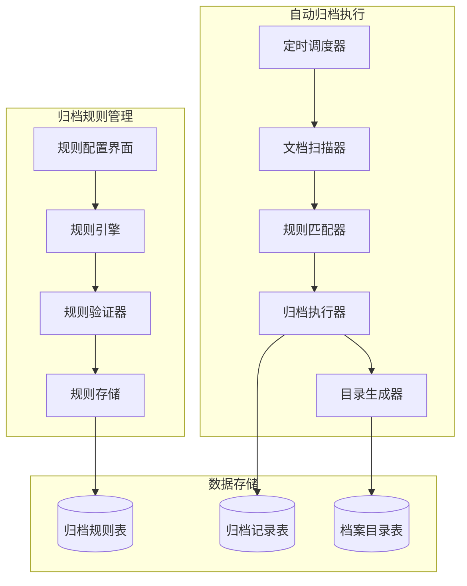
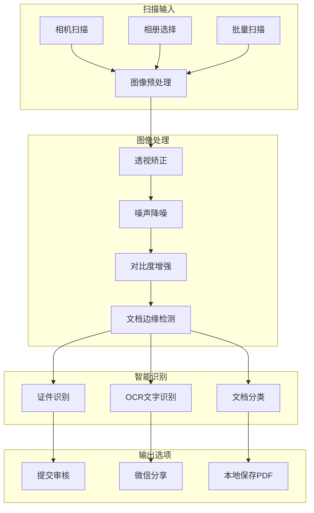
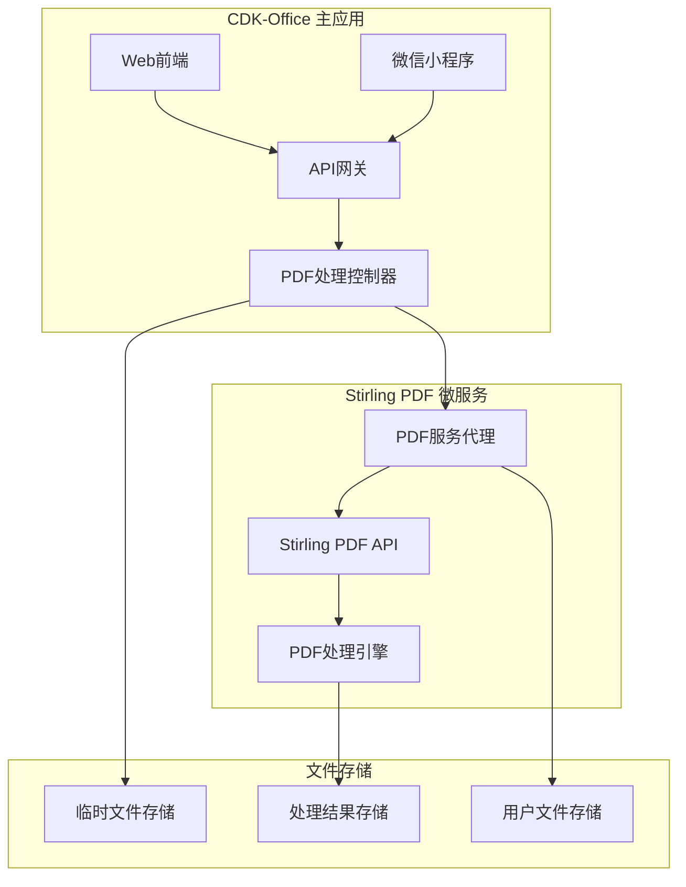

# CDK-Office 文档自动归档与智能扫描系统设计

## 1. 概述

基于现有CDK-Office企业内容管理平台，新增文档自动归档、智能扫描和PDF处理三大核心功能，进一步提升企业文档管理效率和用户体验。

### 1.1 新增功能特性

- **自动归档系统**：团队管理员可设置归档规则，系统自动执行归档并生成档案目录
- **智能文档扫描**：支持微信小程序、移动端连续扫描、透视矫正、证件识别
- **PDF智能处理**：集成Stirling PDF，提供完整PDF文档处理能力
- **多端同步体验**：Web端、微信小程序、移动端功能一致性

### 1.2 技术栈扩展

在现有CDK-Office技术栈基础上新增：

**后端扩展**：
- Stirling PDF集成（Java微服务调用）
- OpenCV图像处理（文档扫描）
- 定时任务调度器（自动归档）
- 文档版本控制系统

**前端扩展**：
- 移动端相机API集成
- Canvas图像处理
- PDF.js预览增强
- 文件流下载管理

## 2. 自动归档系统设计

### 2.1 架构设计



### 2.2 数据模型设计

```sql
-- 归档规则表
CREATE TABLE archive_rules (
    id UUID PRIMARY KEY DEFAULT gen_random_uuid(),
    team_id UUID REFERENCES teams(id),
    rule_name VARCHAR(255) NOT NULL,
    rule_type VARCHAR(50) NOT NULL, -- time_based, size_based, tag_based, custom
    rule_config JSONB NOT NULL,
    target_archive_path VARCHAR(500),
    is_active BOOLEAN DEFAULT true,
    created_by UUID REFERENCES users(id),
    created_at TIMESTAMP DEFAULT NOW(),
    updated_at TIMESTAMP DEFAULT NOW()
);

-- 归档记录表
CREATE TABLE archive_records (
    id UUID PRIMARY KEY DEFAULT gen_random_uuid(),
    rule_id UUID REFERENCES archive_rules(id),
    document_id UUID REFERENCES documents(id),
    original_path VARCHAR(500),
    archive_path VARCHAR(500),
    archive_status VARCHAR(20) DEFAULT 'pending',
    archive_date TIMESTAMP DEFAULT NOW(),
    metadata JSONB
);

-- 档案目录表
CREATE TABLE archive_catalogs (
    id UUID PRIMARY KEY DEFAULT gen_random_uuid(),
    team_id UUID REFERENCES teams(id),
    catalog_name VARCHAR(255),
    catalog_path VARCHAR(500),
    document_count INTEGER DEFAULT 0,
    total_size BIGINT DEFAULT 0,
    created_date TIMESTAMP DEFAULT NOW(),
    catalog_metadata JSONB
);
```

### 2.3 归档规则引擎

```go
// 归档规则配置
type ArchiveRule struct {
    ID           UUID                   `json:"id"`
    TeamID       UUID                   `json:"team_id"`
    RuleName     string                 `json:"rule_name"`
    RuleType     ArchiveRuleType        `json:"rule_type"`
    RuleConfig   map[string]interface{} `json:"rule_config"`
    TargetPath   string                 `json:"target_archive_path"`
    IsActive     bool                   `json:"is_active"`
    CreatedBy    UUID                   `json:"created_by"`
    CreatedAt    time.Time              `json:"created_at"`
}

type ArchiveRuleType string

const (
    TimeBasedRule   ArchiveRuleType = "time_based"   // 基于时间归档
    SizeBasedRule   ArchiveRuleType = "size_based"   // 基于大小归档  
    TagBasedRule    ArchiveRuleType = "tag_based"    // 基于标签归档
    CustomRule      ArchiveRuleType = "custom"       // 自定义规则
)

// 归档服务
type ArchiveService struct {
    db        *gorm.DB
    storage   StorageService
    scheduler *cron.Cron
    logger    *zap.Logger
}

// 执行归档任务
func (s *ArchiveService) ExecuteArchive() error {
    rules, err := s.getActiveRules()
    if err != nil {
        return err
    }
    
    for _, rule := range rules {
        documents, err := s.findMatchingDocuments(rule)
        if err != nil {
            continue
        }
        
        for _, doc := range documents {
            if err := s.archiveDocument(doc, rule); err != nil {
                s.logger.Error("归档文档失败", zap.Error(err))
            }
        }
        
        if err := s.updateArchiveCatalog(rule); err != nil {
            s.logger.Error("更新档案目录失败", zap.Error(err))
        }
    }
    
    return nil
}
```

## 3. 智能文档扫描系统设计

### 3.1 扫描功能架构



### 3.2 数据模型扩展

```sql
-- 文档扫描会话表
CREATE TABLE scan_sessions (
    id UUID PRIMARY KEY DEFAULT gen_random_uuid(),
    user_id UUID REFERENCES users(id),
    session_type VARCHAR(20) DEFAULT 'document',
    scan_count INTEGER DEFAULT 0,
    max_pages INTEGER DEFAULT 20,
    created_at TIMESTAMP DEFAULT NOW(),
    expires_at TIMESTAMP DEFAULT NOW() + INTERVAL '1 hour'
);

-- 扫描图像表
CREATE TABLE scan_images (
    id UUID PRIMARY KEY DEFAULT gen_random_uuid(),
    session_id UUID REFERENCES scan_sessions(id),
    original_image_path VARCHAR(500),
    processed_image_path VARCHAR(500),
    page_number INTEGER,
    processing_status VARCHAR(20) DEFAULT 'pending',
    ocr_result TEXT,
    confidence_score DECIMAL(3,2),
    metadata JSONB,
    created_at TIMESTAMP DEFAULT NOW()
);

-- 证件识别结果表
CREATE TABLE id_recognition_results (
    id UUID PRIMARY KEY DEFAULT gen_random_uuid(),
    scan_image_id UUID REFERENCES scan_images(id),
    id_type VARCHAR(50),
    extracted_fields JSONB,
    confidence_scores JSONB,
    created_at TIMESTAMP DEFAULT NOW()
);
```

### 3.3 图像处理服务

```go
// 图像处理服务
type ImageProcessingService struct {
    opencv    OpenCVProcessor
    ocr       OCRService
    storage   StorageService
    ai        AIService
}

// 处理扫描图像
func (s *ImageProcessingService) ProcessScanImage(imageData []byte, sessionID UUID, pageNum int) (*ScanImage, error) {
    // 1. 保存原始图像
    originalPath, err := s.storage.SaveImage(imageData, "original")
    if err != nil {
        return nil, err
    }
    
    // 2. 图像预处理
    processedData, err := s.preprocessImage(imageData)
    if err != nil {
        return nil, err
    }
    
    // 3. 保存处理后图像
    processedPath, err := s.storage.SaveImage(processedData, "processed")
    if err != nil {
        return nil, err
    }
    
    // 4. 创建扫描记录
    scanImage := &ScanImage{
        SessionID:           sessionID,
        OriginalImagePath:   originalPath,
        ProcessedImagePath:  processedPath,
        PageNumber:         pageNum,
        ProcessingStatus:   "processing",
    }
    
    // 5. 异步OCR识别
    go s.performOCR(scanImage)
    
    return scanImage, nil
}

// 透视矫正
func (s *ImageProcessingService) perspectiveCorrection(imageData []byte) ([]byte, error) {
    // 1. 检测文档边缘
    edges, err := s.opencv.DetectDocumentEdges(imageData)
    if err != nil {
        return nil, err
    }
    
    // 2. 应用透视矫正
    correctedImage, err := s.opencv.ApplyPerspectiveTransform(imageData, edges)
    if err != nil {
        return nil, err
    }
    
    return correctedImage, nil
}
```

## 4. Stirling PDF集成设计

### 4.1 系统架构



### 4.2 PDF处理服务

```go
// PDF处理服务
type PDFProcessingService struct {
    stirlingClient *StirlingPDFClient
    storage        StorageService
    db            *gorm.DB
}

type PDFTaskType string

const (
    PDFMerge          PDFTaskType = "merge"
    PDFSplit          PDFTaskType = "split"
    PDFCompress       PDFTaskType = "compress"
    PDFConvert        PDFTaskType = "convert"
    PDFWatermark      PDFTaskType = "watermark"
    PDFPassword       PDFTaskType = "password"
    PDFOCR            PDFTaskType = "ocr"
    PDFExtractImages  PDFTaskType = "extract_images"
)

// 处理PDF任务
func (s *PDFProcessingService) ProcessPDF(userID UUID, taskType PDFTaskType, files []string, params map[string]interface{}) (*PDFProcessingTask, error) {
    task := &PDFProcessingTask{
        ID:         uuid.New(),
        UserID:     userID,
        TaskType:   taskType,
        InputFiles: files,
        Parameters: params,
        Status:     "pending",
        CreatedAt:  time.Now(),
    }
    
    if err := s.db.Create(task).Error; err != nil {
        return nil, err
    }
    
    // 异步处理
    go s.executeTask(task)
    
    return task, nil
}
```

## 5. 用户界面设计

### 5.1 Web端界面扩展

基于现有CDK-Office界面，在业务中心新增PDF工具模块：

```typescript
// PDF工具组件
const PDFToolsPage: React.FC = () => {
  const [selectedTool, setSelectedTool] = useState<PDFTaskType>('merge');
  const [files, setFiles] = useState<File[]>([]);
  const [processing, setProcessing] = useState(false);

  const pdfTools = [
    { type: 'merge', name: 'PDF合并', icon: Merge },
    { type: 'split', name: 'PDF拆分', icon: Split },
    { type: 'compress', name: 'PDF压缩', icon: Compress },
    { type: 'convert', name: '格式转换', icon: Convert },
  ];

  return (
    <div className="container mx-auto p-6">
      <h1 className="text-2xl font-bold mb-6">PDF处理工具</h1>
      
      {/* 工具选择 */}
      <div className="grid grid-cols-4 gap-4 mb-6">
        {pdfTools.map((tool) => (
          <Card 
            key={tool.type}
            className={cn(
              "cursor-pointer transition-colors",
              selectedTool === tool.type ? "ring-2 ring-primary" : ""
            )}
            onClick={() => setSelectedTool(tool.type)}
          >
            <CardContent className="p-4 text-center">
              <tool.icon className="h-8 w-8 mx-auto mb-2" />
              <p className="text-sm font-medium">{tool.name}</p>
            </CardContent>
          </Card>
        ))}
      </div>
      
      {/* 文件上传区域 */}
      <Card className="mb-6">
        <CardContent className="p-6">
          <FileUpload
            files={files}
            onFilesChange={setFiles}
            accept=".pdf"
            multiple={selectedTool === 'merge'}
          />
        </CardContent>
      </Card>
      
      {/* 处理按钮 */}
      <Button 
        onClick={handleProcess}
        disabled={files.length === 0 || processing}
        className="w-full"
      >
        {processing ? '处理中...' : `开始${pdfTools.find(t => t.type === selectedTool)?.name}`}
      </Button>
    </div>
  );
};
```

### 5.2 微信小程序扫描界面

```javascript
// 扫描页面
Component({
  data: {
    scanSession: null,
    scannedImages: [],
    scanMode: 'document',
    showActionSheet: false
  },
  
  methods: {
    // 开始扫描
    async startScan() {
      const session = await this.createScanSession();
      this.setData({ scanSession: session });
      this.openCamera();
    },
    
    // 处理扫描结果
    async handleScanAction(action) {
      switch (action) {
        case 'submit':
          await this.submitToDocumentCenter();
          break;
        case 'share':
          await this.shareToWechat();
          break;
        case 'save':
          await this.saveToLocal();
          break;
      }
    }
  }
});
```

## 6. API接口设计

### 6.1 归档管理接口

```go
// 归档规则管理
POST   /api/archive/rules              // 创建归档规则
GET    /api/archive/rules              // 获取归档规则列表
PUT    /api/archive/rules/{id}         // 更新归档规则
DELETE /api/archive/rules/{id}         // 删除归档规则
POST   /api/archive/rules/{id}/execute // 手动执行归档

// 归档记录查询
GET    /api/archive/records            // 获取归档记录
GET    /api/archive/catalogs           // 获取档案目录
```

### 6.2 扫描服务接口

```go
// 扫描会话管理
POST   /api/scan/session               // 创建扫描会话
GET    /api/scan/session/{id}          // 获取会话信息
POST   /api/scan/session/{id}/image    // 上传扫描图像
POST   /api/scan/session/{id}/complete // 完成扫描

// 文档处理
POST   /api/documents/create-from-scan // 从扫描创建文档
POST   /api/scan/generate-pdf          // 生成PDF
POST   /api/scan/share                 // 生成分享链接
```

### 6.3 PDF处理接口

```go
// PDF处理
POST   /api/pdf/merge                  // 合并PDF
POST   /api/pdf/split                  // 拆分PDF
POST   /api/pdf/compress               // 压缩PDF
POST   /api/pdf/convert                // 格式转换
GET    /api/pdf/tasks/{id}             // 获取处理状态
GET    /api/pdf/tasks/{id}/download    // 下载处理结果
```

## 7. 部署与配置

### 7.1 Stirling PDF部署

```yaml
# docker-compose.yml 扩展
version: '3.8'

services:
  cdk-office:
    # ... 现有配置
    environment:
      - STIRLING_PDF_URL=http://stirling-pdf:8080
    depends_on:
      - stirling-pdf

  stirling-pdf:
    image: stirlingtools/stirling-pdf:latest
    ports:
      - "8081:8080"
    environment:
      - DOCKER_ENABLE_SECURITY=false
      - INSTALL_BOOK_AND_ADVANCED_HTML_OPS=false
    volumes:
      - stirling_data:/usr/share/tesseract-ocr
    networks:
      - cdk-office

volumes:
  stirling_data:

networks:
  cdk-office:
    driver: bridge
```

### 7.2 配置文件扩展

```yaml
# config.yaml 扩展
archive:
  enabled: true
  schedule: "0 2 * * *"  # 每天凌晨2点执行
  temp_retention_days: 7
  max_concurrent_tasks: 5

scan:
  enabled: true
  max_pages_per_session: 20
  session_timeout: 3600  # 1小时
  image_quality: 0.8
  opencv_enabled: true

pdf_processing:
  stirling_pdf_url: "http://stirling-pdf:8080"
  max_file_size: 100MB
  timeout: 300  # 5分钟
  concurrent_tasks: 3
```

### 7.3 权限配置

```sql
-- 权限配置扩展
INSERT INTO permissions (name, description, category) VALUES
('archive.manage', '管理归档规则', 'archive'),
('archive.view', '查看归档记录', 'archive'),
('scan.use', '使用扫描功能', 'scan'),
('pdf.process', '使用PDF处理工具', 'pdf');

-- 角色权限分配
INSERT INTO role_permissions (role_id, permission_id) 
SELECT r.id, p.id FROM roles r, permissions p 
WHERE r.name = 'team_admin' AND p.name IN ('archive.manage', 'archive.view');

INSERT INTO role_permissions (role_id, permission_id)
SELECT r.id, p.id FROM roles r, permissions p
WHERE r.name = 'user' AND p.name IN ('scan.use', 'pdf.process', 'archive.view');
```