# CDK-Office 企业内容管理平台系统设计（优化版）

## 1. 概述

CDK-Office 是基于开源项目 [Linux DO CDK](https://github.com/linux-do/cdk) 技术架构的企业级内容管理平台。以"大道至简"为设计理念，采用单体应用架构，微信生态授权体系，完全独立部署，面向企业内部使用的综合性办公平台。

### 1.1 核心价值

- **技术复用**：100% 复刻 CDK 项目的技术栈和架构设计
- **微信生态**：基于微信扫码登录，集成小程序无缝体验
- **企业场景**：专注文档管理、智能检索、AI问答三大核心能力
- **轻量部署**：单体应用架构，优化适配 2C2G VPS + Supabase 免费层
- **AI 增强**：内置多模态 AI 服务，提升办公效率
- **安全可控**：四级权限体系，确保数据安全

### 1.2 技术栈继承

**完全基于CDK项目技术栈**：

**后端架构**
- Go 1.24 + Gin Framework
- GORM + Supabase PostgreSQL
- Redis 缓存 + Session 管理
- OpenTelemetry 可观测性
- Swagger API 文档

**前端架构**
- Next.js 15 + React 19 (Web端)
- 微信小程序 (移动端主力)
- TypeScript + Tailwind CSS 4
- Shadcn UI 组件库
- Lucide Icons + @tabler/icons-react

**界面设计继承与优化**：
- 基于 CDK 项目完整界面设计
- 侧边栏"快速创建"功能增强为"文档中心"
- 集成文档上传、智能检索、AI问答功能
- 保持 CDK 项目的用户体验和操作习惯

## 2. 架构设计

### 2.1 单体应用架构设计

遵循"大道至简"设计理念，采用单体应用架构，确保系统简洁高效：

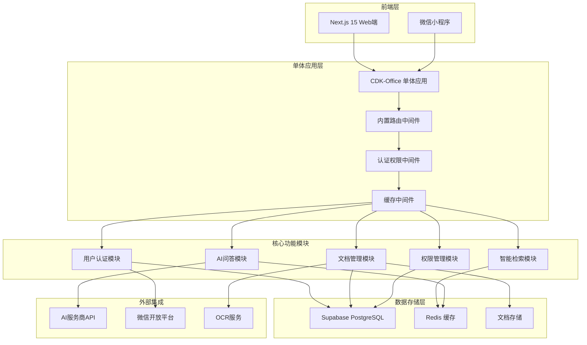

### 2.2 三层缓存架构

简化缓存策略，专注核心性能优化：

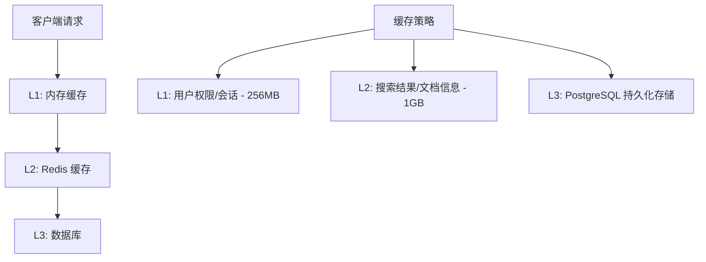

### 2.3 单体应用模块化设计

基于CDK项目架构，采用清晰的模块化设计：

```
cdk-office/                # 单体应用根目录
├── internal/              # 内部模块 (继承CDK结构)
│   ├── apps/              # 应用模块
│   │   ├── auth/          # 认证模块 (继承CDK)
│   │   │   ├── wechat.go  # 微信登录 (新增)
│   │   │   └── permission.go # 权限管理 (扩展)
│   │   ├── document/      # 文档管理 (新增核心模块)
│   │   │   ├── upload.go  # 文档上传
│   │   │   ├── search.go  # 文档搜索
│   │   │   ├── approval.go # 审批流程
│   │   │   └── storage.go # 存储管理
│   │   ├── ai/            # AI问答 (新增核心模块)
│   │   │   ├── chat.go    # 智能问答
│   │   │   ├── embedding.go # 向量化
│   │   │   └── knowledge.go # 知识库
│   │   └── dashboard/     # 仪表板 (继承CDK)
│   ├── cmd/               # 命令行工具 (继承CDK)
│   ├── config/            # 配置管理 (继承CDK)
│   ├── db/                # 数据库 (继承CDK)
│   ├── logger/            # 日志 (继承CDK)
│   ├── router/            # 路由 (继承CDK)
│   └── utils/             # 工具函数 (继承CDK)
├── frontend/              # 前端项目 (继承CDK)
│   ├── app/               # Next.js应用
│   ├── components/        # 组件库
│   │   ├── document/      # 文档相关组件 (新增)
│   │   ├── ai/            # AI问答组件 (新增)
│   │   └── common/        # 通用组件 (继承CDK)
│   └── lib/               # 工具库
├── miniprogram/           # 微信小程序 (新增)
│   ├── pages/             # 页面
│   ├── components/        # 组件
│   └── utils/             # 工具函数
└── docs/                  # 文档 (继承CDK)
```

## 3. 核心功能设计

### 3.1 用户权限体系

基于微信扫码认证体系，设计简洁高效的权限模型：

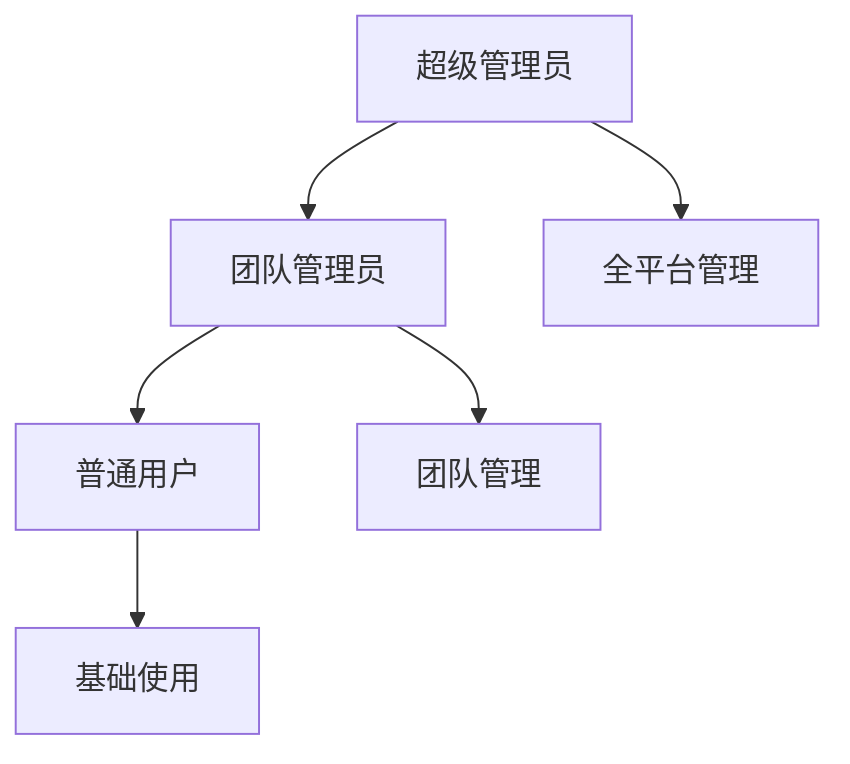

**三级权限架构**：

| 角色级别 | 权限范围 | 核心功能 |
|---------|----------|----------|
| 超级管理员 | 全平台 | 系统配置、团队管理、全局数据管理、跨团队操作 |
| 团队管理员 | 团队内 | 成员管理、文档审批、团队配置、数据分析 |
| 普通用户 | 基础功能 | 文档上传/查看、AI问答、智能检索、个人设置 |

**权限实现**：
```go
// 基于CDK项目权限模型扩展
type UserRole string

const (
    RoleSuperAdmin UserRole = "super_admin"
    RoleTeamAdmin  UserRole = "team_admin" 
    RoleUser       UserRole = "user"
)

type Permission struct {
    ID          UUID      `json:"id" gorm:"type:uuid;primary_key"`
    UserID      UUID      `json:"user_id"`
    TeamID      UUID      `json:"team_id"`
    Role        UserRole  `json:"role"`
    Permissions []string  `json:"permissions" gorm:"type:text[]"`
    CreatedAt   time.Time `json:"created_at"`
}
```

### 3.2 文档管理模块

基于CDK项目的数据模型，设计企业级文档管理系统：

```go
// 文档核心模型
type Document struct {
    ID          UUID      `json:"id" gorm:"type:uuid;primary_key;default:gen_random_uuid()"`
    Title       string    `json:"title" gorm:"size:255;not null"`
    Content     string    `json:"content" gorm:"type:text"`
    FileType    string    `json:"file_type" gorm:"size:50"`
    FileSize    int64     `json:"file_size"`
    FilePath    string    `json:"file_path" gorm:"size:500"`
    
    // 继承CDK项目的用户关联
    AuthorID    UUID      `json:"author_id" gorm:"type:uuid;not null"`
    TeamID      UUID      `json:"team_id" gorm:"type:uuid;not null"`
    
    // 文档状态管理
    Status      string    `json:"status" gorm:"default:'draft'"` // draft, pending, approved, published
    Visibility  string    `json:"visibility" gorm:"default:'private'"` // private, team, public
    
    // AI增强字段
    Summary     string    `json:"summary" gorm:"type:text"`
    Keywords    []string  `json:"keywords" gorm:"type:text[]"`
    Embedding   []float32 `json:"embedding" gorm:"type:vector(1536)"`
    
    CreatedAt   time.Time `json:"created_at" gorm:"autoCreateTime"`
    UpdatedAt   time.Time `json:"updated_at" gorm:"autoUpdateTime"`
}

// 文档服务
type DocumentService struct {
    db    *gorm.DB
    redis *redis.Client
    ai    *AIService
}

func (s *DocumentService) UploadDocument(userID UUID, teamID UUID, file *multipart.FileHeader) (*Document, error) {
    // 1. 验证文件类型和大小
    if err := s.validateFile(file); err != nil {
        return nil, err
    }
    
    // 2. 保存文件
    filePath, err := s.saveFile(file)
    if err != nil {
        return nil, err
    }
    
    // 3. 提取文本内容
    content, err := s.extractContent(filePath)
    if err != nil {
        return nil, err
    }
    
    // 4. AI处理：生成摘要和关键词
    summary, keywords, err := s.ai.ProcessDocument(content)
    if err != nil {
        log.Printf("AI processing failed: %v", err)
    }
    
    // 5. 生成向量嵌入
    embedding, err := s.ai.GenerateEmbedding(content)
    if err != nil {
        log.Printf("Embedding generation failed: %v", err)
    }
    
    // 6. 创建文档记录
    doc := &Document{
        Title:     file.Filename,
        Content:   content,
        FileType:  filepath.Ext(file.Filename),
        FileSize:  file.Size,
        FilePath:  filePath,
        AuthorID:  userID,
        TeamID:    teamID,
        Status:    "pending", // 需要审批
        Summary:   summary,
        Keywords:  keywords,
        Embedding: embedding,
    }
    
    if err := s.db.Create(doc).Error; err != nil {
        return nil, err
    }
    
    // 7. 提交审批流程
    return doc, s.submitForApproval(doc)
}
```

### 3.3 AI问答模块

基于知识库的智能问答系统，支持多模态AI服务：

```go
// AI问答核心服务
type AIService struct {
    db         *gorm.DB
    redis      *redis.Client
    vectorDB   *VectorDB
    llmClients map[string]LLMClient // 支持多个AI服务商
}

// 知识库问答
type KnowledgeQA struct {
    ID          UUID      `json:"id" gorm:"type:uuid;primary_key"`
    UserID      UUID      `json:"user_id"`
    TeamID      UUID      `json:"team_id"`
    Question    string    `json:"question" gorm:"type:text"`
    Answer      string    `json:"answer" gorm:"type:text"`
    Sources     []UUID    `json:"sources" gorm:"type:uuid[]"` // 引用文档ID
    Confidence  float32   `json:"confidence"`
    Feedback    string    `json:"feedback"`
    AIProvider  string    `json:"ai_provider" gorm:"size:50"`
    CreatedAt   time.Time `json:"created_at"`
}

// 智能问答功能
func (s *AIService) AskQuestion(userID, teamID UUID, question string) (*KnowledgeQA, error) {
    // 1. 问题向量化
    questionEmbedding, err := s.GenerateEmbedding(question)
    if err != nil {
        return nil, err
    }
    
    // 2. 检索相关文档 (语义搜索)
    relevantDocs, err := s.vectorDB.SimilaritySearch(questionEmbedding, teamID)
    if err != nil {
        return nil, err
    }
    
    // 3. 构建上下文
    context := s.buildContext(relevantDocs)
    
    // 4. 调用LLM生成答案
    answer, confidence, err := s.generateAnswer(question, context)
    if err != nil {
        return nil, err
    }
    
    // 5. 保存问答记录
    qa := &KnowledgeQA{
        UserID:     userID,
        TeamID:     teamID,
        Question:   question,
        Answer:     answer,
        Sources:    s.extractDocumentIDs(relevantDocs),
        Confidence: confidence,
        AIProvider: s.getCurrentProvider(),
    }
    
    if err := s.db.Create(qa).Error; err != nil {
        return nil, err
    }
    
    // 6. 缓存结果
    s.cacheQA(qa)
    
    return qa, nil
}
```

### 3.4 智能检索模块

结合关键词搜索和语义搜索，提供精准的文档检索服务：

```go
// 搜索服务
type SearchService struct {
    db        *gorm.DB
    redis     *redis.Client
    gofound   *GoFoundClient  // 关键词搜索
    vectorDB  *VectorDB       // 语义搜索
}

// 搜索结果
type SearchResult struct {
    Documents    []DocumentResult `json:"documents"`
    Total        int             `json:"total"`
    SearchTime   time.Duration   `json:"search_time"`
    SearchType   string          `json:"search_type"` // keyword, semantic, hybrid
    Suggestions  []string        `json:"suggestions"`
}

type DocumentResult struct {
    Document   *Document `json:"document"`
    Score      float32   `json:"score"`
    Highlights []string  `json:"highlights"`
    Reason     string    `json:"reason"` // 匹配原因
}

// 混合搜索策略
func (s *SearchService) SearchDocuments(userID, teamID UUID, query string, options *SearchOptions) (*SearchResult, error) {
    startTime := time.Now()
    
    // 1. 检查缓存
    if cached := s.getCachedResult(query, teamID); cached != nil {
        return cached, nil
    }
    
    // 2. 并行执行关键词搜索和语义搜索
    var keywordResults, semanticResults []DocumentResult
    var wg sync.WaitGroup
    
    wg.Add(2)
    go func() {
        defer wg.Done()
        keywordResults, _ = s.keywordSearch(query, teamID, userID)
    }()
    
    go func() {
        defer wg.Done()
        semanticResults, _ = s.semanticSearch(query, teamID, userID)
    }()
    
    wg.Wait()
    
    // 3. 结果融合和排序
    mergedResults := s.mergeAndRankResults(keywordResults, semanticResults)
    
    // 4. 构建返回结果
    result := &SearchResult{
        Documents:   mergedResults,
        Total:       len(mergedResults),
        SearchTime:  time.Since(startTime),
        SearchType:  "hybrid",
        Suggestions: s.generateSuggestions(query),
    }
    
    // 5. 缓存结果
    s.cacheSearchResult(query, teamID, result)
    
    // 6. 记录搜索日志
    s.logSearch(userID, query, len(mergedResults))
    
    return result, nil
}

// 语义搜索
func (s *SearchService) semanticSearch(query string, teamID, userID UUID) ([]DocumentResult, error) {
    // 1. 生成查询向量
    queryEmbedding, err := s.generateQueryEmbedding(query)
    if err != nil {
        return nil, err
    }
    
    // 2. 向量相似度搜索
    similarDocs, err := s.vectorDB.Search(queryEmbedding, teamID, 50)
    if err != nil {
        return nil, err
    }
    
    // 3. 权限过滤
    accessibleDocs := s.filterByPermissions(similarDocs, userID, teamID)
    
    // 4. 转换为搜索结果
    var results []DocumentResult
    for _, doc := range accessibleDocs {
        results = append(results, DocumentResult{
            Document:   doc.Document,
            Score:      doc.Similarity,
            Highlights: s.extractSemanticHighlights(doc, query),
            Reason:     "语义相似",
        })
    }
    
    return results, nil
}
```

## 4. 部署架构

### 4.1 轻量级部署方案

针对企业内部使用，优化单体应用部署策略：

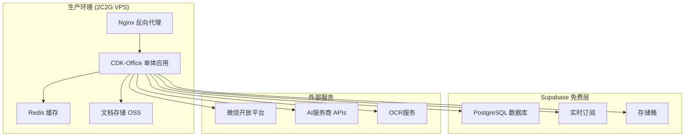

### 4.2 Docker 容器化部署

```dockerfile
# Dockerfile
FROM golang:1.24-alpine AS builder

WORKDIR /app
COPY go.mod go.sum ./
RUN go mod download

COPY . .
RUN CGO_ENABLED=0 GOOS=linux go build -o cdk-office ./main.go

FROM alpine:latest
RUN apk --no-cache add ca-certificates tzdata
WORKDIR /root/

COPY --from=builder /app/cdk-office .
COPY --from=builder /app/config.yaml .

EXPOSE 8080
CMD ["./cdk-office", "api"]
```

```yaml
# docker-compose.yml
version: '3.8'

services:
  cdk-office:
    build: .
    ports:
      - "8080:8080"
    environment:
      - DATABASE_URL=${SUPABASE_DATABASE_URL}
      - REDIS_URL=redis://redis:6379
      - JWT_SECRET=${JWT_SECRET}
      - WECHAT_APP_ID=${WECHAT_APP_ID}
      - WECHAT_APP_SECRET=${WECHAT_APP_SECRET}
    depends_on:
      - redis
    volumes:
      - ./uploads:/app/uploads
      - ./config.yaml:/app/config.yaml
    restart: unless-stopped

  redis:
    image: redis:7-alpine
    ports:
      - "6379:6379"
    volumes:
      - redis_data:/data
    restart: unless-stopped

  nginx:
    image: nginx:alpine
    ports:
      - "80:80"
      - "443:443"
    volumes:
      - ./nginx.conf:/etc/nginx/nginx.conf
      - ./ssl:/etc/nginx/ssl
    depends_on:
      - cdk-office
    restart: unless-stopped

volumes:
  redis_data:
```

### 4.3 配置管理

```yaml
# config.yaml - 基于CDK项目配置结构
server:
  port: 8080
  mode: production
  
database:
  type: postgresql
  host: ${SUPABASE_HOST}
  port: 5432
  user: ${SUPABASE_USER}
  password: ${SUPABASE_PASSWORD}
  name: ${SUPABASE_DATABASE}
  sslmode: require
  
redis:
  addr: localhost:6379
  password: ""
  db: 0
  
jwt:
  secret: ${JWT_SECRET}
  expire: 24h
  
wechat:
  app_id: ${WECHAT_APP_ID}
  app_secret: ${WECHAT_APP_SECRET}
  redirect_url: ${WECHAT_REDIRECT_URL}
  
ai:
  providers:
    openai:
      api_key: ${OPENAI_API_KEY}
      model: gpt-3.5-turbo
    gemini:
      api_key: ${GEMINI_API_KEY}
      model: gemini-pro
  default_provider: openai
  
storage:
  type: oss  # local, oss, cos
  endpoint: ${OSS_ENDPOINT}
  access_key: ${OSS_ACCESS_KEY}
  secret_key: ${OSS_SECRET_KEY}
  bucket: ${OSS_BUCKET}
  
logging:
  level: info
  format: json
  output: /var/log/cdk-office.log
```

## 5. 实施计划

### 5.1 开发阶段规划

**阶段一：基础架构搭建 (2周)**
- [ ] 复制CDK项目基础代码
- [ ] 适配单体应用架构
- [ ] 集成Supabase数据库
- [ ] 配置Redis缓存
- [ ] 基础认证系统

**阶段二：核心功能开发 (4周)**
- [ ] 微信登录集成
- [ ] 用户权限体系
- [ ] 文档管理模块
- [ ] 文档上传功能
- [ ] 基础搜索功能

**阶段三：AI功能集成 (3周)**
- [ ] AI问答模块
- [ ] 智能检索系统
- [ ] 向量数据库集成
- [ ] 多模态AI服务

**阶段四：前端界面开发 (3周)**
- [ ] 基于CDK前端界面修改
- [ ] 文档中心界面
- [ ] AI问答界面
- [ ] 微信小程序开发

**阶段五：测试与优化 (2周)**
- [ ] 功能测试
- [ ] 性能优化
- [ ] 安全测试
- [ ] 部署测试

### 5.2 技术栈检查清单

**后端开发**
- [ ] Go 1.24 环境搭建
- [ ] Gin 框架集成
- [ ] GORM ORM 配置
- [ ] Supabase 连接配置
- [ ] Redis 缓存配置
- [ ] JWT 认证实现
- [ ] 微信 OAuth 集成
- [ ] AI 服务商 API 集成
- [ ] 文件上传处理
- [ ] 向量数据库集成

**前端开发**
- [ ] Next.js 15 项目搭建
- [ ] TypeScript 配置
- [ ] Tailwind CSS 4 配置
- [ ] Shadcn UI 组件库
- [ ] 微信小程序开发环境
- [ ] API 接口对接
- [ ] 文档上传组件
- [ ] AI 问答界面
- [ ] 响应式设计
- [ ] PWA 功能支持

**部署运维**
- [ ] Docker 容器化
- [ ] Nginx 反向代理配置
- [ ] SSL 证书配置
- [ ] 监控告警系统
- [ ] 日志收集系统
- [ ] 备份恢复方案
- [ ] 性能监控
- [ ] 安全加固

### 5.3 风险控制

**技术风险**
- CDK项目代码适配复杂度
- AI服务稳定性和成本控制
- 向量数据库性能优化
- 微信生态集成限制

**解决方案**
- 分阶段迁移，确保每个模块独立可测试
- 多AI服务商备份，实现降级策略
- 缓存优化，减少向量计算频次
- 完善微信登录异常处理机制

**部署风险**
- 单点故障风险
- 数据库连接数限制
- 存储空间不足
- 外部服务依赖

**解决方案**
- 实现健康检查和自动重启
- 连接池配置优化
- 定期清理和存储监控
- 外部服务降级方案

---

## 总结

CDK-Office 企业内容管理平台采用"大道至简"的设计理念，在继承 CDK 项目完整技术栈的基础上，专注于文档管理、智能检索、AI问答三大核心能力。通过单体应用架构确保系统简洁高效，通过微信生态集成提升用户体验，通过AI技术增强提升办公效率。

整个系统设计充分考虑了企业内部使用场景的特殊需求，在保持技术先进性的同时，确保了部署的简便性和运维的可控性。预计总开发周期14周，可以满足中小企业快速上线和规模化应用的需求。
    if cached := s.getCachedResult(query, teamID); cached != nil {
        return cached, nil
    }
    
    // 2. 并行执行关键词搜索和语义搜索
    var keywordResults, semanticResults []DocumentResult
    var wg sync.WaitGroup
    
    wg.Add(2)
    go func() {
        defer wg.Done()
        keywordResults, _ = s.keywordSearch(query, teamID, userID)
    }()
    
    go func() {
        defer wg.Done()
        semanticResults, _ = s.semanticSearch(query, teamID, userID)
    }()
    
    wg.Wait()
    
    // 3. 结果融合和排序
    mergedResults := s.mergeAndRankResults(keywordResults, semanticResults)
    
    // 4. 构建返回结果
    result := &SearchResult{
        Documents:   mergedResults,
        Total:       len(mergedResults),
        SearchTime:  time.Since(startTime),
        SearchType:  "hybrid",
        Suggestions: s.generateSuggestions(query),
    }
    
    // 5. 缓存结果
    s.cacheSearchResult(query, teamID, result)
    
    // 6. 记录搜索日志
    s.logSearch(userID, query, len(mergedResults))
    
    return result, nil
}

// 语义搜索
func (s *SearchService) semanticSearch(query string, teamID, userID UUID) ([]DocumentResult, error) {
    // 1. 生成查询向量
    queryEmbedding, err := s.generateQueryEmbedding(query)
    if err != nil {
        return nil, err
    }
    
    // 2. 向量相似度搜索
    similarDocs, err := s.vectorDB.Search(queryEmbedding, teamID, 50)
    if err != nil {
        return nil, err
    }
    
    // 3. 权限过滤
    accessibleDocs := s.filterByPermissions(similarDocs, userID, teamID)
    
    // 4. 转换为搜索结果
    var results []DocumentResult
    for _, doc := range accessibleDocs {
        results = append(results, DocumentResult{
            Document:   doc.Document,
            Score:      doc.Similarity,
            Highlights: s.extractSemanticHighlights(doc, query),
            Reason:     "语义相似",
        })
    }
    
    return results, nil
}
```eLog).Error; err != nil {
        return err
    }
    
    // 5. 标记为待删除
    field.Status = "pending_delete"
    if err := s.db.Save(field).Error; err != nil {
        return err
    }
    
    // 6. 提交审批
    return s.approval.SubmitDictionaryApproval(userID, fieldID, "delete", "删除数据字典字段")
}

// 超级管理员审批数据字典变更
func (s *DataDictionaryService) ApproveDictionaryChange(changeLogID, approverID UUID, decision, comment string) error {
    // 1. 验证超级管理员权限
    if !s.isSuperAdmin(approverID) {
        return errors.New("只有超级管理员可以审批数据字典变更")
    }
    
    // 2. 获取变更记录
    changeLog := &DictionaryChangeLog{}
    if err := s.db.First(changeLog, changeLogID).Error; err != nil {
        return err
    }
    
    // 3. 更新审批状态
    now := time.Now()
    changeLog.ApprovalStatus = decision
    changeLog.ApprovedBy = approverID
    changeLog.ApprovalComment = comment
    changeLog.ApprovedAt = &now
    
    if err := s.db.Save(changeLog).Error; err != nil {
        return err
    }
    
    // 4. 如果审批通过，应用变更
    if decision == "approved" {
        return s.applyDictionaryChange(changeLog)
    }
    
    // 5. 如果拒绝，恢复状态
    return s.revertDictionaryChange(changeLog)
}

// 应用数据字典变更
func (s *DataDictionaryService) applyDictionaryChange(changeLog *DictionaryChangeLog) error {
    switch changeLog.ChangeType {
    case "create":
        // 激活新创建的字段
        return s.db.Model(&DataDictionary{}).Where("id = ?", changeLog.DictionaryID).
            Update("status", "active").Error
            
    case "update":
        // 应用字段更新
        var newField DataDictionary
        if err := json.Unmarshal([]byte(changeLog.NewValue), &newField); err != nil {
            return err
        }
        return s.db.Save(&newField).Error
        
    case "delete":
        // 软删除字段
        return s.db.Model(&DataDictionary{}).Where("id = ?", changeLog.DictionaryID).
            Update("is_active", false).Error
    }
    
    return nil
}
```

### 3.4 权限管理系统

#### 3.4.1 超级管理员权限体系

**页面信息设置**：
```go
type SystemPageConfig struct {
    ID          UUID      `json:"id" gorm:"type:uuid;primary_key;default:gen_random_uuid()"`
    SiteName    string    `json:"site_name" gorm:"size:100;default:'CDK-Office'"`
    SiteTitle   string    `json:"site_title" gorm:"size:200"`
    SiteDescription string `json:"site_description" gorm:"size:500"`
    SiteLogo    string    `json:"site_logo" gorm:"size:255"` // Logo URL
    SiteFavicon string    `json:"site_favicon" gorm:"size:255"` // Favicon URL
    
    // 法律信息
    CompanyName   string `json:"company_name" gorm:"size:200"`
    ICPNumber     string `json:"icp_number" gorm:"size:50"` // 备案号
    PoliceNumber  string `json:"police_number" gorm:"size:50"` // 公安备案号
    CopyrightText string `json:"copyright_text" gorm:"size:300"`
    
    // 联系信息
    ContactEmail  string `json:"contact_email" gorm:"size:100"`
    ContactPhone  string `json:"contact_phone" gorm:"size:50"`
    ContactAddress string `json:"contact_address" gorm:"size:300"`
    
    // 页面自定义
    CustomCSS     string `json:"custom_css" gorm:"type:text"`
    CustomJS      string `json:"custom_js" gorm:"type:text"`
    LoginBgImage  string `json:"login_bg_image" gorm:"size:255"`
    LoginWelcome  string `json:"login_welcome" gorm:"size:500"`
    
    UpdatedBy UUID      `json:"updated_by" gorm:"type:uuid"`
    UpdatedAt time.Time `json:"updated_at" gorm:"autoUpdateTime"`
}

// 页面信息设置接口
type PageConfigService struct {
    db *gorm.DB
}

func (s *PageConfigService) UpdatePageConfig(adminID UUID, config *SystemPageConfig) error {
    // 验证超级管理员权限
    if !s.isSuperAdmin(adminID) {
        return errors.New("只有超级管理员可以修改页面配置")
    }
    
    config.UpdatedBy = adminID
    
    // 更新或创建配置
    var existingConfig SystemPageConfig
    if err := s.db.First(&existingConfig).Error; err != nil {
        if errors.Is(err, gorm.ErrRecordNotFound) {
            return s.db.Create(config).Error
        }
        return err
    }
    
    config.ID = existingConfig.ID
    return s.db.Save(config).Error
}
```

**系统设置 - AI/OCR服务配置**：
```go
type AIServiceConfig struct {
    ID            UUID      `json:"id" gorm:"type:uuid;primary_key;default:gen_random_uuid()"`
    ServiceName   string    `json:"service_name" gorm:"size:100"` // 服务商名称
    ServiceType   string    `json:"service_type"` // ocr, ai_chat, ai_translate, ai_summary
    Provider      string    `json:"provider"` // baidu, tencent, aliyun, openai, custom
    
    // 配置信息
    APIEndpoint   string    `json:"api_endpoint" gorm:"size:255"`
    APIKey        string    `json:"api_key" gorm:"size:255"`
    SecretKey     string    `json:"secret_key" gorm:"size:255"`
    AppID         string    `json:"app_id" gorm:"size:100"`
    Region        string    `json:"region" gorm:"size:50"`
    
    // 高级配置
    MaxRetries    int       `json:"max_retries" gorm:"default:3"`
    Timeout       int       `json:"timeout" gorm:"default:30"` // 秒
    RateLimit     int       `json:"rate_limit" gorm:"default:100"` // 每分钟请求数
    
    // 自定义配置
    CustomHeaders string    `json:"custom_headers" gorm:"type:text"` // JSON格式
    CustomParams  string    `json:"custom_params" gorm:"type:text"`  // JSON格式
    
    IsEnabled     bool      `json:"is_enabled" gorm:"default:true"`
    IsDefault     bool      `json:"is_default" gorm:"default:false"`
    Priority      int       `json:"priority" gorm:"default:0"` // 优先级
    
    CreatedBy     UUID      `json:"created_by" gorm:"type:uuid"`
    UpdatedBy     UUID      `json:"updated_by" gorm:"type:uuid"`
    CreatedAt     time.Time `json:"created_at" gorm:"autoCreateTime"`
    UpdatedAt     time.Time `json:"updated_at" gorm:"autoUpdateTime"`
}

// 预设服务商配置
type PresetServiceProviders struct {
    OCRProviders []ProviderTemplate `json:"ocr_providers"`
    AIProviders  []ProviderTemplate `json:"ai_providers"`
}

type ProviderTemplate struct {
    Name        string            `json:"name"`
    Provider    string            `json:"provider"`
    DisplayName string            `json:"display_name"`
    Logo        string            `json:"logo"`
    Description string            `json:"description"`
    ConfigTemplate map[string]interface{} `json:"config_template"`
    RequiredFields []string       `json:"required_fields"`
    SupportedTypes []string       `json:"supported_types"`
}

// 获取预设服务商配置
func GetPresetProviders() *PresetServiceProviders {
    return &PresetServiceProviders{
        OCRProviders: []ProviderTemplate{
            {
                Name:        "baidu_ocr",
                Provider:    "baidu",
                DisplayName: "百度OCR",
                Logo:        "/assets/providers/baidu-logo.png",
                Description: "百度智能云文字识别服务",
                ConfigTemplate: map[string]interface{}{
                    "api_endpoint": "https://aip.baidubce.com/rest/2.0/ocr/v1/general_basic",
                    "auth_endpoint": "https://aip.baidubce.com/oauth/2.0/token",
                },
                RequiredFields: []string{"api_key", "secret_key"},
                SupportedTypes: []string{"general", "accurate", "handwriting", "numbers"},
            },
            {
                Name:        "tencent_ocr",
                Provider:    "tencent",
                DisplayName: "腾讯云OCR",
                Logo:        "/assets/providers/tencent-logo.png",
                Description: "腾讯云文字识别服务",
                ConfigTemplate: map[string]interface{}{
                    "api_endpoint": "https://ocr.tencentcloudapi.com",
                },
                RequiredFields: []string{"secret_id", "secret_key", "region"},
                SupportedTypes: []string{"general", "accurate", "handwriting", "id_card", "business_card"},
            },
            {
                Name:        "aliyun_ocr",
                Provider:    "aliyun",
                DisplayName: "阿里云OCR",
                Logo:        "/assets/providers/aliyun-logo.png",
                Description: "阿里云文字识别服务",
                ConfigTemplate: map[string]interface{}{
                    "api_endpoint": "https://ocr-api.cn-hangzhou.aliyuncs.com",
                },
                RequiredFields: []string{"access_key_id", "access_key_secret", "region"},
                SupportedTypes: []string{"general", "scene", "vehicle", "face"},
            },
        },
        AIProviders: []ProviderTemplate{
            {
                Name:        "baidu_ai",
                Provider:    "baidu",
                DisplayName: "百度千帆",
                Logo:        "/assets/providers/baidu-logo.png",
                Description: "百度千帆大模型平台",
                ConfigTemplate: map[string]interface{}{
                    "api_endpoint": "https://aip.baidubce.com/rpc/2.0/ai_custom/v1/wenxinworkshop/chat/completions",
                },
                RequiredFields: []string{"api_key", "secret_key"},
                SupportedTypes: []string{"chat", "embedding", "completion"},
            },
            {
                Name:        "tencent_hunyuan",
                Provider:    "tencent",
                DisplayName: "腾讯混元",
                Logo:        "/assets/providers/tencent-logo.png",
                Description: "腾讯混元大模型",
                ConfigTemplate: map[string]interface{}{
                    "api_endpoint": "https://hunyuan.tencentcloudapi.com",
                },
                RequiredFields: []string{"secret_id", "secret_key", "region"},
                SupportedTypes: []string{"chat", "image_generation"},
            },
            {
                Name:        "aliyun_tongyi",
                Provider:    "aliyun",
                DisplayName: "阿里通义千问",
                Logo:        "/assets/providers/aliyun-logo.png",
                Description: "阿里云通义千问大模型",
                ConfigTemplate: map[string]interface{}{
                    "api_endpoint": "https://dashscope.aliyuncs.com/api/v1/services/aigc/text-generation/generation",
                },
                RequiredFields: []string{"api_key"},
                SupportedTypes: []string{"chat", "completion", "embedding"},
            },
            {
                Name:        "openai",
                Provider:    "openai",
                DisplayName: "OpenAI",
                Logo:        "/assets/providers/openai-logo.png",
                Description: "OpenAI GPT模型",
                ConfigTemplate: map[string]interface{}{
                    "api_endpoint": "https://api.openai.com/v1/chat/completions",
                },
                RequiredFields: []string{"api_key"},
                SupportedTypes: []string{"chat", "completion", "embedding", "image"},
            },
        },
    }
}

// AI服务配置管理
type AIServiceManager struct {
    db     *gorm.DB
    config map[string]*AIServiceConfig
}

func (m *AIServiceManager) CreateServiceConfig(adminID UUID, config *AIServiceConfig) error {
    if !m.isSuperAdmin(adminID) {
        return errors.New("只有超级管理员可以配置AI服务")
    }
    
    config.CreatedBy = adminID
    config.UpdatedBy = adminID
    
    // 如果设置为默认，取消其他同类型服务的默认状态
    if config.IsDefault {
        m.db.Model(&AIServiceConfig{}).Where("service_type = ? AND is_default = true", config.ServiceType).
            Update("is_default", false)
    }
    
    return m.db.Create(config).Error
}

func (m *AIServiceManager) TestServiceConnection(adminID UUID, configID UUID) error {
    if !m.isSuperAdmin(adminID) {
        return errors.New("权限不足")
    }
    
    config := &AIServiceConfig{}
    if err := m.db.First(config, configID).Error; err != nil {
        return err
    }
    
    // 根据服务类型测试连接
    switch config.ServiceType {
    case "ocr":
        return m.testOCRService(config)
    case "ai_chat":
        return m.testAIService(config)
    default:
        return errors.New("不支持的服务类型")
    }
}
```

**团队配置管理**：
```go
type TeamConfiguration struct {
    ID       UUID `json:"id" gorm:"type:uuid;primary_key;default:gen_random_uuid()"`
    TeamID   UUID `json:"team_id" gorm:"type:uuid;unique;not null"`
    
    // 基本信息
    TeamName        string `json:"team_name" gorm:"size:100"`
    TeamDescription string `json:"team_description" gorm:"size:500"`
    TeamLogo        string `json:"team_logo" gorm:"size:255"`
    MaxMembers      int    `json:"max_members" gorm:"default:50"`
    
    // 默认密码配置
    DefaultPassword struct {
        Enabled       bool      `json:"enabled" gorm:"default:false"`
        Password      string    `json:"password" gorm:"size:255"`
        SetBy         UUID      `json:"set_by" gorm:"type:uuid"`
        SetAt         time.Time `json:"set_at"`
        LastModified  time.Time `json:"last_modified"`
        ForceChange   bool      `json:"force_change" gorm:"default:true"` // 协作用户是否必须修改
        ValidDays     int       `json:"valid_days" gorm:"default:30"`     // 默认密码有效期
    } `json:"default_password" gorm:"embedded;embeddedPrefix:default_pwd_"`
    
    // 权限配置
    PermissionSettings struct {
        AllowSelfRegister     bool `json:"allow_self_register" gorm:"default:false"`
        RequireApproval       bool `json:"require_approval" gorm:"default:true"`
        EnableGuestAccess     bool `json:"enable_guest_access" gorm:"default:false"`
        MaxUploadSize         int64 `json:"max_upload_size" gorm:"default:52428800"` // 50MB
        AllowedFileTypes      []string `json:"allowed_file_types" gorm:"type:text[]"`
        RetentionDays         int  `json:"retention_days" gorm:"default:365"`
    } `json:"permission_settings" gorm:"embedded;embeddedPrefix:perm_"`
    
    // 通知配置
    NotificationSettings struct {
        EmailEnabled      bool     `json:"email_enabled" gorm:"default:true"`
        WechatEnabled     bool     `json:"wechat_enabled" gorm:"default:true"`
        SMSEnabled        bool     `json:"sms_enabled" gorm:"default:false"`
        NotifyEvents      []string `json:"notify_events" gorm:"type:text[]"` // approval, upload, share, etc.
        QuietHours        string   `json:"quiet_hours"` // JSON格式的免打扰时间设置
    } `json:"notification_settings" gorm:"embedded;embeddedPrefix:notify_"`
    
    // 审批配置
    ApprovalSettings struct {
        AutoApprovalRules []string `json:"auto_approval_rules" gorm:"type:text[]"`
        RequireComment    bool     `json:"require_comment" gorm:"default:false"`
        TimeoutHours      int      `json:"timeout_hours" gorm:"default:72"`
        EscalationEnabled bool     `json:"escalation_enabled" gorm:"default:false"`
        EscalationHours   int      `json:"escalation_hours" gorm:"default:24"`
    } `json:"approval_settings" gorm:"embedded;embeddedPrefix:approval_"`
    
    CreatedBy UUID      `json:"created_by" gorm:"type:uuid"`
    UpdatedBy UUID      `json:"updated_by" gorm:"type:uuid"`
    CreatedAt time.Time `json:"created_at" gorm:"autoCreateTime"`
    UpdatedAt time.Time `json:"updated_at" gorm:"autoUpdateTime"`
}

// 超级管理员团队配置管理
type SuperAdminTeamService struct {
    db *gorm.DB
}

func (s *SuperAdminTeamService) CreateTeam(adminID UUID, teamConfig *TeamConfiguration) error {
    if !s.isSuperAdmin(adminID) {
        return errors.New("只有超级管理员可以创建团队")
    }
    
    teamConfig.CreatedBy = adminID
    teamConfig.UpdatedBy = adminID
    
    // 创建团队记录
    team := &Team{
        Name:        teamConfig.TeamName,
        Description: teamConfig.TeamDescription,
        Logo:        teamConfig.TeamLogo,
        Status:      "active",
        CreatedBy:   adminID,
    }
    
    tx := s.db.Begin()
    
    if err := tx.Create(team).Error; err != nil {
        tx.Rollback()
        return err
    }
    
    teamConfig.TeamID = team.ID
    if err := tx.Create(teamConfig).Error; err != nil {
        tx.Rollback()
        return err
    }
    
    return tx.Commit().Error
}

func (s *SuperAdminTeamService) UpdateTeamConfig(adminID UUID, teamID UUID, updates map[string]interface{}) error {
    if !s.isSuperAdmin(adminID) {
        return errors.New("只有超级管理员可以修改团队配置")
    }
    
    config := &TeamConfiguration{}
    if err := s.db.Where("team_id = ?", teamID).First(config).Error; err != nil {
        return err
    }
    
    updates["updated_by"] = adminID
    
    return s.db.Model(config).Updates(updates).Error
}

func (s *SuperAdminTeamService) AssignTeamManager(adminID UUID, teamID UUID, userID UUID) error {
    if !s.isSuperAdmin(adminID) {
        return errors.New("只有超级管理员可以指定团队管理员")
    }
    
    // 更新用户角色
    user := &User{}
    if err := s.db.First(user, userID).Error; err != nil {
        return err
    }
    
    user.Role = "team_manager"
    user.TeamID = teamID
    
    if err := s.db.Save(user).Error; err != nil {
        return err
    }
    
    // 记录操作日志
    log := &AdminOperationLog{
        AdminID:     adminID,
        Operation:   "assign_team_manager",
        TargetType:  "user",
        TargetID:    userID,
        Description: fmt.Sprintf("指定用户 %s 为团队 %s 的管理员", user.Nickname, teamID),
    }
    
    return s.db.Create(log).Error
}

#### 3.4.2 团队管理员权限优化

**默认团队密码管理**：
```go
type TeamPasswordManager struct {
    db *gorm.DB
}

// 设置默认密码
func (m *TeamPasswordManager) SetDefaultPassword(managerID UUID, teamID UUID, password string, settings PasswordSettings) error {
    // 验证团队管理员权限
    if !m.isTeamManager(managerID, teamID) {
        return errors.New("只有团队管理员可以设置默认密码")
    }
    
    // 加密密码
    hashedPassword, err := m.hashPassword(password)
    if err != nil {
        return err
    }
    
    // 更新团队配置
    config := &TeamConfiguration{}
    if err := m.db.Where("team_id = ?", teamID).First(config).Error; err != nil {
        return err
    }
    
    config.DefaultPassword.Enabled = true
    config.DefaultPassword.Password = hashedPassword
    config.DefaultPassword.SetBy = managerID
    config.DefaultPassword.SetAt = time.Now()
    config.DefaultPassword.LastModified = time.Now()
    config.DefaultPassword.ForceChange = settings.ForceChange
    config.DefaultPassword.ValidDays = settings.ValidDays
    config.UpdatedBy = managerID
    
    if err := m.db.Save(config).Error; err != nil {
        return err
    }
    
    // 记录操作日志
    log := &TeamOperationLog{
        TeamID:      teamID,
        OperatorID:  managerID,
        Operation:   "set_default_password",
        Description: "设置团队默认密码",
    }
    m.db.Create(log)
    
    // 通知所有团队成员
    members := m.getTeamMembers(teamID)
    for _, member := range members {
        if member.Role == "normal" || member.Role == "collaborator" {
            notification := &Notification{
                UserID:  member.ID,
                Type:    "system",
                Title:   "团队默认密码更新",
                Content: "您的团队管理员已更新默认密码，请及时更新您的登录信息",
            }
            m.notificationService.Send(notification)
        }
    }
    
    return nil
}

type PasswordSettings struct {
    ForceChange bool `json:"force_change"` // 是否强制修改
    ValidDays   int  `json:"valid_days"`   // 有效天数
}

// 修改默认密码
func (m *TeamPasswordManager) UpdateDefaultPassword(managerID UUID, teamID UUID, newPassword string) error {
    if !m.isTeamManager(managerID, teamID) {
        return errors.New("无权限修改默认密码")
    }
    
    config := &TeamConfiguration{}
    if err := m.db.Where("team_id = ?", teamID).First(config).Error; err != nil {
        return err
    }
    
    if !config.DefaultPassword.Enabled {
        return errors.New("团队默认密码未启用")
    }
    
    hashedPassword, err := m.hashPassword(newPassword)
    if err != nil {
        return err
    }
    
    // 保存历史密码
    history := &PasswordHistory{
        TeamID:      teamID,
        OldPassword: config.DefaultPassword.Password,
        NewPassword: hashedPassword,
        ChangedBy:   managerID,
        ChangedAt:   time.Now(),
    }
    m.db.Create(history)
    
    // 更新密码
    config.DefaultPassword.Password = hashedPassword
    config.DefaultPassword.LastModified = time.Now()
    config.UpdatedBy = managerID
    
    return m.db.Save(config).Error
}

// 禁用默认密码
func (m *TeamPasswordManager) DisableDefaultPassword(managerID UUID, teamID UUID) error {
    if !m.isTeamManager(managerID, teamID) {
        return errors.New("无权限禁用默认密码")
    }
    
    config := &TeamConfiguration{}
    if err := m.db.Where("team_id = ?", teamID).First(config).Error; err != nil {
        return err
    }
    
    config.DefaultPassword.Enabled = false
    config.UpdatedBy = managerID
    
    return m.db.Save(config).Error
}
```

**协作用户管理及权限分配**：
```go
type CollaboratorManager struct {
    db *gorm.DB
}

// 协作用户组管理
type CollaboratorGroup struct {
    ID          UUID      `json:"id" gorm:"type:uuid;primary_key;default:gen_random_uuid()"`
    TeamID      UUID      `json:"team_id" gorm:"type:uuid;not null"`
    GroupName   string    `json:"group_name" gorm:"size:100;not null"`
    Description string    `json:"description" gorm:"size:500"`
    
    // 模块权限
    Permissions struct {
        // 文档中心权限
        Documents struct {
            CanView     bool     `json:"can_view" gorm:"default:true"`
            CanUpload   bool     `json:"can_upload" gorm:"default:false"`
            CanEdit     bool     `json:"can_edit" gorm:"default:false"`
            CanDelete   bool     `json:"can_delete" gorm:"default:false"`
            CanShare    bool     `json:"can_share" gorm:"default:false"`
            CanApprove  bool     `json:"can_approve" gorm:"default:false"`
            Categories  []string `json:"categories" gorm:"type:text[]"` // 可访问的文档分类
        } `json:"documents" gorm:"embedded;embeddedPrefix:doc_"`
        
        // 用户管理权限
        Users struct {
            CanView      bool `json:"can_view" gorm:"default:false"`
            CanAdd       bool `json:"can_add" gorm:"default:false"`
            CanEdit      bool `json:"can_edit" gorm:"default:false"`
            CanDeactivate bool `json:"can_deactivate" gorm:"default:false"`
            CanAssignRole bool `json:"can_assign_role" gorm:"default:false"`
        } `json:"users" gorm:"embedded;embeddedPrefix:user_"`
        
        // 应用中心权限
        Applications struct {
            CanView    bool     `json:"can_view" gorm:"default:true"`
            CanManage  bool     `json:"can_manage" gorm:"default:false"`
            CanInstall bool     `json:"can_install" gorm:"default:false"`
            AllowedApps []string `json:"allowed_apps" gorm:"type:text[]"` // 允许使用的应用ID
        } `json:"applications" gorm:"embedded;embeddedPrefix:app_"`
        
        // 二维码应用权限
        QRCode struct {
            CanView   bool     `json:"can_view" gorm:"default:false"`
            CanCreate bool     `json:"can_create" gorm:"default:false"`
            CanEdit   bool     `json:"can_edit" gorm:"default:false"`
            CanShare  bool     `json:"can_share" gorm:"default:false"`
            AllowedTypes []string `json:"allowed_types" gorm:"type:text[]"` // 允许的二维码类型
        } `json:"qrcode" gorm:"embedded;embeddedPrefix:qr_"`
        
        // 业务中心权限
        Business struct {
            CanView     bool     `json:"can_view" gorm:"default:false"`
            CanOperate  bool     `json:"can_operate" gorm:"default:false"`
            CanApprove  bool     `json:"can_approve" gorm:"default:false"`
            Modules     []string `json:"modules" gorm:"type:text[]"` // 允许访问的业务模块
        } `json:"business" gorm:"embedded;embeddedPrefix:biz_"`
        
        // 系统管理权限
        System struct {
            CanViewLogs    bool `json:"can_view_logs" gorm:"default:false"`
            CanViewStats   bool `json:"can_view_stats" gorm:"default:false"`
            CanManageDict  bool `json:"can_manage_dict" gorm:"default:false"`
            CanViewAudit   bool `json:"can_view_audit" gorm:"default:false"`
        } `json:"system" gorm:"embedded;embeddedPrefix:sys_"`
    } `json:"permissions" gorm:"embedded"`
    
    IsActive  bool      `json:"is_active" gorm:"default:true"`
    CreatedBy UUID      `json:"created_by" gorm:"type:uuid"`
    UpdatedBy UUID      `json:"updated_by" gorm:"type:uuid"`
    CreatedAt time.Time `json:"created_at" gorm:"autoCreateTime"`
    UpdatedAt time.Time `json:"updated_at" gorm:"autoUpdateTime"`
}

// 用户组成员关联
type GroupMembership struct {
    ID      UUID `json:"id" gorm:"type:uuid;primary_key;default:gen_random_uuid()"`
    GroupID UUID `json:"group_id" gorm:"type:uuid;not null"`
    UserID  UUID `json:"user_id" gorm:"type:uuid;not null"`
    
    AssignedBy UUID      `json:"assigned_by" gorm:"type:uuid"`
    AssignedAt time.Time `json:"assigned_at" gorm:"autoCreateTime"`
    
    // 唯一约束
    Group *CollaboratorGroup `json:"group" gorm:"foreignKey:GroupID"`
    User  *User              `json:"user" gorm:"foreignKey:UserID"`
}

// 创建协作用户组
func (m *CollaboratorManager) CreateGroup(managerID UUID, teamID UUID, group *CollaboratorGroup) error {
    if !m.isTeamManager(managerID, teamID) {
        return errors.New("只有团队管理员可以创建协作用户组")
    }
    
    group.TeamID = teamID
    group.CreatedBy = managerID
    group.UpdatedBy = managerID
    
    return m.db.Create(group).Error
}

// 修改组权限
func (m *CollaboratorManager) UpdateGroupPermissions(managerID UUID, groupID UUID, permissions map[string]interface{}) error {
    group := &CollaboratorGroup{}
    if err := m.db.First(group, groupID).Error; err != nil {
        return err
    }
    
    if !m.isTeamManager(managerID, group.TeamID) {
        return errors.New("无权限修改此组权限")
    }
    
    permissions["updated_by"] = managerID
    
    if err := m.db.Model(group).Updates(permissions).Error; err != nil {
        return err
    }
    
    // 记录权限变更日志
    log := &PermissionChangeLog{
        GroupID:     groupID,
        ChangedBy:   managerID,
        ChangeType:  "update_permissions",
        OldValue:    m.serializePermissions(&group.Permissions),
        NewValue:    m.mergePermissions(&group.Permissions, permissions),
        Description: fmt.Sprintf("修改协作组 %s 的权限设置", group.GroupName),
    }
    m.db.Create(log)
    
    return nil
}

// 添加用户到组
func (m *CollaboratorManager) AddUserToGroup(managerID UUID, groupID UUID, userID UUID) error {
    group := &CollaboratorGroup{}
    if err := m.db.First(group, groupID).Error; err != nil {
        return err
    }
    
    if !m.isTeamManager(managerID, group.TeamID) {
        return errors.New("无权限添加用户到此组")
    }
    
    // 检查用户是否已在组中
    var count int64
    m.db.Model(&GroupMembership{}).Where("group_id = ? AND user_id = ?", groupID, userID).Count(&count)
    if count > 0 {
        return errors.New("用户已在此组中")
    }
    
    membership := &GroupMembership{
        GroupID:    groupID,
        UserID:     userID,
        AssignedBy: managerID,
    }
    
    if err := m.db.Create(membership).Error; err != nil {
        return err
    }
    
    // 更新用户角色为协作用户
    user := &User{}
    m.db.First(user, userID)
    if user.Role == "normal" {
        user.Role = "collaborator"
        m.db.Save(user)
    }
    
    // 发送通知
    notification := &Notification{
        UserID:  userID,
        Type:    "system",
        Title:   "权限更新",
        Content: fmt.Sprintf("您已被添加到协作组 \"%s\"，获得了新的操作权限", group.GroupName),
    }
    m.notificationService.Send(notification)
    
    return nil
}

// 移除用户从组
func (m *CollaboratorManager) RemoveUserFromGroup(managerID UUID, groupID UUID, userID UUID) error {
    group := &CollaboratorGroup{}
    if err := m.db.First(group, groupID).Error; err != nil {
        return err
    }
    
    if !m.isTeamManager(managerID, group.TeamID) {
        return errors.New("无权限从此组移除用户")
    }
    
    // 移除成员资格
    if err := m.db.Where("group_id = ? AND user_id = ?", groupID, userID).Delete(&GroupMembership{}).Error; err != nil {
        return err
    }
    
    // 检查用户是否还在其他组中
    var count int64
    m.db.Model(&GroupMembership{}).Where("user_id = ?", userID).Count(&count)
    
    // 如果不在任何协作组中，降级为普通用户
    if count == 0 {
        user := &User{}
        m.db.First(user, userID)
        if user.Role == "collaborator" {
            user.Role = "normal"
            m.db.Save(user)
        }
    }
    
    return nil
}

// 获取用户的所有权限
func (m *CollaboratorManager) GetUserPermissions(userID UUID) (*AggregatedPermissions, error) {
    user := &User{}
    if err := m.db.First(user, userID).Error; err != nil {
        return nil, err
    }
    
    // 基础权限
    basePerms := m.getBasePermissions(user.Role)
    
    // 如果是协作用户，聚合所有组权限
    if user.Role == "collaborator" {
        groups := []*CollaboratorGroup{}
        m.db.Joins("JOIN group_memberships ON group_memberships.group_id = collaborator_groups.id").
            Where("group_memberships.user_id = ? AND collaborator_groups.is_active = true", userID).
            Find(&groups)
        
        for _, group := range groups {
            basePerms = m.mergePermissions(basePerms, &group.Permissions)
        }
    }
    
    return basePerms, nil
}

type AggregatedPermissions struct {
    Documents    DocumentPermissions    `json:"documents"`
    Users        UserPermissions        `json:"users"`
    Applications ApplicationPermissions `json:"applications"`
    QRCode       QRCodePermissions      `json:"qrcode"`
    Business     BusinessPermissions    `json:"business"`
    System       SystemPermissions      `json:"system"`
}
```

#### 3.4.3 管理后台界面设计

**超级管理员后台界面**：

```typescript
// 页面信息设置组件
const PageConfigPanel: React.FC = () => {
  const [config, setConfig] = useState<SystemPageConfig>();
  const [uploading, setUploading] = useState(false);
  
  const handleLogoUpload = async (file: File) => {
    setUploading(true);
    try {
      const logoUrl = await uploadFile(file, 'logos');
      setConfig(prev => ({ ...prev, site_logo: logoUrl }));
    } catch (error) {
      toast.error('上传失败');
    } finally {
      setUploading(false);
    }
  };
  
  return (
    <Card className="p-6">
      <CardHeader>
        <CardTitle className="flex items-center gap-2">
          <Settings className="h-5 w-5" />
          页面信息配置
        </CardTitle>
      </CardHeader>
      
      <CardContent className="space-y-6">
        {/* 基本信息 */}
        <div className="grid grid-cols-2 gap-4">
          <div>
            <Label htmlFor="siteName">站点名称</Label>
            <Input
              id="siteName"
              value={config?.site_name || ''}
              onChange={(e) => setConfig(prev => ({ ...prev, site_name: e.target.value }))}
            />
          </div>
          <div>
            <Label htmlFor="siteTitle">站点标题</Label>
            <Input
              id="siteTitle"
              value={config?.site_title || ''}
              onChange={(e) => setConfig(prev => ({ ...prev, site_title: e.target.value }))}
            />
          </div>
        </div>
        
        {/* Logo上传 */}
        <div>
          <Label>站点Logo</Label>
          <div className="flex items-center gap-4">
            {config?.site_logo && (
              
            )}
            <LogoUploader onUpload={handleLogoUpload} loading={uploading} />
          </div>
        </div>
        
        {/* 法律信息 */}
        <Separator />
        <div className="grid grid-cols-2 gap-4">
          <div>
            <Label htmlFor="icpNumber">ICP备案号</Label>
            <Input
              id="icpNumber"
              placeholder="如：京ICP备12345678号"
              value={config?.icp_number || ''}
              onChange={(e) => setConfig(prev => ({ ...prev, icp_number: e.target.value }))}
            />
          </div>
          <div>
            <Label htmlFor="policeNumber">公安备案号</Label>
            <Input
              id="policeNumber"
              placeholder="如：京公网11010802012345号"
              value={config?.police_number || ''}
              onChange={(e) => setConfig(prev => ({ ...prev, police_number: e.target.value }))}
            />
          </div>
        </div>
        
        {/* 联系信息 */}
        <Separator />
        <div className="grid grid-cols-3 gap-4">
          <div>
            <Label htmlFor="contactEmail">联系邮箱</Label>
            <Input
              id="contactEmail"
              type="email"
              value={config?.contact_email || ''}
              onChange={(e) => setConfig(prev => ({ ...prev, contact_email: e.target.value }))}
            />
          </div>
          <div>
            <Label htmlFor="contactPhone">联系电话</Label>
            <Input
              id="contactPhone"
              value={config?.contact_phone || ''}
              onChange={(e) => setConfig(prev => ({ ...prev, contact_phone: e.target.value }))}
            />
          </div>
          <div>
            <Label htmlFor="contactAddress">联系地址</Label>
            <Input
              id="contactAddress"
              value={config?.contact_address || ''}
              onChange={(e) => setConfig(prev => ({ ...prev, contact_address: e.target.value }))}
            />
          </div>
        </div>
      </CardContent>
    </Card>
  );
};

// AI/OCR服务配置组件
const AIServiceConfig: React.FC = () => {
  const [services, setServices] = useState<AIServiceConfig[]>([]);
  const [selectedProvider, setSelectedProvider] = useState<string>('');
  const [showAddModal, setShowAddModal] = useState(false);
  const [presetProviders] = useState(getPresetProviders());
  
  const handleAddService = (serviceType: 'ocr' | 'ai_chat') => {
    setSelectedProvider('');
    setShowAddModal(true);
  };
  
  const handleTestConnection = async (configId: string) => {
    try {
      await testServiceConnection(configId);
      toast.success('连接测试成功');
    } catch (error) {
      toast.error('连接测试失败：' + error.message);
    }
  };
  
  return (
    <div className="space-y-6">
      {/* OCR服务配置 */}
      <Card>
        <CardHeader>
          <div className="flex items-center justify-between">
            <CardTitle className="flex items-center gap-2">
              <FileText className="h-5 w-5" />
              OCR文字识别服务
            </CardTitle>
            <Button onClick={() => handleAddService('ocr')}>
              <Plus className="h-4 w-4 mr-2" />
              添加服务
            </Button>
          </div>
        </CardHeader>
        
        <CardContent>
          <div className="grid gap-4">
            {services.filter(s => s.service_type === 'ocr').map(service => (
              <ServiceConfigCard 
                key={service.id}
                service={service}
                onTest={() => handleTestConnection(service.id)}
                onEdit={() => {}}
                onDelete={() => {}}
              />
            ))}
            
            {services.filter(s => s.service_type === 'ocr').length === 0 && (
              <div className="text-center py-8 text-gray-500">
                <FileText className="h-12 w-12 mx-auto mb-4 opacity-50" />
                <p>尚未配置 OCR 服务</p>
                <p className="text-sm">请添加至少一个 OCR 服务以启用文字识别功能</p>
              </div>
            )}
          </div>
        </CardContent>
      </Card>
      
      {/* AI服务配置 */}
      <Card>
        <CardHeader>
          <div className="flex items-center justify-between">
            <CardTitle className="flex items-center gap-2">
              <Bot className="h-5 w-5" />
              AI智能服务
            </CardTitle>
            <Button onClick={() => handleAddService('ai_chat')}>
              <Plus className="h-4 w-4 mr-2" />
              添加服务
            </Button>
          </div>
        </CardHeader>
        
        <CardContent>
          <div className="grid gap-4">
            {services.filter(s => s.service_type === 'ai_chat').map(service => (
              <ServiceConfigCard 
                key={service.id}
                service={service}
                onTest={() => handleTestConnection(service.id)}
                onEdit={() => {}}
                onDelete={() => {}}
              />
            ))}
          </div>
        </CardContent>
      </Card>
      
      {/* 添加服务弹窗 */}
      <AddServiceModal 
        isOpen={showAddModal}
        onClose={() => setShowAddModal(false)}
        presetProviders={presetProviders}
        onAdd={(config) => {
          // 添加新服务
          setServices(prev => [...prev, config]);
          setShowAddModal(false);
        }}
      />
    </div>
  );
};

// 服务配置卡片组件
const ServiceConfigCard: React.FC<{
  service: AIServiceConfig;
  onTest: () => void;
  onEdit: () => void;
  onDelete: () => void;
}> = ({ service, onTest, onEdit, onDelete }) => {
  const getProviderLogo = (provider: string) => {
    const logos = {
      baidu: '/assets/providers/baidu-logo.png',
      tencent: '/assets/providers/tencent-logo.png',
      aliyun: '/assets/providers/aliyun-logo.png',
      openai: '/assets/providers/openai-logo.png',
    };
    return logos[provider] || '/assets/providers/default-logo.png';
  };
  
  return (
    <div className="border rounded-lg p-4 hover:shadow-md transition-shadow">
      <div className="flex items-center justify-between">
        <div className="flex items-center gap-3">
          
          <div>
            <h4 className="font-medium">{service.service_name}</h4>
            <p className="text-sm text-gray-500">
              {service.provider} - {service.service_type}
            </p>
          </div>
          {service.is_default && (
            <Badge variant="default">默认</Badge>
          )}
          {!service.is_enabled && (
            <Badge variant="secondary">已禁用</Badge>
          )}
        </div>
        
        <div className="flex items-center gap-2">
          <Button variant="outline" size="sm" onClick={onTest}>
            <Zap className="h-4 w-4 mr-1" />
            测试
          </Button>
          <Button variant="outline" size="sm" onClick={onEdit}>
            <Edit className="h-4 w-4" />
          </Button>
          <Button variant="outline" size="sm" onClick={onDelete}>
            <Trash2 className="h-4 w-4" />
          </Button>
        </div>
      </div>
      
      <div className="mt-3 grid grid-cols-2 gap-4 text-sm">
        <div>
          <span className="text-gray-500">请求限制：</span>
          <span>{service.rate_limit}/分钟</span>
        </div>
        <div>
          <span className="text-gray-500">超时时间：</span>
          <span>{service.timeout}秒</span>
        </div>
      </div>
    </div>
  );
};

// 团队配置管理组件
const TeamConfigManager: React.FC = () => {
  const [teams, setTeams] = useState<Team[]>([]);
  const [selectedTeam, setSelectedTeam] = useState<Team | null>(null);
  const [showCreateModal, setShowCreateModal] = useState(false);
  
  return (
    <div className="space-y-6">
      <div className="flex items-center justify-between">
        <h2 className="text-2xl font-bold">团队管理</h2>
        <Button onClick={() => setShowCreateModal(true)}>
          <Plus className="h-4 w-4 mr-2" />
          创建团队
        </Button>
      </div>
      
      <div className="grid grid-cols-1 md:grid-cols-2 lg:grid-cols-3 gap-6">
        {teams.map(team => (
          <TeamCard 
            key={team.id}
            team={team}
            onClick={() => setSelectedTeam(team)}
          />
        ))}
      </div>
      
      {/* 团队详情弹窗 */}
      {selectedTeam && (
        <TeamDetailModal 
          team={selectedTeam}
          isOpen={!!selectedTeam}
          onClose={() => setSelectedTeam(null)}
        />
      )}
      
      {/* 创建团队弹窗 */}
      <CreateTeamModal 
        isOpen={showCreateModal}
        onClose={() => setShowCreateModal(false)}
        onSuccess={(newTeam) => {
          setTeams(prev => [...prev, newTeam]);
          setShowCreateModal(false);
        }}
      />
    </div>
  );
};
```

**团队管理员后台界面**：

```typescript
// 默认密码管理组件
const DefaultPasswordManager: React.FC<{ teamId: string }> = ({ teamId }) => {
  const [passwordConfig, setPasswordConfig] = useState<DefaultPasswordConfig>();
  const [showPasswordForm, setShowPasswordForm] = useState(false);
  const [newPassword, setNewPassword] = useState('');
  const [settings, setSettings] = useState<PasswordSettings>({
    force_change: true,
    valid_days: 30
  });
  
  const handleSetPassword = async () => {
    try {
      await setDefaultPassword(teamId, newPassword, settings);
      toast.success('默认密码设置成功');
      setShowPasswordForm(false);
      setNewPassword('');
    } catch (error) {
      toast.error('设置失败：' + error.message);
    }
  };
  
  return (
    <Card>
      <CardHeader>
        <CardTitle className="flex items-center gap-2">
          <Key className="h-5 w-5" />
          默认密码管理
        </CardTitle>
      </CardHeader>
      
      <CardContent className="space-y-4">
        {passwordConfig?.enabled ? (
          <div className="space-y-4">
            <div className="flex items-center justify-between p-4 bg-green-50 rounded-lg">
              <div>
                <p className="font-medium text-green-800">默认密码已启用</p>
                <p className="text-sm text-green-600">
                  设置时间：{formatDate(passwordConfig.set_at)}
                </p>
                <p className="text-sm text-green-600">
                  有效期：{passwordConfig.valid_days}天
                </p>
              </div>
              <div className="flex gap-2">
                <Button variant="outline" onClick={() => setShowPasswordForm(true)}>
                  修改密码
                </Button>
                <Button variant="outline" onClick={() => disableDefaultPassword(teamId)}>
                  禁用
                </Button>
              </div>
            </div>
            
            {/* 密码设置 */}
            <div className="grid grid-cols-2 gap-4 p-4 border rounded-lg">
              <div className="flex items-center justify-between">
                <Label>强制修改密码</Label>
                <Switch 
                  checked={passwordConfig.force_change}
                  onCheckedChange={(checked) => updatePasswordSettings(teamId, { force_change: checked })}
                />
              </div>
              <div>
                <Label>密码有效期（天）</Label>
                <Input 
                  type="number"
                  value={passwordConfig.valid_days}
                  onChange={(e) => updatePasswordSettings(teamId, { valid_days: parseInt(e.target.value) })}
                />
              </div>
            </div>
          </div>
        ) : (
          <div className="text-center py-8">
            <Key className="h-12 w-12 mx-auto mb-4 text-gray-400" />
            <p className="text-gray-500 mb-4">尚未设置默认密码</p>
            <Button onClick={() => setShowPasswordForm(true)}>
              设置默认密码
            </Button>
          </div>
        )}
        
        {/* 密码设置表单 */}
        {showPasswordForm && (
          <Dialog open={showPasswordForm} onOpenChange={setShowPasswordForm}>
            <DialogContent>
              <DialogHeader>
                <DialogTitle>
                  {passwordConfig?.enabled ? '修改' : '设置'}默认密码
                </DialogTitle>
              </DialogHeader>
              
              <div className="space-y-4">
                <div>
                  <Label htmlFor="password">新密码</Label>
                  <Input 
                    id="password"
                    type="password"
                    value={newPassword}
                    onChange={(e) => setNewPassword(e.target.value)}
                    placeholder="请输入新密码"
                  />
                </div>
                
                <div className="flex items-center space-x-2">
                  <Switch 
                    id="forceChange"
                    checked={settings.force_change}
                    onCheckedChange={(checked) => setSettings(prev => ({ ...prev, force_change: checked }))}
                  />
                  <Label htmlFor="forceChange">协作用户必须修改密码</Label>
                </div>
                
                <div>
                  <Label htmlFor="validDays">密码有效期（天）</Label>
                  <Input 
                    id="validDays"
                    type="number"
                    value={settings.valid_days}
                    onChange={(e) => setSettings(prev => ({ ...prev, valid_days: parseInt(e.target.value) }))}
                  />
                </div>
              </div>
              
              <DialogFooter>
                <Button variant="outline" onClick={() => setShowPasswordForm(false)}>
                  取消
                </Button>
                <Button onClick={handleSetPassword} disabled={!newPassword}>
                  确认{passwordConfig?.enabled ? '修改' : '设置'}
                </Button>
              </DialogFooter>
            </DialogContent>
          </Dialog>
        )}
      </CardContent>
    </Card>
  );
};

// 协作用户组管理
const CollaboratorGroupManager: React.FC<{ teamId: string }> = ({ teamId }) => {
  const [groups, setGroups] = useState<CollaboratorGroup[]>([]);
  const [selectedGroup, setSelectedGroup] = useState<CollaboratorGroup | null>(null);
  const [showCreateForm, setShowCreateForm] = useState(false);
  
  return (
    <Card>
      <CardHeader>
        <div className="flex items-center justify-between">
          <CardTitle className="flex items-center gap-2">
            <Users className="h-5 w-5" />
            协作用户组管理
          </CardTitle>
          <Button onClick={() => setShowCreateForm(true)}>
            <Plus className="h-4 w-4 mr-2" />
            创建用户组
          </Button>
        </div>
      </CardHeader>
      
      <CardContent>
        <div className="space-y-4">
          {groups.map(group => (
            <GroupCard 
              key={group.id}
              group={group}
              onClick={() => setSelectedGroup(group)}
            />
          ))}
          
          {groups.length === 0 && (
            <div className="text-center py-8 text-gray-500">
              <Users className="h-12 w-12 mx-auto mb-4 opacity-50" />
              <p>尚未创建任何协作用户组</p>
            </div>
          )}
        </div>
        
        {/* 组详情管理 */}
        {selectedGroup && (
          <GroupDetailModal 
            group={selectedGroup}
            isOpen={!!selectedGroup}
            onClose={() => setSelectedGroup(null)}
            onUpdate={(updatedGroup) => {
              setGroups(prev => prev.map(g => g.id === updatedGroup.id ? updatedGroup : g));
            }}
          />
        )}
        
        {/* 创建组表单 */}
        <CreateGroupModal 
          teamId={teamId}
          isOpen={showCreateForm}
          onClose={() => setShowCreateForm(false)}
          onSuccess={(newGroup) => {
            setGroups(prev => [...prev, newGroup]);
            setShowCreateForm(false);
          }}
        />
      </CardContent>
    </Card>
  );
};
```

#### 3.4.4 打印模版设计系统

**集成数据字典的打印模版**：

```go
// 打印模版结构
type PrintTemplate struct {
    ID          UUID      `json:"id" gorm:"type:uuid;primary_key;default:gen_random_uuid()"`
    TeamID      UUID      `json:"team_id" gorm:"type:uuid;not null"`
    TemplateName string   `json:"template_name" gorm:"size:100;not null"`
    Description  string   `json:"description" gorm:"size:500"`
    Category     string   `json:"category" gorm:"size:50"` // document, label, report
    
    // 模版内容和字段映射
    TemplateHTML  string                   `json:"template_html" gorm:"type:text"`
    TemplateCSS   string                   `json:"template_css" gorm:"type:text"`
    FieldMappings []TemplateFieldMapping   `json:"field_mappings" gorm:"foreignKey:TemplateID"`
    
    CreatedBy UUID      `json:"created_by" gorm:"type:uuid"`
    CreatedAt time.Time `json:"created_at" gorm:"autoCreateTime"`
}

// 模版字段映射
type TemplateFieldMapping struct {
    ID           UUID   `json:"id" gorm:"type:uuid;primary_key;default:gen_random_uuid()"`
    TemplateID   UUID   `json:"template_id" gorm:"type:uuid;not null"`
    FieldKey     string `json:"field_key" gorm:"size:100"`     // 模版字段标识
    DictModule   string `json:"dict_module" gorm:"size:50"`     // 数据字典模块
    DictFieldKey string `json:"dict_field_key" gorm:"size:100"` // 数据字典字段
    DefaultValue string `json:"default_value" gorm:"size:255"`  // 默认值
    FormatType   string `json:"format_type"`                    // text, number, date
}
```

#### 3.4.5 二维码应用表单设计

```go
// 二维码表单结构
type QRCodeForm struct {
    ID          UUID      `json:"id" gorm:"type:uuid;primary_key;default:gen_random_uuid()"`
    TeamID      UUID      `json:"team_id" gorm:"type:uuid;not null"`
    FormName    string    `json:"form_name" gorm:"size:100;not null"`
    FormType    string    `json:"form_type"` // survey, registration, feedback
    
    FormFields []QRCodeFormField `json:"form_fields" gorm:"foreignKey:FormID"`
    CreatedBy  UUID              `json:"created_by" gorm:"type:uuid"`
    CreatedAt  time.Time         `json:"created_at" gorm:"autoCreateTime"`
}

// 表单字段定义
type QRCodeFormField struct {
    ID       UUID `json:"id" gorm:"type:uuid;primary_key;default:gen_random_uuid()"`
    FormID   UUID `json:"form_id" gorm:"type:uuid;not null"`
    
    FieldKey     string `json:"field_key" gorm:"size:100;not null"`
    FieldLabel   string `json:"field_label" gorm:"size:255;not null"`
    FieldType    string `json:"field_type"` // text, number, select, radio
    
    // 数据字典关联
    DictModule   string `json:"dict_module" gorm:"size:50"`
    DictFieldKey string `json:"dict_field_key" gorm:"size:100"`
    
    IsRequired   bool     `json:"is_required" gorm:"default:false"`
    DefaultValue string   `json:"default_value"`
    Options      []string `json:"options" gorm:"type:text[]"`
    DisplayOrder int      `json:"display_order" gorm:"default:0"`
}
```

#### 3.4.6 电子合同生成

```go
// 电子合同模版
type ContractTemplate struct {
    ID           UUID      `json:"id" gorm:"type:uuid;primary_key;default:gen_random_uuid()"`
    TeamID       UUID      `json:"team_id" gorm:"type:uuid;not null"`
    TemplateName string    `json:"template_name" gorm:"size:100;not null"`
    ContractType string    `json:"contract_type"` // employment, service, purchase
    
    TemplateContent string                  `json:"template_content" gorm:"type:text"`
    FieldMappings   []ContractFieldMapping `json:"field_mappings" gorm:"foreignKey:TemplateID"`
    
    CreatedBy UUID      `json:"created_by" gorm:"type:uuid"`
    CreatedAt time.Time `json:"created_at" gorm:"autoCreateTime"`
}

// 合同字段映射
type ContractFieldMapping struct {
    ID           UUID   `json:"id" gorm:"type:uuid;primary_key;default:gen_random_uuid()"`
    TemplateID   UUID   `json:"template_id" gorm:"type:uuid;not null"`
    FieldKey     string `json:"field_key" gorm:"size:100"`
    DictModule   string `json:"dict_module" gorm:"size:50"`
    DictFieldKey string `json:"dict_field_key" gorm:"size:100"`
    DefaultValue string `json:"default_value" gorm:"size:500"`
    FieldType    string `json:"field_type"` // text, number, date, party
}
```

#### 3.4.7 超级管理员多层级管理

```go
// 超级管理员管理
type SuperAdminManager struct {
    ID        UUID   `json:"id" gorm:"type:uuid;primary_key;default:gen_random_uuid()"`
    UserID    UUID   `json:"user_id" gorm:"type:uuid;unique;not null"`
    Level     int    `json:"level" gorm:"default:1"` // 1=普通超管, 2=高级超管
    CreatedBy UUID   `json:"created_by" gorm:"type:uuid"`
    CreatedAt time.Time `json:"created_at" gorm:"autoCreateTime"`
}

// 创建超级管理员
func (s *SuperAdminService) CreateSuperAdmin(creatorID UUID, userID UUID, level int) error {
    if !s.isSuperAdmin(creatorID) {
        return errors.New("只有超级管理员可以创建新的超级管理员")
    }
    
    admin := &SuperAdminManager{
        UserID:    userID,
        Level:     level,
        CreatedBy: creatorID,
    }
    
    // 更新用户角色
    user := &User{}
    s.db.First(user, userID)
    user.Role = "super_admin"
    s.db.Save(user)
    
    return s.db.Create(admin).Error
}
```

#### 3.4.8 通知系统优化

```go
// 通知渠道配置
type NotificationChannel struct {
    ID          UUID   `json:"id" gorm:"type:uuid;primary_key;default:gen_random_uuid()"`
    ChannelType string `json:"channel_type"` // email, sms, telegram, wechat, internal
    ChannelName string `json:"channel_name" gorm:"size:100"`
    
    // 配置信息
    Config struct {
        SMTPHost     string `json:"smtp_host"`
        SMTPPort     int    `json:"smtp_port"`
        SMTPUser     string `json:"smtp_user"`
        SMTPPassword string `json:"smtp_password"`
        TelegramToken string `json:"telegram_token"`
        TelegramChatID string `json:"telegram_chat_id"`
    } `json:"config" gorm:"embedded"`
    
    IsEnabled bool      `json:"is_enabled" gorm:"default:false"`
    CreatedAt time.Time `json:"created_at" gorm:"autoCreateTime"`
}

// 团队通知设置
type TeamNotificationSettings struct {
    ID       UUID `json:"id" gorm:"type:uuid;primary_key;default:gen_random_uuid()"`
    TeamID   UUID `json:"team_id" gorm:"type:uuid;not null"`
    
    EmailEnabled    bool `json:"email_enabled" gorm:"default:false"`
    SMSEnabled      bool `json:"sms_enabled" gorm:"default:false"`
    TelegramEnabled bool `json:"telegram_enabled" gorm:"default:false"`
    WechatEnabled   bool `json:"wechat_enabled" gorm:"default:true"`
    InternalEnabled bool `json:"internal_enabled" gorm:"default:true"`
    
    UpdatedBy UUID      `json:"updated_by" gorm:"type:uuid"`
    UpdatedAt time.Time `json:"updated_at" gorm:"autoUpdateTime"`
}

// 超级管理员配置通知渠道
func (s *NotificationService) ConfigureTeamNotifications(adminID UUID, teamID UUID, settings *TeamNotificationSettings) error {
    if !s.isSuperAdmin(adminID) {
        return errors.New("只有超级管理员可以配置团队通知")
    }
    
    settings.TeamID = teamID
    settings.UpdatedBy = adminID
    
    return s.db.Save(settings).Error
}
```

## 6. 登录认证系统

### 6.1 登录界面设计

**保持原项目界面一致性**，支持微信扫码登录和账密登录备选：

```typescript
// 登录页面主要组件
const LoginPage: React.FC = () => {
  const [showWechatQR, setShowWechatQR] = useState(false);
  const [showPasswordLogin, setShowPasswordLogin] = useState(false);
  const [showPasswordReset, setShowPasswordReset] = useState(false);

  return (
    <div className="min-h-screen bg-gradient-to-br from-blue-50 to-indigo-100">
      <div className="relative flex items-center justify-center min-h-screen px-4">
        <div className="w-full max-w-md">
          {/* Logo和标题区域 */}
          <div className="text-center mb-8">
            <div className="mx-auto w-16 h-16 bg-blue-600 rounded-xl flex items-center justify-center mb-4">
              <Building2 className="w-8 h-8 text-white" />
            </div>
            <h1 className="text-2xl font-bold text-gray-900 mb-2">CDK-Office</h1>
            <p className="text-gray-600">企业内容管理平台</p>
          </div>

          {/* 主登录卡片 */}
          <Card className="backdrop-blur-sm bg-white/90 shadow-xl border-0">
            <CardContent className="p-8">
              <div className="space-y-4">
                {/* 微信扫码登录按钮 - 主要入口 */}
                <Button 
                  onClick={() => setShowWechatQR(true)}
                  className="w-full bg-green-600 hover:bg-green-700 text-white py-3 text-lg font-medium"
                  size="lg"
                >
                  <QrCode className="w-5 h-5 mr-2" />
                  微信扫码登录
                </Button>

                <div className="relative">
                  <div className="absolute inset-0 flex items-center">
                    <span className="w-full border-t border-gray-300" />
                  </div>
                  <div className="relative flex justify-center text-sm">
                    <span className="bg-white px-2 text-gray-500">或</span>
                  </div>
                </div>

                {/* 账密登录备选 */}
                <Button 
                  variant="outline" 
                  onClick={() => setShowPasswordLogin(true)}
                  className="w-full py-3"
                  size="lg"
                >
                  <Key className="w-4 w-4 mr-2" />
                  账号密码登录
                </Button>

                {/* 密码找回链接 */}
                <div className="text-center pt-4">
                  <button 
                    onClick={() => setShowPasswordReset(true)}
                    className="text-sm text-blue-600 hover:text-blue-800 hover:underline"
                  >
                    忘记密码？
                  </button>
                </div>
              </div>
            </CardContent>
          </Card>
        </div>
      </div>

      {/* 各种登录模态窗口 */}
      <WechatQRLoginModal isOpen={showWechatQR} onClose={() => setShowWechatQR(false)} />
      <PasswordLoginModal isOpen={showPasswordLogin} onClose={() => setShowPasswordLogin(false)} />
      <PasswordResetModal isOpen={showPasswordReset} onClose={() => setShowPasswordReset(false)} />
    </div>
  );
};
```

### 6.2 微信扫码登录流程

**支持首次绑定身份验证**：

```go
// 微信认证服务
type WechatAuthService struct {
    db          *gorm.DB
    wechatAPI   *WechatAPI
    userService *UserService
}

// 生成微信登录二维码
func (s *WechatAuthService) GenerateQRCode(c *gin.Context) {
    loginKey := uuid.New().String()
    qrParams := fmt.Sprintf("login_key=%s&timestamp=%d", loginKey, time.Now().Unix())
    qrCodeURL := fmt.Sprintf("%s/wechat-login?%s", s.getWechatAppURL(), qrParams)
    
    loginState := &WechatLoginState{
        LoginKey:  loginKey,
        Status:    "active",
        ExpiresAt: time.Now().Add(5 * time.Minute),
    }
    s.db.Create(loginState)
    
    c.JSON(200, gin.H{
        "loginKey":  loginKey,
        "qrCodeUrl": qrCodeURL,
        "expiresIn": 300,
    })
}

// 用户身份绑定
func (s *WechatAuthService) BindUser(c *gin.Context) {
    var req UserBindingRequest
    if err := c.ShouldBindJSON(&req); err != nil {
        c.JSON(400, gin.H{"error": "参数错误"})
        return
    }
    
    // 验证身份信息匹配员工数据
    employee, err := s.validateEmployee(req.RealName, req.IdCard)
    if err != nil {
        c.JSON(400, gin.H{"error": "身份信息验证失败：" + err.Error()})
        return
    }
    
    // 创建或更新用户记录
    user := &User{
        WechatOpenid:  req.WechatOpenid,
        WechatUnionid: req.WechatUnionid,
        Username:      employee.EmployeeID,
        Nickname:      req.Nickname,
        AvatarURL:     req.AvatarUrl,
        EmployeeID:    employee.ID,
        TeamID:        employee.TeamID,
        Role:          "normal",
        IsActive:      true,
    }
    
    s.db.Create(user)
    
    token, err := s.generateJWT(user)
    if err != nil {
        c.JSON(500, gin.H{"error": "生成Token失败"})
        return
    }
    
    c.JSON(200, gin.H{
        "success": true,
        "user":    user,
        "token":   token,
    })
}

type UserBindingRequest struct {
    WechatOpenid  string `json:"wechatOpenid"`
    WechatUnionid string `json:"wechatUnionid"`
    RealName      string `json:"realName"`
    IdCard        string `json:"idCard"`
    Phone         string `json:"phone"`
    Nickname      string `json:"nickname"`
    AvatarUrl     string `json:"avatarUrl"`
}

type WechatLoginState struct {
    ID        UUID      `json:"id" gorm:"type:uuid;primary_key;default:gen_random_uuid()"`
    LoginKey  string    `json:"login_key" gorm:"size:100;unique"`
    Status    string    `json:"status"` // active, scanned, confirmed, expired
    UserID    UUID      `json:"user_id" gorm:"type:uuid"`
    ExpiresAt time.Time `json:"expires_at"`
    CreatedAt time.Time `json:"created_at" gorm:"autoCreateTime"`
}

// 验证员工信息
func (s *WechatAuthService) validateEmployee(realName, idCard string) (*Employee, error) {
    employee := &Employee{}
    err := s.db.Where("real_name = ? AND id_card = ? AND status = 'active'", realName, idCard).First(employee).Error
    
    if err != nil {
        if errors.Is(err, gorm.ErrRecordNotFound) {
            return nil, errors.New("未找到匹配的员工信息，请联系管理员")
        }
        return nil, err
    }
    
    return employee, nil
}
```

### 6.3 密码找回系统

**支持手机验证码、邮箱验证码找回或联系管理员**：

```go
// 密码找回服务
type PasswordResetService struct {
    db     *gorm.DB
    sms    *SMSService
    email  *EmailService
    config *SystemConfig
}

// 检查可用的验证方式
func (s *PasswordResetService) GetAvailableVerifyMethods(c *gin.Context) {
    var req struct {
        Username string `json:"username"`
    }
    
    if err := c.ShouldBindJSON(&req); err != nil {
        c.JSON(400, gin.H{"error": "参数错误"})
        return
    }
    
    user, err := s.getUserByUsername(req.Username)
    if err != nil {
        c.JSON(400, gin.H{"error": "用户不存在"})
        return
    }
    
    methods := make(map[string]interface{})
    
    // 检查短信服务配置
    if s.config.SMSEnabled && user.Phone != "" {
        methods["sms"] = map[string]interface{}{
            "available": true,
            "contact":   s.maskPhone(user.Phone),
        }
    } else {
        methods["sms"] = map[string]interface{}{
            "available": false,
            "reason":    "短信服务未配置或未绑定手机",
        }
    }
    
    // 检查邮箱服务配置
    if s.config.EmailEnabled && user.Email != "" {
        methods["email"] = map[string]interface{}{
            "available": true,
            "contact":   s.maskEmail(user.Email),
        }
    } else {
        methods["email"] = map[string]interface{}{
            "available": false,
            "reason":    "邮箱服务未配置或未绑定邮箱",
        }
    }
    
    // 检查是否有可用的验证方式
    hasAvailableMethod := false
    for _, method := range methods {
        if methodMap, ok := method.(map[string]interface{}); ok {
            if available, exists := methodMap["available"]; exists && available.(bool) {
                hasAvailableMethod = true
                break
            }
        }
    }
    
    c.JSON(200, gin.H{
        "methods":            methods,
        "hasAvailableMethod": hasAvailableMethod,
        "needContact":        !hasAvailableMethod,
    })
}

// 发送邮箱验证码
func (s *PasswordResetService) SendEmailCode(c *gin.Context) {
    var req struct {
        Username string `json:"username"`
        Email    string `json:"email"`
    }
    
    if err := c.ShouldBindJSON(&req); err != nil {
        c.JSON(400, gin.H{"error": "参数错误"})
        return
    }
    
    // 检查邮箱服务配置
    if !s.config.EmailEnabled {
        c.JSON(400, gin.H{
            "error": "邮箱服务未配置，请尝试其他验证方式或联系管理员",
            "needContact": true,
        })
        return
    }
    
    // 验证用户信息
    user, err := s.validateUserEmail(req.Username, req.Email)
    if err != nil {
        c.JSON(400, gin.H{"error": err.Error()})
        return
    }
    
    // 生成验证码
    code := s.generateVerifyCode()
    
    // 存储验证码
    resetRecord := &PasswordResetRecord{
        UserID:     user.ID,
        VerifyType: "email",
        Contact:    req.Email,
        Code:       code,
        ExpiresAt:  time.Now().Add(15 * time.Minute), // 邮箱验证码有效期15分钟
    }
    s.db.Create(resetRecord)
    
    // 发送邮件
    err = s.email.SendResetCode(req.Email, user.Nickname, code)
    if err != nil {
        c.JSON(500, gin.H{"error": "发送验证码失败"})
        return
    }
    
    c.JSON(200, gin.H{
        "message": "邮箱验证码已发送",
        "masked":  s.maskEmail(req.Email),
    })
}

// 验证用户邮箱
func (s *PasswordResetService) validateUserEmail(username, email string) (*User, error) {
    user := &User{}
    err := s.db.Where("(username = ? OR employee_id = ?) AND email = ? AND is_active = true", 
        username, username, email).First(user).Error
    
    if err != nil {
        if errors.Is(err, gorm.ErrRecordNotFound) {
            return nil, errors.New("用户名或邮箱地址不匹配")
        }
        return nil, err
    }
    
    return user, nil
}

// 隐藏邮箱
func (s *PasswordResetService) maskEmail(email string) string {
    parts := strings.Split(email, "@")
    if len(parts) != 2 {
        return email
    }
    
    username := parts[0]
    domain := parts[1]
    
    if len(username) <= 2 {
        return username + "***@" + domain
    }
    
    return username[:2] + "***@" + domain
}

type PasswordResetRecord struct {
    ID         UUID      `json:"id" gorm:"type:uuid;primary_key;default:gen_random_uuid()"`
    UserID     UUID      `json:"user_id" gorm:"type:uuid"`
    VerifyType string    `json:"verify_type" gorm:"size:10"` // sms, email
    Contact    string    `json:"contact" gorm:"size:100"`     // 手机号或邮箱
    Code       string    `json:"code" gorm:"size:10"`
    Used       bool      `json:"used" gorm:"default:false"`
    ExpiresAt  time.Time `json:"expires_at"`
    CreatedAt  time.Time `json:"created_at" gorm:"autoCreateTime"`
}

// 邮箱服务
type EmailService struct {
    smtpHost     string
    smtpPort     int
    smtpUser     string
    smtpPassword string
}

func (e *EmailService) SendResetCode(email, nickname, code string) error {
    subject := "CDK-Office 密码重置验证码"
    
    body := fmt.Sprintf(`
        <h2>密码重置验证码</h2>
        <p>亲爱的 %s：</p>
        <p>您的密码重置验证码为：</p>
        <h1 style="color: #007bff; font-size: 32px; letter-spacing: 4px;">%s</h1>
        <p>该验证码在 15 分钟内有效，请尽快使用。</p>
        <p>如果您没有申请密码重置，请忽略此邮件。</p>
        <hr>
        <p style="color: #666; font-size: 12px;">CDK-Office 企业内容管理平台</p>
    `, nickname, code)
    
    return e.sendEmail(email, subject, body)
}
```

## 10. 仪表板智能检索系统

### 10.1 全文检索功能

**基于ElasticSearch的全文检索引擎**：

```go
// 全文检索服务
type FullTextSearchService struct {
    db             *gorm.DB
    esClient       *elasticsearch.Client
    aiService      *AIService
    permissionService *PermissionService
}

// 搜索请求结构
type SearchRequest struct {
    Query      string   `json:"query"`
    UserID     UUID     `json:"user_id"`
    TeamID     UUID     `json:"team_id"`
    SearchType string   `json:"search_type"` // full_text, semantic, intelligent
    Filters    struct {
        FileTypes    []string `json:"file_types"`
        DateRange    struct {
            StartDate string `json:"start_date"`
            EndDate   string `json:"end_date"`
        } `json:"date_range"`
        Categories   []string `json:"categories"`
        Visibility   []string `json:"visibility"`
    } `json:"filters"`
    Pagination struct {
        Page     int `json:"page" default:"1"`
        PageSize int `json:"page_size" default:"20"`
    } `json:"pagination"`
}

// 搜索结果结构
type SearchResponse struct {
    Results []SearchResult `json:"results"`
    Total   int64          `json:"total"`
    Page    int            `json:"page"`
    PageSize int           `json:"page_size"`
    TimeTaken string       `json:"time_taken"`
    Suggestions []string   `json:"suggestions,omitempty"`
}

type SearchResult struct {
    ID          UUID      `json:"id"`
    Title       string    `json:"title"`
    Content     string    `json:"content"`
    Snippet     string    `json:"snippet"`
    DocumentType string   `json:"document_type"`
    FilePath    string    `json:"file_path"`
    CreatedBy   string    `json:"created_by"`
    CreatedAt   time.Time `json:"created_at"`
    Score       float64   `json:"score"`
    Highlights  []string  `json:"highlights"`
}

// 执行全文检索
func (s *FullTextSearchService) PerformSearch(req *SearchRequest) (*SearchResponse, error) {
    start := time.Now()
    
    // 构建基于权限的搜索查询
    searchQuery, err := s.buildSearchQuery(req)
    if err != nil {
        return nil, err
    }
    
    // 执行ElasticSearch查询
    esResponse, err := s.executeESQuery(searchQuery)
    if err != nil {
        return nil, err
    }
    
    // 解析搜索结果
    results, total := s.parseESResponse(esResponse)
    
    // 过滤用户无权访问的文档
    filteredResults := s.filterResultsByPermission(results, req.UserID, req.TeamID)
    
    response := &SearchResponse{
        Results:   filteredResults,
        Total:     total,
        Page:      req.Pagination.Page,
        PageSize:  req.Pagination.PageSize,
        TimeTaken: time.Since(start).String(),
    }
    
    // 如果结果较少，提供搜索建议
    if len(filteredResults) < 5 {
        response.Suggestions = s.generateSearchSuggestions(req.Query)
    }
    
    return response, nil
}

// 构建基于权限的搜索查询
func (s *FullTextSearchService) buildSearchQuery(req *SearchRequest) (map[string]interface{}, error) {
    user, err := s.permissionService.GetUserWithPermissions(req.UserID)
    if err != nil {
        return nil, err
    }
    
    // 基础查询
    query := map[string]interface{}{
        "query": map[string]interface{}{
            "bool": map[string]interface{}{
                "must": []map[string]interface{}{
                    {
                        "multi_match": map[string]interface{}{
                            "query":  req.Query,
                            "fields": []string{"title^2", "content", "tags"},
                            "type":   "best_fields",
                        },
                    },
                },
                "filter": []map[string]interface{}{},
            },
        },
        "highlight": map[string]interface{}{
            "fields": map[string]interface{}{
                "title":   map[string]interface{}{},
                "content": map[string]interface{}{"fragment_size": 150, "number_of_fragments": 3},
            },
        },
        "from": (req.Pagination.Page - 1) * req.Pagination.PageSize,
        "size": req.Pagination.PageSize,
    }
    
    filters := query["query"].(map[string]interface{})["bool"].(map[string]interface{})["filter"].([]map[string]interface{})
    
    // 根据用户角色添加权限过滤
    switch user.Role {
    case "super_admin":
        // 超级管理员可以搜索指定团队的所有文档
        if req.TeamID != uuid.Nil {
            filters = append(filters, map[string]interface{}{
                "term": map[string]interface{}{"team_id": req.TeamID.String()},
            })
        }
        
    case "team_manager":
        // 团队管理员可以搜索本团队所有文档
        filters = append(filters, map[string]interface{}{
            "term": map[string]interface{}{"team_id": user.TeamID.String()},
        })
        
    case "collaborator":
        // 协作用户可以搜索本团队文档和有权限的其他团队公开文档
        filters = append(filters, map[string]interface{}{
            "bool": map[string]interface{}{
                "should": []map[string]interface{}{
                    {
                        "term": map[string]interface{}{"team_id": user.TeamID.String()},
                    },
                    {
                        "bool": map[string]interface{}{
                            "must": []map[string]interface{}{
                                {
                                    "terms": map[string]interface{}{
                                        "visibility": []string{"team_public", "system_public"},
                                    },
                                },
                            },
                        },
                    },
                },
            },
        })
        
    default: // normal user
        // 普通用户只能搜索公开文档
        filters = append(filters, map[string]interface{}{
            "terms": map[string]interface{}{
                "visibility": []string{"team_public", "system_public"},
            },
        })
    }
    
    // 添加其他过滤条件
    if len(req.Filters.FileTypes) > 0 {
        filters = append(filters, map[string]interface{}{
            "terms": map[string]interface{}{"file_type": req.Filters.FileTypes},
        })
    }
    
    if req.Filters.DateRange.StartDate != "" || req.Filters.DateRange.EndDate != "" {
        dateFilter := map[string]interface{}{
            "range": map[string]interface{}{
                "created_at": map[string]interface{}{},
            },
        }
        
        if req.Filters.DateRange.StartDate != "" {
            dateFilter["range"].(map[string]interface{})["created_at"].(map[string]interface{})["gte"] = req.Filters.DateRange.StartDate
        }
        if req.Filters.DateRange.EndDate != "" {
            dateFilter["range"].(map[string]interface{})["created_at"].(map[string]interface{})["lte"] = req.Filters.DateRange.EndDate
        }
        
        filters = append(filters, dateFilter)
    }
    
    query["query"].(map[string]interface{})["bool"].(map[string]interface{})["filter"] = filters
    
    return query, nil
}
```

### 10.2 智能问答系统

**基于AI的分级智能问答功能**：

```go
// 智能问答服务
type IntelligentQAService struct {
    db                *gorm.DB
    aiService         *AIService
    searchService     *FullTextSearchService
    permissionService *PermissionService
    vectorDB          *VectorDBClient
}

// 问答请求结构
type QARequest struct {
    Question   string `json:"question"`
    UserID     UUID   `json:"user_id"`
    TeamID     UUID   `json:"team_id,omitempty"` // 超级管理员切换团队时使用
    Context    string `json:"context,omitempty"`  // 对话上下文
    Language   string `json:"language" default:"zh-CN"`
}

// 问答响应结构
type QAResponse struct {
    Answer       string            `json:"answer"`
    Sources      []DocumentSource  `json:"sources"`
    Confidence   float64           `json:"confidence"`
    Suggestions  []string          `json:"suggestions,omitempty"`
    Context      string            `json:"context"`
    ResponseTime string            `json:"response_time"`
}

type DocumentSource struct {
    DocumentID   UUID   `json:"document_id"`
    Title        string `json:"title"`
    Snippet      string `json:"snippet"`
    Relevance    float64 `json:"relevance"`
    DocumentType string `json:"document_type"`
}

// 执行智能问答
func (s *IntelligentQAService) ProcessQuestion(req *QARequest) (*QAResponse, error) {
    start := time.Now()
    
    user, err := s.permissionService.GetUserWithPermissions(req.UserID)
    if err != nil {
        return nil, err
    }
    
    // 根据用户权限确定搜索范围
    searchScope := s.determineSearchScope(user, req.TeamID)
    
    // 检索相关文档
    relevantDocs, err := s.retrieveRelevantDocuments(req.Question, searchScope)
    if err != nil {
        return nil, err
    }
    
    // 构建AI问答上下文
    context := s.buildQAContext(relevantDocs, req.Context)
    
    // 调用AI服务生成答案
    answer, confidence, err := s.generateAnswer(req.Question, context)
    if err != nil {
        return nil, err
    }
    
    // 生成相关建议
    suggestions := s.generateSuggestions(req.Question, relevantDocs)
    
    response := &QAResponse{
        Answer:       answer,
        Sources:      s.formatDocumentSources(relevantDocs),
        Confidence:   confidence,
        Suggestions:  suggestions,
        Context:      context,
        ResponseTime: time.Since(start).String(),
    }
    
    // 记录问答历史
    s.recordQAHistory(req, response)
    
    return response, nil
}

// 确定搜索范围
func (s *IntelligentQAService) determineSearchScope(user *User, teamID UUID) *SearchScope {
    scope := &SearchScope{
        UserID: user.ID,
        TeamID: user.TeamID,
    }
    
    switch user.Role {
    case "super_admin":
        // 超级管理员：如果指定了团队ID，则搜索该团队所有文档；否则搜索全局
        if teamID != uuid.Nil {
            scope.TeamID = teamID
            scope.AccessLevel = "team_all"
        } else {
            scope.AccessLevel = "global_all"
        }
        
    case "team_manager":
        // 团队管理员：搜索本团队所有文档
        scope.AccessLevel = "team_all"
        
    case "collaborator":
        // 协作用户：搜索本团队文档 + 其他团队公开文档
        scope.AccessLevel = "team_plus_public"
        
    default: // normal user
        // 普通用户：只能搜索公开文档
        scope.AccessLevel = "public_only"
    }
    
    return scope
}

type SearchScope struct {
    UserID      UUID   `json:"user_id"`
    TeamID      UUID   `json:"team_id"`
    AccessLevel string `json:"access_level"` // global_all, team_all, team_plus_public, public_only
}

// 检索相关文档
func (s *IntelligentQAService) retrieveRelevantDocuments(question string, scope *SearchScope) ([]*Document, error) {
    // 1. 使用向量搜索找到语义相似的文档
    vectorResults, err := s.vectorDB.SimilaritySearch(question, scope)
    if err != nil {
        return nil, err
    }
    
    // 2. 使用全文搜索找到关键词匹配的文档
    searchReq := &SearchRequest{
        Query:      question,
        UserID:     scope.UserID,
        TeamID:     scope.TeamID,
        SearchType: "semantic",
    }
    
    textResults, err := s.searchService.PerformSearch(searchReq)
    if err != nil {
        return nil, err
    }
    
    // 3. 合并和排序结果
    combinedResults := s.combineAndRankResults(vectorResults, textResults.Results)
    
    // 4. 根据权限过滤文档
    filteredDocs := s.filterDocumentsByScope(combinedResults, scope)
    
    // 5. 限制返回数量（前10个最相关的文档）
    if len(filteredDocs) > 10 {
        filteredDocs = filteredDocs[:10]
    }
    
    return filteredDocs, nil
}

// 构建问答上下文
func (s *IntelligentQAService) buildQAContext(docs []*Document, previousContext string) string {
    var contextBuilder strings.Builder
    
    // 添加历史对话上下文
    if previousContext != "" {
        contextBuilder.WriteString("对话历史：\n")
        contextBuilder.WriteString(previousContext)
        contextBuilder.WriteString("\n\n")
    }
    
    // 添加相关文档内容
    contextBuilder.WriteString("相关文档内容：\n")
    for i, doc := range docs {
        contextBuilder.WriteString(fmt.Sprintf("文档%d：%s\n", i+1, doc.Title))
        // 截取文档内容摘要（前500字符）
        content := doc.Content
        if len(content) > 500 {
            content = content[:500] + "..."
        }
        contextBuilder.WriteString(content)
        contextBuilder.WriteString("\n\n")
    }
    
    return contextBuilder.String()
}

// 生成AI答案
func (s *IntelligentQAService) generateAnswer(question, context string) (string, float64, error) {
    prompt := fmt.Sprintf(`
        基于以下提供的文档内容，回答用户的问题。如果文档中没有相关信息，请明确说明。
        
        问题：%s
        
        %s
        
        请提供准确、有用的答案，并在答案末尾标注主要参考的文档。
    `, question, context)
    
    response, err := s.aiService.ChatCompletion(prompt)
    if err != nil {
        return "", 0, err
    }
    
    // 计算置信度（基于文档相关性和AI响应质量）
    confidence := s.calculateConfidence(response, context)
    
    return response.Content, confidence, nil
}

// 计算答案置信度
func (s *IntelligentQAService) calculateConfidence(aiResponse *AIResponse, context string) float64 {
    // 基础置信度（根据AI模型的置信度）
    baseConfidence := 0.7
    
    // 根据上下文长度调整（更多相关文档 = 更高置信度）
    contextLength := len(context)
    if contextLength > 2000 {
        baseConfidence += 0.2
    } else if contextLength > 1000 {
        baseConfidence += 0.1
    }
    
    // 根据答案长度调整（过短或过长的答案可能不够准确）
    answerLength := len(aiResponse.Content)
    if answerLength > 100 && answerLength < 1000 {
        baseConfidence += 0.1
    }
    
    // 确保置信度在0-1范围内
    if baseConfidence > 1.0 {
        baseConfidence = 1.0
    }
    
    return baseConfidence
}.First(user, resetRecord.UserID)
    
    hashedPassword, _ := bcrypt.GenerateFromPassword([]byte(req.NewPassword), bcrypt.DefaultCost)
    user.Password = string(hashedPassword)
    s.db.Save(user)
    
    // 标记验证码已使用
    resetRecord.Used = true
    s.db.Save(resetRecord)
    
    c.JSON(200, gin.H{"message": "密码重置成功"})
}

type ResetCodeRequest struct {
    Username string `json:"username"`
    Phone    string `json:"phone"`
}

type ResetPasswordRequest struct {
    Username    string `json:"username"`
    Phone       string `json:"phone"`
    Code        string `json:"code"`
    NewPassword string `json:"newPassword"`
}

type PasswordResetRecord struct {
    ID        UUID      `json:"id" gorm:"type:uuid;primary_key;default:gen_random_uuid()"`
    UserID    UUID      `json:"user_id" gorm:"type:uuid"`
    Phone     string    `json:"phone" gorm:"size:20"`
    Code      string    `json:"code" gorm:"size:10"`
    Used      bool      `json:"used" gorm:"default:false"`
    ExpiresAt time.Time `json:"expires_at"`
    CreatedAt time.Time `json:"created_at" gorm:"autoCreateTime"`
}
```

## 7. 服务状态管理与降级机制

### 7.1 服务状态监控系统

**AI/OCR/短信服务状态管理**：

```go
// 服务状态管理
type ServiceStatus struct {
    ID            UUID      `json:"id" gorm:"type:uuid;primary_key;default:gen_random_uuid()"`
    ServiceID     UUID      `json:"service_id" gorm:"type:uuid;not null"`
    ServiceType   string    `json:"service_type"` // ai, ocr, sms, email
    Status        string    `json:"status"`      // healthy, degraded, unavailable
    
    // 健康检查指标
    ResponseTime  int64     `json:"response_time"` // 毫秒
    SuccessRate   float64   `json:"success_rate"` // 成功率 0-1
    ErrorCount    int       `json:"error_count"`  // 错误次数
    LastError     string    `json:"last_error" gorm:"type:text"`
    
    LastCheckAt   time.Time `json:"last_check_at"`
    UpdatedAt     time.Time `json:"updated_at" gorm:"autoUpdateTime"`
}

// 服务健康检查器
type ServiceHealthChecker struct {
    db       *gorm.DB
    services map[string]ServiceChecker
}

type ServiceChecker interface {
    CheckHealth(config *AIServiceConfig) (*HealthCheckResult, error)
    GetServiceType() string
}

type HealthCheckResult struct {
    Status       string        `json:"status"`
    ResponseTime time.Duration `json:"response_time"`
    Error        error         `json:"error,omitempty"`
    Details      map[string]interface{} `json:"details,omitempty"`
}

// 定期健康检查服务
func (s *ServiceHealthChecker) StartHealthCheckRoutine() {
    ticker := time.NewTicker(5 * time.Minute) // 每5分钟检查一次
    
    go func() {
        for range ticker.C {
            s.checkAllServices()
        }
    }()
}

func (s *ServiceHealthChecker) checkServiceHealth(config *AIServiceConfig) {
    result, err := s.performHealthCheck(config)
    if err != nil {
        log.Printf("健康检查失败: %v", err)
        return
    }
    
    // 更新服务状态
    status := &ServiceStatus{}
    s.db.Where("service_id = ?", config.ID).FirstOrCreate(status, ServiceStatus{
        ServiceID:   config.ID,
        ServiceType: config.ServiceType,
    })
    
    status.Status = result.Status
    status.ResponseTime = int64(result.ResponseTime.Milliseconds())
    status.LastCheckAt = time.Now()
    
    if result.Error != nil {
        status.ErrorCount++
        status.LastError = result.Error.Error()
    }
    
    s.db.Save(status)
    
    // 如果服务不可用，触发降级
    if result.Status == "unavailable" {
        s.triggerFallback(config)
    }
}
```

### 7.2 服务降级机制

```go
// 服务降级管理
type ServiceFallbackManager struct {
    db *gorm.DB
}

// 触发服务降级
func (m *ServiceFallbackManager) triggerFallback(config *AIServiceConfig) {
    switch config.ServiceType {
    case "ocr":
        m.handleOCRFallback(config)
    case "ai_chat":
        m.handleAIFallback(config)
    case "sms":
        m.handleSMSFallback(config)
    }
}

// OCR服务降级处理
func (m *ServiceFallbackManager) handleOCRFallback(failedConfig *AIServiceConfig) {
    // 1. 查找同类型的备用服务
    var backupConfigs []AIServiceConfig
    m.db.Where("service_type = ? AND id != ? AND is_enabled = true", 
        "ocr", failedConfig.ID).Order("priority ASC").Find(&backupConfigs)
    
    if len(backupConfigs) > 0 {
        // 切换到备用服务
        log.Printf("OCR服务 %s 不可用，切换到备用服务 %s", 
            failedConfig.ServiceName, backupConfigs[0].ServiceName)
        
        // 临时设置备用服务为默认
        m.db.Model(&AIServiceConfig{}).Where("service_type = ?", "ocr").
            Update("is_default", false)
        m.db.Model(&backupConfigs[0]).Update("is_default", true)
    } else {
        // 没有备用服务，禁用OCR功能
        log.Printf("OCR服务完全不可用，禁用OCR功能")
        m.disableOCRFeatures()
    }
}

// AI服务降级处理
func (m *ServiceFallbackManager) handleAIFallback(failedConfig *AIServiceConfig) {
    var backupConfigs []AIServiceConfig
    m.db.Where("service_type = ? AND id != ? AND is_enabled = true", 
        "ai_chat", failedConfig.ID).Order("priority ASC").Find(&backupConfigs)
    
    if len(backupConfigs) > 0 {
        log.Printf("AI服务 %s 不可用，切换到备用服务 %s", 
            failedConfig.ServiceName, backupConfigs[0].ServiceName)
        
        m.db.Model(&AIServiceConfig{}).Where("service_type = ?", "ai_chat").
            Update("is_default", false)
        m.db.Model(&backupConfigs[0]).Update("is_default", true)
    } else {
        log.Printf("AI服务完全不可用，启用离线模式")
        m.enableOfflineMode()
    }
}

// 短信服务降级处理
func (m *ServiceFallbackManager) handleSMSFallback(failedConfig *AIServiceConfig) {
    var backupConfigs []AIServiceConfig
    m.db.Where("service_type = ? AND id != ? AND is_enabled = true", 
        "sms", failedConfig.ID).Order("priority ASC").Find(&backupConfigs)
    
    if len(backupConfigs) > 0 {
        log.Printf("短信服务 %s 不可用，切换到备用服务 %s", 
            failedConfig.ServiceName, backupConfigs[0].ServiceName)
        
        m.db.Model(&AIServiceConfig{}).Where("service_type = ?", "sms").
            Update("is_default", false)
        m.db.Model(&backupConfigs[0]).Update("is_default", true)
    } else {
        log.Printf("短信服务完全不可用，禁用短信功能")
        m.disableSMSFeatures()
    }
}
```

## 8. 水印配置系统

### 8.1 团队水印管理

**支持打印、分享、下载水印配置**：

```go
// 团队水印配置
type TeamWatermarkConfig struct {
    ID     UUID `json:"id" gorm:"type:uuid;primary_key;default:gen_random_uuid()"`
    TeamID UUID `json:"team_id" gorm:"type:uuid;unique;not null"`
    
    // 打印水印设置
    PrintWatermark struct {
        Enabled     bool    `json:"enabled" gorm:"default:true"`
        Template    string  `json:"template" gorm:"size:500"` // 水印模版
        Position    string  `json:"position" gorm:"default:'center'"` // center, top-left, top-right, bottom-left, bottom-right
        Opacity     float64 `json:"opacity" gorm:"default:0.3"`     // 0.1-1.0
        FontSize    int     `json:"font_size" gorm:"default:24"`    // 字体大小
        FontColor   string  `json:"font_color" gorm:"default:'#666666'"`
        Rotation    int     `json:"rotation" gorm:"default:45"`     // 旋转角度
    } `json:"print_watermark" gorm:"embedded;embeddedPrefix:print_"`
    
    // 分享水印设置
    ShareWatermark struct {
        Enabled     bool    `json:"enabled" gorm:"default:true"`
        Template    string  `json:"template" gorm:"size:500"`
        Position    string  `json:"position" gorm:"default:'bottom-right'"`
        Opacity     float64 `json:"opacity" gorm:"default:0.5"`
        FontSize    int     `json:"font_size" gorm:"default:16"`
        FontColor   string  `json:"font_color" gorm:"default:'#ff6b6b'"`
        IncludeTime bool    `json:"include_time" gorm:"default:true"` // 是否包含时间
    } `json:"share_watermark" gorm:"embedded;embeddedPrefix:share_"`
    
    // 下载水印设置
    DownloadWatermark struct {
        Enabled     bool    `json:"enabled" gorm:"default:true"`
        Template    string  `json:"template" gorm:"size:500"`
        Position    string  `json:"position" gorm:"default:'diagonal'"`
        Opacity     float64 `json:"opacity" gorm:"default:0.2"`
        FontSize    int     `json:"font_size" gorm:"default:32"`
        FontColor   string  `json:"font_color" gorm:"default:'#cccccc'"`
        Density     int     `json:"density" gorm:"default:3"` // 水印密度
    } `json:"download_watermark" gorm:"embedded;embeddedPrefix:download_"`
    
    // 自定义水印生成规则
    CustomRules []WatermarkRule `json:"custom_rules" gorm:"foreignKey:TeamID"`
    
    CreatedBy UUID      `json:"created_by" gorm:"type:uuid"`
    UpdatedBy UUID      `json:"updated_by" gorm:"type:uuid"`
    CreatedAt time.Time `json:"created_at" gorm:"autoCreateTime"`
    UpdatedAt time.Time `json:"updated_at" gorm:"autoUpdateTime"`
}

// 水印生成规则
type WatermarkRule struct {
    ID       UUID   `json:"id" gorm:"type:uuid;primary_key;default:gen_random_uuid()"`
    TeamID   UUID   `json:"team_id" gorm:"type:uuid;not null"`
    RuleName string `json:"rule_name" gorm:"size:100"`
    
    // 规则配置
    RuleConfig struct {
        Fields      []string `json:"fields" gorm:"type:text[]"` // team, department, employee, date, time
        Separator   string   `json:"separator" gorm:"default:' - '"`
        DateFormat  string   `json:"date_format" gorm:"default:'2006-01-02'"`
        TimeFormat  string   `json:"time_format" gorm:"default:'15:04:05'"`
        Prefix      string   `json:"prefix" gorm:"size:100"`
        Suffix      string   `json:"suffix" gorm:"size:100"`
    } `json:"rule_config" gorm:"embedded;embeddedPrefix:rule_"`
    
    IsDefault bool      `json:"is_default" gorm:"default:false"`
    CreatedAt time.Time `json:"created_at" gorm:"autoCreateTime"`
}

// 水印生成服务
type WatermarkService struct {
    db *gorm.DB
}

// 生成水印文本
func (s *WatermarkService) GenerateWatermarkText(teamID UUID, userID UUID, watermarkType string) (string, error) {
    config := &TeamWatermarkConfig{}
    if err := s.db.Preload("CustomRules").Where("team_id = ?", teamID).First(config).Error; err != nil {
        return "", err
    }
    
    user := &User{}
    if err := s.db.Preload("Employee").Preload("Employee.Department").First(user, userID).Error; err != nil {
        return "", err
    }
    
    team := &Team{}
    if err := s.db.First(team, teamID).Error; err != nil {
        return "", err
    }
    
    // 获取对应类型的模版
    var template string
    switch watermarkType {
    case "print":
        template = config.PrintWatermark.Template
    case "share":
        template = config.ShareWatermark.Template
    case "download":
        template = config.DownloadWatermark.Template
    default:
        template = "团队 + 部门 + 员工姓名"
    }
    
    // 如果没有模版，使用默认规则
    if template == "" {
        rule := s.getDefaultRule(config)
        if rule != nil {
            return s.applyRule(rule, team, user), nil
        }
        template = "{{team}} - {{department}} - {{employee}}"
    }
    
    // 解析模版变量
    watermarkText := s.parseTemplate(template, team, user)
    
    return watermarkText, nil
}

// 解析模版变量
func (s *WatermarkService) parseTemplate(template string, team *Team, user *User) string {
    replacements := map[string]string{
        "{{team}}":       team.Name,
        "{{department}}": "",
        "{{employee}}":   user.Nickname,
        "{{username}}":   user.Username,
        "{{date}}":       time.Now().Format("2006-01-02"),
        "{{time}}":       time.Now().Format("15:04:05"),
        "{{datetime}}":   time.Now().Format("2006-01-02 15:04:05"),
    }
    
    // 获取部门信息
    if user.Employee != nil && user.Employee.Department != nil {
        replacements["{{department}}"] = user.Employee.Department.Name
    }
    
    result := template
    for placeholder, value := range replacements {
        result = strings.ReplaceAll(result, placeholder, value)
    }
    
    return result
}

// 应用自定义规则
func (s *WatermarkService) applyRule(rule *WatermarkRule, team *Team, user *User) string {
    var parts []string
    
    for _, field := range rule.RuleConfig.Fields {
        switch field {
        case "team":
            parts = append(parts, team.Name)
        case "department":
            if user.Employee != nil && user.Employee.Department != nil {
                parts = append(parts, user.Employee.Department.Name)
            }
        case "employee":
            parts = append(parts, user.Nickname)
        case "date":
            parts = append(parts, time.Now().Format(rule.RuleConfig.DateFormat))
        case "time":
            parts = append(parts, time.Now().Format(rule.RuleConfig.TimeFormat))
        }
    }
    
    result := rule.RuleConfig.Prefix + strings.Join(parts, rule.RuleConfig.Separator) + rule.RuleConfig.Suffix
    return result
}

// 水印应用服务
func (s *WatermarkService) ApplyWatermark(filePath string, watermarkText string, config WatermarkConfig) error {
    switch config.Type {
    case "image":
        return s.applyImageWatermark(filePath, watermarkText, config)
    case "pdf":
        return s.applyPDFWatermark(filePath, watermarkText, config)
    default:
        return errors.New("不支持的文件类型")
    }
}

type WatermarkConfig struct {
    Type      string  // image, pdf
    Position  string  // center, top-left, etc.
    Opacity   float64
    FontSize  int
    FontColor string
    Rotation  int
}

// 团队管理员水印配置管理
func (s *WatermarkService) UpdateTeamWatermarkConfig(managerID UUID, teamID UUID, config *TeamWatermarkConfig) error {
    if !s.isTeamManager(managerID, teamID) {
        return errors.New("只有团队管理员可以修改水印配置")
    }
    
    config.TeamID = teamID
    config.UpdatedBy = managerID
    
    return s.db.Save(config).Error
}

// 创建自定义水印规则
func (s *WatermarkService) CreateWatermarkRule(managerID UUID, teamID UUID, rule *WatermarkRule) error {
    if !s.isTeamManager(managerID, teamID) {
        return errors.New("只有团队管理员可以创建水印规则")
    }
    
    rule.TeamID = teamID
    
    // 如果设置为默认，取消其他默认规则
    if rule.IsDefault {
        s.db.Model(&WatermarkRule{}).Where("team_id = ?", teamID).Update("is_default", false)
    }
    
    return s.db.Create(rule).Error
}
```

## 9. 演示数据初始化系统

### 9.1 演示数据生成

**默认生成团队全部演示数据**：

```go
// 演示数据管理
type DemoDataManager struct {
    db *gorm.DB
}

// 演示数据配置
type DemoDataConfig struct {
    UserCount       int `json:"user_count" default:"20"`
    DocumentCount   int `json:"document_count" default:"50"`
    TaskCount       int `json:"task_count" default:"30"`
    EventCount      int `json:"event_count" default:"15"`
    TemplateCount   int `json:"template_count" default:"10"`
    QRCodeFormCount int `json:"qrcode_form_count" default:"5"`
    ContractCount   int `json:"contract_count" default:"8"`
}

// 初始化团队演示数据
func (m *DemoDataManager) InitializeDemoData(teamID UUID, managerID UUID) error {
    // 验证团队管理员权限
    if !m.isTeamManager(managerID, teamID) {
        return errors.New("只有团队管理员可以初始化演示数据")
    }
    
    config := &DemoDataConfig{}
    
    tx := m.db.Begin()
    
    // 1. 创建演示用户
    if err := m.createDemoUsers(tx, teamID, config.UserCount); err != nil {
        tx.Rollback()
        return err
    }
    
    // 2. 创建演示文档
    if err := m.createDemoDocuments(tx, teamID, config.DocumentCount); err != nil {
        tx.Rollback()
        return err
    }
    
    // 3. 创建演示任务
    if err := m.createDemoTasks(tx, teamID, config.TaskCount); err != nil {
        tx.Rollback()
        return err
    }
    
    // 4. 创建演示事件
    if err := m.createDemoEvents(tx, teamID, config.EventCount); err != nil {
        tx.Rollback()
        return err
    }
    
    // 5. 创建演示模版
    if err := m.createDemoTemplates(tx, teamID, config.TemplateCount); err != nil {
        tx.Rollback()
        return err
    }
    
    // 6. 创建演示二维码表单
    if err := m.createDemoQRCodeForms(tx, teamID, config.QRCodeFormCount); err != nil {
        tx.Rollback()
        return err
    }
    
    // 7. 创建演示合同模版
    if err := m.createDemoContracts(tx, teamID, config.ContractCount); err != nil {
        tx.Rollback()
        return err
    }
    
    // 8. 创建演示数据字典
    if err := m.createDemoDataDictionary(tx, teamID); err != nil {
        tx.Rollback()
        return err
    }
    
    // 9. 创建演示水印配置
    if err := m.createDemoWatermarkConfig(tx, teamID, managerID); err != nil {
        tx.Rollback()
        return err
    }
    
    return tx.Commit().Error
}

// 创建演示用户
func (m *DemoDataManager) createDemoUsers(tx *gorm.DB, teamID UUID, count int) error {
    departments := []string{"研发部", "市场部", "运营部", "人力资源部", "财务部"}
    positions := []string{"高级工程师", "产品经理", "运营专员", "HR专员", "财务分析师"}
    
    for i := 0; i < count; i++ {
        employee := &Employee{
            EmployeeID: fmt.Sprintf("DEMO%04d", i+1),
            RealName:   fmt.Sprintf("演示用户%d", i+1),
            Phone:      fmt.Sprintf("138000%05d", i+10000),
            Email:      fmt.Sprintf("demo%d@company.com", i+1),
            Department: departments[i%len(departments)],
            Position:   positions[i%len(positions)],
            Status:     "active",
        }
        
        if err := tx.Create(employee).Error; err != nil {
            return err
        }
        
        user := &User{
            Username:   employee.EmployeeID,
            Nickname:   employee.RealName,
            EmployeeID: employee.ID,
            TeamID:     teamID,
            Role:       "normal",
            IsActive:   true,
        }
        
        if err := tx.Create(user).Error; err != nil {
            return err
        }
    }
    
    return nil
}

// 创建演示文档
func (m *DemoDataManager) createDemoDocuments(tx *gorm.DB, teamID UUID, count int) error {
    categories := []string{"公司制度", "技术文档", "产品说明", "会议纪要", "项目计划"}
    
    var users []User
    tx.Where("team_id = ?", teamID).Find(&users)
    
    for i := 0; i < count; i++ {
        document := &Document{
            Title:       fmt.Sprintf("%s - 演示文档 %d", categories[i%len(categories)], i+1),
            Description: fmt.Sprintf("这是一份演示文档，用于展示系统功能，编号: %d", i+1),
            FileType:    "application/pdf",
            FileSize:    int64(1024 * (100 + i*10)), // 模拟文件大小
            FilePath:    fmt.Sprintf("/demo/documents/demo_%d.pdf", i+1),
            Tags:        []string{categories[i%len(categories)], "演示", "测试"},
            Visibility:  m.getRandomVisibility(),
            CreatorID:   users[i%len(users)].ID,
            TeamID:      teamID,
            Status:      "approved",
            ApprovedAt:  time.Now().Add(-time.Duration(i) * time.Hour),
        }
        
        if err := tx.Create(document).Error; err != nil {
            return err
        }
    }
    
    return nil
}

// 创建演示任务
func (m *DemoDataManager) createDemoTasks(tx *gorm.DB, teamID UUID, count int) error {
    taskTypes := []string{"系统开发", "产品设计", "市场调研", "文档整理", "测试验证"}
    priorities := []string{"low", "medium", "high"}
    statuses := []string{"pending", "in_progress", "completed"}
    
    var users []User
    tx.Where("team_id = ?", teamID).Find(&users)
    
    for i := 0; i < count; i++ {
        task := &Task{
            Title:       fmt.Sprintf("%s任务 %d", taskTypes[i%len(taskTypes)], i+1),
            Description: fmt.Sprintf("演示任务描述，任务编号: %d", i+1),
            Priority:    priorities[i%len(priorities)],
            Status:      statuses[i%len(statuses)],
            Progress:    rand.Intn(101), // 0-100的随机进度
            DueDate:     time.Now().Add(time.Duration(i+1) * 24 * time.Hour),
            UserID:      users[i%len(users)].ID,
            AssignedBy:  users[0].ID, // 第一个用户作为分配者
            TeamID:      teamID,
            Tags:        []string{taskTypes[i%len(taskTypes)], "演示"},
        }
        
        if err := tx.Create(task).Error; err != nil {
            return err
        }
    }
    
    return nil
}

// 一键清理演示数据
func (m *DemoDataManager) CleanupDemoData(teamID UUID, managerID UUID) error {
    if !m.isTeamManager(managerID, teamID) {
        return errors.New("只有团队管理员可以清理演示数据")
    }
    
    tx := m.db.Begin()
    
    // 删除演示用户和相关数据
    tx.Where("team_id = ? AND username LIKE 'DEMO%'", teamID).Delete(&User{})
    tx.Where("employee_id LIKE 'DEMO%'").Delete(&Employee{})
    
    // 删除演示文档
    tx.Where("team_id = ? AND title LIKE '%演示文档%'", teamID).Delete(&Document{})
    
    // 删除演示任务
    tx.Where("team_id = ? AND tags::text LIKE '%演示%'", teamID).Delete(&Task{})
    
    // 删除演示事件
    tx.Where("team_id = ? AND title LIKE '%演示%'", teamID).Delete(&Event{})
    
    return tx.Commit().Error
}

// 随机生成可见性
func (m *DemoDataManager) getRandomVisibility() string {
    visibilities := []string{"private", "team_public", "system_public"}
    return visibilities[rand.Intn(len(visibilities))]
}
```

## 6. 登录认证系统

### 6.1 登录界面设计

**保持原项目界面一致性**：

```typescript
// 登录页面组件
const LoginPage: React.FC = () => {
  const [showWechatQR, setShowWechatQR] = useState(false);
  const [showPasswordLogin, setShowPasswordLogin] = useState(false);
  const [showPasswordReset, setShowPasswordReset] = useState(false);
  const [loginForm, setLoginForm] = useState({
    username: '',
    password: ''
  });

  return (
    <div className="min-h-screen bg-gradient-to-br from-blue-50 to-indigo-100">
      {/* 背景装饰 - 继承原项目样式 */}
      <div className="absolute inset-0 bg-[url('/assets/login-bg.svg')] bg-cover bg-center opacity-10" />
      
      <div className="relative flex items-center justify-center min-h-screen px-4">
        <div className="w-full max-w-md">
          {/* Logo 和标题区域 */}
          <div className="text-center mb-8">
            <div className="mx-auto w-16 h-16 bg-blue-600 rounded-xl flex items-center justify-center mb-4">
              <Building2 className="w-8 h-8 text-white" />
            </div>
            <h1 className="text-2xl font-bold text-gray-900 mb-2">
              CDK-Office
            </h1>
            <p className="text-gray-600">
              企业内容管理平台
            </p>
          </div>

          {/* 主登录卡片 */}
          <Card className="backdrop-blur-sm bg-white/90 shadow-xl border-0">
            <CardContent className="p-8">
              <div className="space-y-4">
                {/* 微信扫码登录按钮 - 主要入口 */}
                <Button 
                  onClick={() => setShowWechatQR(true)}
                  className="w-full bg-green-600 hover:bg-green-700 text-white py-3 text-lg font-medium"
                  size="lg"
                >
                  <QrCode className="w-5 h-5 mr-2" />
                  微信扫码登录
                </Button>

                <div className="relative">
                  <div className="absolute inset-0 flex items-center">
                    <span className="w-full border-t border-gray-300" />
                  </div>
                  <div className="relative flex justify-center text-sm">
                    <span className="bg-white px-2 text-gray-500">或</span>
                  </div>
                </div>

                {/* 账密登录备选 */}
                <Button 
                  variant="outline" 
                  onClick={() => setShowPasswordLogin(true)}
                  className="w-full py-3"
                  size="lg"
                >
                  <Key className="w-4 h-4 mr-2" />
                  账号密码登录
                </Button>

                {/* 密码找回链接 */}
                <div className="text-center pt-4">
                  <button 
                    onClick={() => setShowPasswordReset(true)}
                    className="text-sm text-blue-600 hover:text-blue-800 hover:underline"
                  >
                    忘记密码？
                  </button>
                </div>
              </div>
            </CardContent>
          </Card>

          {/* 页脚信息 */}
          <div className="text-center mt-8 text-sm text-gray-500">
            <p>© 2024 CDK-Office. All rights reserved.</p>
          </div>
        </div>
      </div>

      {/* 微信二维码登录模态窗口 */}
      <WechatQRLoginModal 
        isOpen={showWechatQR}
        onClose={() => setShowWechatQR(false)}
      />

      {/* 账密登录模态窗口 */}
      <PasswordLoginModal 
        isOpen={showPasswordLogin}
        onClose={() => setShowPasswordLogin(false)}
        loginForm={loginForm}
        setLoginForm={setLoginForm}
      />

      {/* 密码找回模态窗口 */}
      <PasswordResetModal 
        isOpen={showPasswordReset}
        onClose={() => setShowPasswordReset(false)}
      />
    </div>
  );
};
```

### 6.2 微信扫码登录模态窗口

```typescript
// 微信二维码登录组件
const WechatQRLoginModal: React.FC<{
  isOpen: boolean;
  onClose: () => void;
}> = ({ isOpen, onClose }) => {
  const [qrCode, setQrCode] = useState<string>('');
  const [qrStatus, setQrStatus] = useState<'loading' | 'active' | 'scanned' | 'expired' | 'success'>('loading');
  const [loginKey, setLoginKey] = useState<string>('');

  // 生成二维码
  const generateQRCode = async () => {
    try {
      setQrStatus('loading');
      const response = await fetch('/api/auth/wechat/qr-generate', {
        method: 'POST'
      });
      const data = await response.json();
      
      setQrCode(data.qrCodeUrl);
      setLoginKey(data.loginKey);
      setQrStatus('active');
      
      // 开始轮询登录状态
      pollLoginStatus(data.loginKey);
    } catch (error) {
      toast.error('生成二维码失败');
      setQrStatus('expired');
    }
  };

  // 轮询登录状态
  const pollLoginStatus = async (key: string) => {
    const pollInterval = setInterval(async () => {
      try {
        const response = await fetch(`/api/auth/wechat/qr-status/${key}`);
        const data = await response.json();
        
        switch (data.status) {
          case 'scanned':
            setQrStatus('scanned');
            break;
          case 'confirmed':
            setQrStatus('success');
            clearInterval(pollInterval);
            
            if (data.needBinding) {
              // 需要绑定个人信息
              showUserBindingModal(data.wechatInfo);
            } else {
              // 直接登录成功
              handleLoginSuccess(data.token, data.user);
            }
            break;
          case 'expired':
            setQrStatus('expired');
            clearInterval(pollInterval);
            break;
        }
      } catch (error) {
        console.error('轮询登录状态失败:', error);
      }
    }, 2000);

    // 5分钟后停止轮询
    setTimeout(() => {
      clearInterval(pollInterval);
      if (qrStatus === 'active' || qrStatus === 'scanned') {
        setQrStatus('expired');
      }
    }, 300000);
  };

  useEffect(() => {
    if (isOpen) {
      generateQRCode();
    }
  }, [isOpen]);

  const getStatusContent = () => {
    switch (qrStatus) {
      case 'loading':
        return (
          <div className="text-center">
            <Loader2 className="w-8 h-8 animate-spin mx-auto mb-2" />
            <p className="text-gray-600">正在生成二维码...</p>
          </div>
        );
      
      case 'active':
        return (
          <div className="text-center">
            <div className="bg-white p-4 rounded-lg mb-4">
              <QRCodeSVG value={qrCode} size={200} className="mx-auto" />
            </div>
            <p className="text-gray-700 font-medium">请使用微信扫码登录</p>
            <p className="text-sm text-gray-500 mt-1">打开微信，扫一扫上面的二维码</p>
          </div>
        );
      
      case 'scanned':
        return (
          <div className="text-center">
            <div className="bg-green-50 p-4 rounded-lg mb-4">
              <CheckCircle className="w-16 h-16 text-green-600 mx-auto mb-2" />
            </div>
            <p className="text-gray-700 font-medium">扫码成功</p>
            <p className="text-sm text-gray-500 mt-1">请在手机上确认登录</p>
          </div>
        );
      
      case 'expired':
        return (
          <div className="text-center">
            <div className="bg-gray-50 p-4 rounded-lg mb-4">
              <AlertCircle className="w-16 h-16 text-gray-400 mx-auto mb-2" />
            </div>
            <p className="text-gray-700 font-medium">二维码已过期</p>
            <Button onClick={generateQRCode} className="mt-3">
              重新生成
            </Button>
          </div>
        );
      
      case 'success':
        return (
          <div className="text-center">
            <div className="bg-green-50 p-4 rounded-lg mb-4">
              <CheckCircle className="w-16 h-16 text-green-600 mx-auto mb-2" />
            </div>
            <p className="text-gray-700 font-medium">登录成功</p>
            <p className="text-sm text-gray-500 mt-1">正在跳转...</p>
          </div>
        );
    }
  };

  return (
    <Dialog open={isOpen} onOpenChange={onClose}>
      <DialogContent className="sm:max-w-md">
        <DialogHeader>
          <DialogTitle className="flex items-center gap-2">
            <QrCode className="w-5 h-5" />
            微信扫码登录
          </DialogTitle>
        </DialogHeader>
        
        <div className="py-6">
          {getStatusContent()}
        </div>
        
        <DialogFooter>
          <Button variant="outline" onClick={onClose}>
            取消
          </Button>
        </DialogFooter>
      </DialogContent>
    </Dialog>
  );
};
```

### 6.3 账密登录备选方案

```typescript
// 账密登录模态窗口
const PasswordLoginModal: React.FC<{
  isOpen: boolean;
  onClose: () => void;
  loginForm: LoginForm;
  setLoginForm: (form: LoginForm) => void;
}> = ({ isOpen, onClose, loginForm, setLoginForm }) => {
  const [loading, setLoading] = useState(false);
  const [showPassword, setShowPassword] = useState(false);

  const handleLogin = async (e: React.FormEvent) => {
    e.preventDefault();
    
    if (!loginForm.username || !loginForm.password) {
      toast.error('请输入用户名和密码');
      return;
    }

    setLoading(true);
    try {
      const response = await fetch('/api/auth/login', {
        method: 'POST',
        headers: {
          'Content-Type': 'application/json',
        },
        body: JSON.stringify(loginForm),
      });

      const data = await response.json();
      
      if (response.ok) {
        if (data.requirePasswordChange) {
          // 需要修改密码
          showPasswordChangeModal(data.user);
        } else {
          handleLoginSuccess(data.token, data.user);
        }
      } else {
        toast.error(data.message || '登录失败');
      }
    } catch (error) {
      toast.error('网络错误，请重试');
    } finally {
      setLoading(false);
    }
  };

  return (
    <Dialog open={isOpen} onOpenChange={onClose}>
      <DialogContent className="sm:max-w-md">
        <DialogHeader>
          <DialogTitle className="flex items-center gap-2">
            <Key className="w-5 h-5" />
            账号密码登录
          </DialogTitle>
        </DialogHeader>
        
        <form onSubmit={handleLogin} className="space-y-4">
          <div>
            <Label htmlFor="username">用户名/工号</Label>
            <Input
              id="username"
              type="text"
              placeholder="请输入用户名或工号"
              value={loginForm.username}
              onChange={(e) => setLoginForm({ ...loginForm, username: e.target.value })}
              disabled={loading}
            />
          </div>
          
          <div>
            <Label htmlFor="password">密码</Label>
            <div className="relative">
              <Input
                id="password"
                type={showPassword ? 'text' : 'password'}
                placeholder="请输入密码"
                value={loginForm.password}
                onChange={(e) => setLoginForm({ ...loginForm, password: e.target.value })}
                disabled={loading}
              />
              <Button
                type="button"
                variant="ghost"
                size="sm"
                className="absolute right-0 top-0 h-full px-3 py-2 hover:bg-transparent"
                onClick={() => setShowPassword(!showPassword)}
              >
                {showPassword ? (
                  <EyeOff className="h-4 w-4" />
                ) : (
                  <Eye className="h-4 w-4" />
                )}
              </Button>
            </div>
          </div>
          
          <DialogFooter className="flex gap-2">
            <Button type="button" variant="outline" onClick={onClose}>
              取消
            </Button>
            <Button type="submit" disabled={loading}>
              {loading ? (
                <>
                  <Loader2 className="w-4 h-4 mr-2 animate-spin" />
                  登录中...
                </>
              ) : (
                '登录'
              )}
            </Button>
          </DialogFooter>
        </form>
      </DialogContent>
    </Dialog>
  );
};
```

### 6.4 密码找回系统

```typescript
// 密码找回模态窗口
const PasswordResetModal: React.FC<{
  isOpen: boolean;
  onClose: () => void;
}> = ({ isOpen, onClose }) => {
  const [step, setStep] = useState<'identify' | 'verify' | 'reset' | 'contact'>('identify');
  const [resetForm, setResetForm] = useState({
    username: '',
    phone: '',
    verifyCode: '',
    newPassword: '',
    confirmPassword: ''
  });
  const [countdown, setCountdown] = useState(0);
  const [smsConfigured, setSmsConfigured] = useState(true);

  // 检查短信服务配置
  useEffect(() => {
    if (isOpen) {
      checkSMSConfiguration();
    }
  }, [isOpen]);

  const checkSMSConfiguration = async () => {
    try {
      const response = await fetch('/api/system/sms-config-status');
      const data = await response.json();
      setSmsConfigured(data.configured);
      
      if (!data.configured) {
        setStep('contact');
      }
    } catch (error) {
      console.error('检查短信配置失败:', error);
    }
  };

  // 发送验证码
  const sendVerifyCode = async () => {
    if (!resetForm.username || !resetForm.phone) {
      toast.error('请填写用户名和手机号');
      return;
    }

    try {
      const response = await fetch('/api/auth/send-reset-code', {
        method: 'POST',
        headers: {
          'Content-Type': 'application/json',
        },
        body: JSON.stringify({
          username: resetForm.username,
          phone: resetForm.phone
        }),
      });

      const data = await response.json();
      
      if (response.ok) {
        toast.success('验证码已发送');
        setStep('verify');
        setCountdown(60);
        
        // 倒计时
        const timer = setInterval(() => {
          setCountdown((prev) => {
            if (prev <= 1) {
              clearInterval(timer);
              return 0;
            }
            return prev - 1;
          });
        }, 1000);
      } else {
        toast.error(data.message || '发送验证码失败');
      }
    } catch (error) {
      toast.error('网络错误，请重试');
    }
  };

  // 验证码验证
  const verifyCode = async () => {
    if (!resetForm.verifyCode) {
      toast.error('请输入验证码');
      return;
    }

    try {
      const response = await fetch('/api/auth/verify-reset-code', {
        method: 'POST',
        headers: {
          'Content-Type': 'application/json',
        },
        body: JSON.stringify({
          username: resetForm.username,
          phone: resetForm.phone,
          code: resetForm.verifyCode
        }),
      });

      const data = await response.json();
      
      if (response.ok) {
        setStep('reset');
      } else {
        toast.error(data.message || '验证码错误');
      }
    } catch (error) {
      toast.error('网络错误，请重试');
    }
  };

  // 重置密码
  const resetPassword = async () => {
    if (!resetForm.newPassword || !resetForm.confirmPassword) {
      toast.error('请输入新密码');
      return;
    }

    if (resetForm.newPassword !== resetForm.confirmPassword) {
      toast.error('两次输入的密码不一致');
      return;
    }

    if (resetForm.newPassword.length < 8) {
      toast.error('密码长度不能少于8位');
      return;
    }

    try {
      const response = await fetch('/api/auth/reset-password', {
        method: 'POST',
        headers: {
          'Content-Type': 'application/json',
        },
        body: JSON.stringify({
          username: resetForm.username,
          phone: resetForm.phone,
          code: resetForm.verifyCode,
          newPassword: resetForm.newPassword
        }),
      });

      const data = await response.json();
      
      if (response.ok) {
        toast.success('密码重置成功');
        onClose();
        // 重置表单
        setResetForm({
          username: '',
          phone: '',
          verifyCode: '',
          newPassword: '',
          confirmPassword: ''
        });
        setStep('identify');
      } else {
        toast.error(data.message || '密码重置失败');
      }
    } catch (error) {
      toast.error('网络错误，请重试');
    }
  };

  const renderStepContent = () => {
    switch (step) {
      case 'identify':
        return (
          <div className="space-y-4">
            <div>
              <Label htmlFor="reset-username">用户名/工号</Label>
              <Input
                id="reset-username"
                placeholder="请输入用户名或工号"
                value={resetForm.username}
                onChange={(e) => setResetForm({ ...resetForm, username: e.target.value })}
              />
            </div>
            <div>
              <Label htmlFor="reset-phone">手机号码</Label>
              <Input
                id="reset-phone"
                placeholder="请输入绑定的手机号码"
                value={resetForm.phone}
                onChange={(e) => setResetForm({ ...resetForm, phone: e.target.value })}
              />
            </div>
            <Button onClick={sendVerifyCode} className="w-full">
              发送验证码
            </Button>
          </div>
        );
      
      case 'verify':
        return (
          <div className="space-y-4">
            <div>
              <Label htmlFor="verify-code">验证码</Label>
              <Input
                id="verify-code"
                placeholder="请输入6位验证码"
                value={resetForm.verifyCode}
                onChange={(e) => setResetForm({ ...resetForm, verifyCode: e.target.value })}
                maxLength={6}
              />
              <p className="text-sm text-gray-500 mt-1">
                验证码已发送至 {resetForm.phone}
              </p>
            </div>
            <div className="flex gap-2">
              <Button 
                variant="outline" 
                onClick={() => setStep('identify')}
                className="flex-1"
              >
                返回
              </Button>
              <Button onClick={verifyCode} className="flex-1">
                验证
              </Button>
            </div>
            {countdown > 0 ? (
              <p className="text-sm text-gray-500 text-center">
                {countdown}秒后可重新发送
              </p>
            ) : (
              <Button 
                variant="link" 
                onClick={sendVerifyCode} 
                className="w-full"
              >
                重新发送验证码
              </Button>
            )}
          </div>
        );
      
      case 'reset':
        return (
          <div className="space-y-4">
            <div>
              <Label htmlFor="new-password">新密码</Label>
              <Input
                id="new-password"
                type="password"
                placeholder="请输入新密码（至少8位）"
                value={resetForm.newPassword}
                onChange={(e) => setResetForm({ ...resetForm, newPassword: e.target.value })}
              />
            </div>
            <div>
              <Label htmlFor="confirm-password">确认新密码</Label>
              <Input
                id="confirm-password"
                type="password"
                placeholder="请再次输入新密码"
                value={resetForm.confirmPassword}
                onChange={(e) => setResetForm({ ...resetForm, confirmPassword: e.target.value })}
              />
            </div>
            <Button onClick={resetPassword} className="w-full">
              重置密码
            </Button>
          </div>
        );
      
      case 'contact':
        return (
          <div className="text-center space-y-4">
            <div className="bg-amber-50 p-4 rounded-lg">
              <AlertTriangle className="w-12 h-12 text-amber-600 mx-auto mb-2" />
              <h3 className="font-medium text-amber-800 mb-2">短信服务未配置</h3>
              <p className="text-sm text-amber-700">
                系统管理员尚未配置短信服务，无法通过手机验证码找回密码。
              </p>
            </div>
            <div className="bg-blue-50 p-4 rounded-lg">
              <p className="text-sm text-blue-700 mb-2">
                请联系您的团队管理员进行密码重置：
              </p>
              <ul className="text-sm text-blue-600 space-y-1">
                <li>• 提供您的用户名或工号</li>
                <li>• 提供身份验证信息</li>
                <li>• 团队管理员将为您重置密码</li>
              </ul>
            </div>
          </div>
        );
    }
  };

  return (
    <Dialog open={isOpen} onOpenChange={onClose}>
      <DialogContent className="sm:max-w-md">
        <DialogHeader>
          <DialogTitle className="flex items-center gap-2">
            <KeyRound className="w-5 h-5" />
            密码找回
          </DialogTitle>
        </DialogHeader>
        
        <div className="py-4">
          {renderStepContent()}
        </div>
        
        {step === 'contact' && (
          <DialogFooter>
            <Button variant="outline" onClick={onClose}>
              我知道了
            </Button>
          </DialogFooter>
        )}
      </DialogContent>
    </Dialog>
  );
};
```

### 3.4 密码策略管理

### 3.4 密码策略管理

**密码策略分类**：

| 用户类型 | 密码要求 | 初始密码 | 修改要求 |
|----------|----------|----------|----------|
| 团队管理员 | 强密码 | 系统生成 | 必须修改 |
| 协作用户 | 强密码 | 团队默认密码 | 必须修改 |
| 普通用户 | 强密码 | 团队默认密码 | 可选修改 |

```go
// 密码策略管理
type PasswordPolicy struct {
    MinLength    int  `json:"min_length" default:"8"`
    RequireUpper bool `json:"require_upper" default:"true"`
    RequireLower bool `json:"require_lower" default:"true"`
    RequireDigit bool `json:"require_digit" default:"true"`
    RequireSpecial bool `json:"require_special" default:"true"`
    MaxAge       int  `json:"max_age" default:"90"` // 天数
}

type UserPasswordStatus struct {
    UserID              UUID      `json:"user_id"`
    IsDefaultPassword   bool      `json:"is_default_password"`
    PasswordSetAt       time.Time `json:"password_set_at"`
    MustChangePassword  bool      `json:"must_change_password"`
    PasswordExpiresAt   time.Time `json:"password_expires_at"`
    LastPasswordChange  time.Time `json:"last_password_change"`
}

func (s *AuthService) HandleLogin(username, password string) (*LoginResult, error) {
    user, err := s.validateCredentials(username, password)
    if err != nil {
        return nil, err
    }
    
    passwordStatus, err := s.getPasswordStatus(user.ID)
    if err != nil {
        return nil, err
    }
    
    result := &LoginResult{
        User:  user,
        Token: s.generateJWT(user),
    }
    
    // 检查是否需要修改密码
    if passwordStatus.MustChangePassword || 
       (user.Role == "collaborator" && passwordStatus.IsDefaultPassword) {
        result.RequirePasswordChange = true
        result.Message = "请修改您的密码"
    } else if user.Role == "normal" && passwordStatus.IsDefaultPassword {
        result.SuggestPasswordChange = true
        result.Message = "建议修改您的密码以提高安全性"
    }
    
    return result, nil
}

// 团队默认密码管理
func (s *TeamService) SetDefaultPassword(teamID UUID, managerID UUID, password string) error {
    // 验证管理员权限
    if !s.isTeamManager(managerID, teamID) {
        return errors.New("无权限设置默认密码")
    }
    
    // 默认密码不需要强密码验证
    hashedPassword := s.hashPassword(password)
    
    teamConfig := &TeamConfig{}
    s.db.Where("team_id = ?", teamID).First(teamConfig)
    
    teamConfig.DefaultPassword = hashedPassword
    teamConfig.DefaultPasswordSetBy = managerID
    teamConfig.DefaultPasswordSetAt = time.Now()
    
    return s.db.Save(teamConfig).Error
}
```

**文档中心权限**：
- 查看各团队公开的文档内容（只读）
- 基于公开知识库的智能问答和搜索
- 文档扫描功能（每个员工都具备）
- **所有上传/扫描/分享需要团队管理员审批**
- 禁止下载、分享非本团队文档

**应用中心权限**：
- 使用所有公开的应用中心工具
- 使用团队管理员授权的二维码应用
- 使用业务中心授权的应用功能

### 3.6 仪表板系统

每个用户都拥有个性化仪表板，支持以下功能：

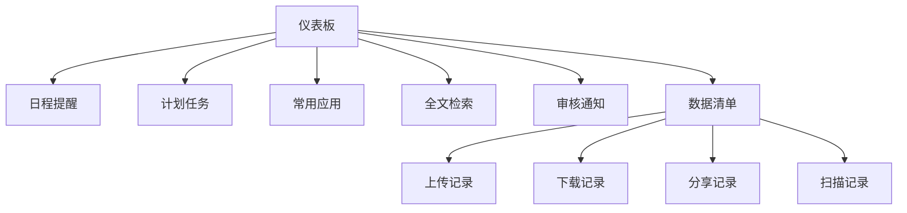

**数据清单功能**（所有用户）：
- 上传记录：显示用户所有上传操作和审批状态
- 下载记录：显示用户所有下载文件记录
- 分享记录：显示用户所有分享操作和状态
- 扫描记录：显示用户所有扫描上传记录

```go
// 用户数据活动记录
type UserDataActivity struct {
    ID           UUID      `json:"id"`
    UserID       UUID      `json:"user_id"`
    ActivityType string    `json:"activity_type"` // upload, download, share, scan
    ResourceName string    `json:"resource_name"`
    FileSize     int64     `json:"file_size"`
    Status       string    `json:"status"` // success, failed, pending_approval
    ApprovalID   UUID      `json:"approval_id,omitempty"`
    CreatedAt    time.Time `json:"created_at"`
}

// 仪表板数据结构更新
type Dashboard struct {
    UserID    UUID `json:"user_id"`
    
    // 日程提醒
    Schedule struct {
        TodayEvents    []Event `json:"today_events"`
        UpcomingEvents []Event `json:"upcoming_events"`
    } `json:"schedule"`
    
    // 计划任务
    Tasks struct {
        PendingTasks   []Task `json:"pending_tasks"`
        CompletedTasks []Task `json:"completed_tasks"`
    } `json:"tasks"`
    
    // 数据清单（所有用户）
    DataActivity struct {
        UploadHistory   []UserDataActivity `json:"upload_history"`
        DownloadHistory []UserDataActivity `json:"download_history"`
        ShareHistory    []UserDataActivity `json:"share_history"`
        ScanHistory     []UserDataActivity `json:"scan_history"`
    } `json:"data_activity"`
    
    // 审核通知（仅协作用户+）
    Notifications struct {
        PendingApprovals []ApprovalProcess `json:"pending_approvals"`
        SystemNotices    []SystemNotice    `json:"system_notices"`
        DictionaryApprovals []DictionaryChangeLog `json:"dictionary_approvals,omitempty"`
    } `json:"notifications,omitempty"`
}
```

```go
// 普通用户权限控制实现
type NormalUserPermissions struct {
    // 文档权限
    CanViewPublicDocs    bool `default:"true"`  // 查看公开文档
    CanScanDocuments     bool `default:"true"`  // 文档扫描
    CanUseAIChat         bool `default:"true"`  // AI智能问答
    CanDownloadOwnTeam   bool `default:"true"`  // 下载本团队文档
    CanShareOwnTeam      bool `default:"false"` // 分享本团队文档
    
    // 应用权限
    CanUseAppCenter      bool `default:"true"`  // 使用应用中心
    AuthorizedQRApps     []string             // 授权的二维码应用
    AuthorizedBusinessApps []string           // 授权的业务应用
}

func CheckNormalUserAccess(user *User, resource string, action string) bool {
    perms := user.Permissions.(*NormalUserPermissions)
    
    switch resource {
    case "document":
        switch action {
        case "view_public":
            return perms.CanViewPublicDocs
        case "scan":
            return perms.CanScanDocuments
        case "ai_chat":
            return perms.CanUseAIChat
        case "download":
            // 只能下载本团队文档
            return perms.CanDownloadOwnTeam && user.TeamID == getResourceTeam(resource)
        }
    case "qrcode_app":
        appID := getAppID(resource)
        return contains(perms.AuthorizedQRApps, appID)
    case "business_app":
        appID := getAppID(resource)
        return contains(perms.AuthorizedBusinessApps, appID)
    }
    
    return false
}
```

### 3.3 权限控制实现

基于微信认证的中间件机制，扩展权限控制：

```go
// 基于微信认证的权限中间件
func RoleMiddleware(requiredRole UserRole) gin.HandlerFunc {
    return func(c *gin.Context) {
        user, exists := wechat.GetUserFromContext(c)
        if !exists {
            c.AbortWithStatusJSON(401, gin.H{"error": "未认证"})
            return
        }
        
        if !hasPermission(user, requiredRole) {
            c.AbortWithStatusJSON(403, gin.H{"error": "权限不足"})
            return
        }
        
        c.Next()
    }
}
```

## 4. 数据库设计

### 4.1 Supabase PostgreSQL 集成方案

在保持 CDK 原有数据模型基础上，完全迁移至 Supabase PostgreSQL：

```sql
-- 优化的用户模型（适配Supabase免费层）
CREATE TABLE users (
    id UUID PRIMARY KEY DEFAULT gen_random_uuid(),
    wechat_openid VARCHAR(100) UNIQUE NOT NULL,
    wechat_unionid VARCHAR(100),
    username VARCHAR(255) UNIQUE,
    nickname VARCHAR(255),
    avatar_url VARCHAR(255),
    is_active BOOLEAN DEFAULT true,
    employee_id VARCHAR(50), -- 员工工号
    department_id UUID,      -- 部门ID
    role_id UUID,           -- 角色ID
    team_id UUID,           -- 团队ID
    last_login_at TIMESTAMP,
    created_at TIMESTAMP DEFAULT NOW(),
    updated_at TIMESTAMP DEFAULT NOW()
);

-- 索引优化（适配2C2G VPS）
CREATE INDEX idx_users_wechat ON users(wechat_openid);
CREATE INDEX idx_users_team ON users(team_id) WHERE team_id IS NOT NULL;
CREATE INDEX idx_users_active ON users(is_active) WHERE is_active = true;

-- 员工信息表（精简版）
CREATE TABLE employees (
    id UUID PRIMARY KEY DEFAULT gen_random_uuid(),
    user_id UUID REFERENCES users(id) ON DELETE CASCADE,
    employee_id VARCHAR(50) UNIQUE,
    real_name VARCHAR(100),
    phone VARCHAR(20),
    email VARCHAR(100),
    department_id UUID,
    position VARCHAR(100),
    status VARCHAR(20) DEFAULT 'active',
    created_at TIMESTAMP DEFAULT NOW()
);

-- 文档表（优化存储）
CREATE TABLE documents (
    id UUID PRIMARY KEY DEFAULT gen_random_uuid(),
    title VARCHAR(255) NOT NULL,
    file_path VARCHAR(500),
    file_type VARCHAR(50),
    file_size BIGINT,
    tags TEXT[], -- 使用数组而非JSONB节省存储
    visibility VARCHAR(20) DEFAULT 'private', -- private, team_public, system_public
    creator_id UUID REFERENCES users(id),
    team_id UUID,
    status VARCHAR(20) DEFAULT 'draft', -- draft, reviewing, approved, rejected
    created_at TIMESTAMP DEFAULT NOW()
);

-- 文档扫描记录表
CREATE TABLE document_scans (
    id UUID PRIMARY KEY DEFAULT gen_random_uuid(),
    user_id UUID REFERENCES users(id),
    original_images TEXT[], -- 原始图片路径数组
    processed_content TEXT, -- OCR识别结果
    auto_tags TEXT[],      -- AI自动标签
    scan_source VARCHAR(20) DEFAULT 'mobile', -- mobile, web, miniprogram
    status VARCHAR(20) DEFAULT 'pending', -- pending, processing, completed, failed
    team_id UUID,
    created_at TIMESTAMP DEFAULT NOW()
);

-- 应用授权表
CREATE TABLE app_permissions (
    id UUID PRIMARY KEY DEFAULT gen_random_uuid(),
    user_id UUID REFERENCES users(id),
    app_type VARCHAR(50), -- qrcode_app, business_app
    app_id VARCHAR(100),
    granted_by UUID REFERENCES users(id), -- 授权人
    granted_at TIMESTAMP DEFAULT NOW(),
    expires_at TIMESTAMP, -- 授权过期时间
    is_active BOOLEAN DEFAULT true
);

-- 审批流程表
CREATE TABLE approval_processes (
    id UUID PRIMARY KEY DEFAULT gen_random_uuid(),
    request_type VARCHAR(50) NOT NULL, -- upload, scan, share, visibility_change
    requestor_id UUID REFERENCES users(id),
    team_id UUID,
    resource_id UUID, -- 文档ID或扫描ID
    content TEXT, -- 申请内容描述
    status VARCHAR(20) DEFAULT 'pending', -- pending, reviewing, approved, rejected
    approver_id UUID REFERENCES users(id),
    approval_comment TEXT,
    submitted_at TIMESTAMP DEFAULT NOW(),
    reviewed_at TIMESTAMP,
    created_at TIMESTAMP DEFAULT NOW()
);

-- 任务管理表
CREATE TABLE tasks (
    id UUID PRIMARY KEY DEFAULT gen_random_uuid(),
    user_id UUID REFERENCES users(id),
    title VARCHAR(255) NOT NULL,
    description TEXT,
    status VARCHAR(20) DEFAULT 'pending', -- pending, in_progress, completed, cancelled
    priority VARCHAR(10) DEFAULT 'medium', -- low, medium, high
    due_date TIMESTAMP,
    assigned_by UUID REFERENCES users(id),
    tags TEXT[],
    progress INTEGER DEFAULT 0, -- 0-100
    team_id UUID,
    created_at TIMESTAMP DEFAULT NOW(),
    updated_at TIMESTAMP DEFAULT NOW()
);

-- 事件日程表
CREATE TABLE events (
    id UUID PRIMARY KEY DEFAULT gen_random_uuid(),
    user_id UUID REFERENCES users(id),
    title VARCHAR(255) NOT NULL,
    description TEXT,
    start_time TIMESTAMP NOT NULL,
    end_time TIMESTAMP NOT NULL,
    event_type VARCHAR(20) DEFAULT 'personal', -- personal, team, system
    priority VARCHAR(10) DEFAULT 'medium',
    reminder BOOLEAN DEFAULT false,
    remind_at TIMESTAMP,
    team_id UUID,
    created_at TIMESTAMP DEFAULT NOW()
);

-- 团队配置表
CREATE TABLE team_configs (
    id UUID PRIMARY KEY DEFAULT gen_random_uuid(),
    team_id UUID UNIQUE,
    default_password_hash VARCHAR(255),
    default_password_set_by UUID REFERENCES users(id),
    default_password_set_at TIMESTAMP,
    approval_settings JSONB,
    notification_settings JSONB,
    created_at TIMESTAMP DEFAULT NOW(),
    updated_at TIMESTAMP DEFAULT NOW()
);

-- 用户密码状态表
CREATE TABLE user_password_status (
    user_id UUID PRIMARY KEY REFERENCES users(id),
    is_default_password BOOLEAN DEFAULT true,
    password_set_at TIMESTAMP DEFAULT NOW(),
    must_change_password BOOLEAN DEFAULT false,
    password_expires_at TIMESTAMP,
    last_password_change TIMESTAMP,
    updated_at TIMESTAMP DEFAULT NOW()
);

-- 通知记录表
CREATE TABLE notifications (
    id UUID PRIMARY KEY DEFAULT gen_random_uuid(),
    user_id UUID REFERENCES users(id),
    type VARCHAR(50), -- approval, system, reminder, task
    title VARCHAR(255),
    content TEXT,
    related_id UUID, -- 关联的记录ID
    is_read BOOLEAN DEFAULT false,
    created_at TIMESTAMP DEFAULT NOW()
);

-- 数据字典表
CREATE TABLE data_dictionaries (
    id UUID PRIMARY KEY DEFAULT gen_random_uuid(),
    team_id UUID NOT NULL,
    module VARCHAR(50), -- user, document, task, application, custom
    field_key VARCHAR(100),
    field_name VARCHAR(255),
    field_type VARCHAR(50), -- string, number, boolean, date, enum, text
    required BOOLEAN DEFAULT false,
    default_value VARCHAR(500),
    options TEXT[], -- 枚举选项
    description VARCHAR(1000),
    status VARCHAR(20) DEFAULT 'active', -- active, pending_approval, pending_delete
    approval_id UUID,
    created_by UUID REFERENCES users(id),
    updated_by UUID REFERENCES users(id),
    created_at TIMESTAMP DEFAULT NOW(),
    updated_at TIMESTAMP DEFAULT NOW()
);

-- 数据字典变更日志
CREATE TABLE dictionary_change_logs (
    id UUID PRIMARY KEY DEFAULT gen_random_uuid(),
    dictionary_id UUID,
    team_id UUID,
    change_type VARCHAR(20), -- create, update, delete
    old_value TEXT, -- JSON格式
    new_value TEXT, -- JSON格式
    requested_by UUID REFERENCES users(id),
    approved_by UUID REFERENCES users(id),
    approval_status VARCHAR(20) DEFAULT 'pending', -- pending, approved, rejected
    approval_comment TEXT,
    requested_at TIMESTAMP DEFAULT NOW(),
    approved_at TIMESTAMP
);

-- 用户数据活动记录
CREATE TABLE user_data_activities (
    id UUID PRIMARY KEY DEFAULT gen_random_uuid(),
    user_id UUID REFERENCES users(id),
    activity_type VARCHAR(20), -- upload, download, share, scan
    resource_id UUID,
    resource_name VARCHAR(255),
    resource_type VARCHAR(50), -- document, file, scan
    file_size BIGINT,
    status VARCHAR(20) DEFAULT 'success', -- success, failed, pending_approval
    approval_id UUID,
    target_users TEXT[], -- 分享目标用户
    expires_at TIMESTAMP, -- 分享过期时间
    created_at TIMESTAMP DEFAULT NOW()
);

-- 优化索引
CREATE INDEX idx_docs_team_status ON documents(team_id, status);
CREATE INDEX idx_docs_creator ON documents(creator_id);
CREATE INDEX idx_docs_visibility ON documents(visibility) WHERE visibility IN ('team_public', 'system_public');
CREATE INDEX idx_scans_user_team ON document_scans(user_id, team_id);
CREATE INDEX idx_scans_status ON document_scans(status) WHERE status = 'pending';
CREATE INDEX idx_app_perms_user ON app_permissions(user_id, app_type, is_active);
CREATE INDEX idx_approvals_status ON approval_processes(status) WHERE status = 'pending';
CREATE INDEX idx_approvals_team ON approval_processes(team_id, status);
CREATE INDEX idx_tasks_user_status ON tasks(user_id, status);
CREATE INDEX idx_tasks_due_date ON tasks(due_date) WHERE status != 'completed';
CREATE INDEX idx_events_user_time ON events(user_id, start_time);
CREATE INDEX idx_events_remind ON events(remind_at) WHERE reminder = true;
CREATE INDEX idx_notifications_user ON notifications(user_id, is_read, created_at);
CREATE INDEX idx_dict_team_status ON data_dictionaries(team_id, status);
CREATE INDEX idx_dict_module ON data_dictionaries(module, field_key);
CREATE INDEX idx_dict_changes_approval ON dictionary_change_logs(approval_status) WHERE approval_status = 'pending';
CREATE INDEX idx_activities_user_type ON user_data_activities(user_id, activity_type, created_at);
```

### 4.2 Row Level Security (RLS) 优化

针对 Supabase 免费层进行 RLS 策略优化：

```sql
-- 文档访问权限策略（支持普通用户跨团队访问公开文档）
CREATE POLICY "文档访问权限" ON documents
FOR SELECT USING (
    -- 系统公开文档（所有用户可见）
    visibility = 'system_public' OR
    -- 团队公开文档（所有用户可见但不可下载分享）
    visibility = 'team_public' OR
    -- 创建者可见
    creator_id = auth.uid() OR
    -- 同团队成员可见私有文档
    (visibility = 'private' AND team_id = (
        SELECT team_id FROM users WHERE id = auth.uid() LIMIT 1
    ))
);

-- 文档下载权限策略（限制普通用户下载范围）
CREATE POLICY "文档下载权限" ON document_downloads
FOR INSERT WITH CHECK (
    -- 系统公开文档允许下载
    EXISTS (
        SELECT 1 FROM documents d 
        WHERE d.id = document_id AND d.visibility = 'system_public'
    ) OR
    -- 本团队文档允许下载
    EXISTS (
        SELECT 1 FROM documents d, users u
        WHERE d.id = document_id 
        AND u.id = auth.uid()
        AND d.team_id = u.team_id
    )
);

-- 员工数据隐私保护
CREATE POLICY "员工信息保护" ON employees
FOR SELECT USING (
    user_id = auth.uid() OR
    EXISTS (
        SELECT 1 FROM users u1, users u2 
        WHERE u1.id = auth.uid() 
        AND u2.id = employees.user_id 
        AND u1.team_id = u2.team_id
        AND u1.role_id IN ('admin', 'manager')
    )
);

-- 文档扫描权限（所有员工都可以扫描）
CREATE POLICY "文档扫描权限" ON document_scans
FOR ALL USING (
    user_id = auth.uid()
);

-- 应用授权查看
CREATE POLICY "应用授权查看" ON app_permissions
FOR SELECT USING (
    user_id = auth.uid() OR
    granted_by = auth.uid()
);

-- 审批流程权限
CREATE POLICY "审批流程权限" ON approval_processes
FOR SELECT USING (
    requestor_id = auth.uid() OR
    approver_id = auth.uid() OR
    EXISTS (
        SELECT 1 FROM users 
        WHERE id = auth.uid() 
        AND role_id IN ('admin', 'team_manager')
        AND team_id = approval_processes.team_id
    )
);

-- 任务访问权限
CREATE POLICY "任务访问权限" ON tasks
FOR ALL USING (
    user_id = auth.uid() OR
    assigned_by = auth.uid() OR
    (
        team_id IS NOT NULL AND 
        team_id = (SELECT team_id FROM users WHERE id = auth.uid())
    )
);

-- 事件日程权限
CREATE POLICY "事件日程权限" ON events
FOR ALL USING (
    user_id = auth.uid() OR
    (
        event_type = 'team' AND
        team_id = (SELECT team_id FROM users WHERE id = auth.uid())
    ) OR
    event_type = 'system'
);

-- 通知访问权限
CREATE POLICY "通知访问权限" ON notifications
FOR ALL USING (
    user_id = auth.uid()
);

-- 团队配置管理
CREATE POLICY "团队配置管理" ON team_configs
FOR ALL USING (
    EXISTS (
        SELECT 1 FROM users 
        WHERE id = auth.uid() 
        AND team_id = team_configs.team_id
        AND role_id IN ('admin', 'team_manager')
    )
);
```

## 5. 核心业务模块

### 5.1 文档中心

基于 CDK 架构，构建企业文档管理系统：


**核心功能**：
- **普邀文档扫描**：每个员工都具备扫描权限
- **快速上传功能**：侧边栏快捷入口，弹窗式上传界面
- **分级权限控制**：系统公开/团队公开/私有三级
- **智能问答**：基于公开知识库，不跨团队访问
- **多格式支持**：PDF、Office、图片等
- **在线预览**：KKofficeView 集成
- **多级审核**：系统管理员/团队管理员/协作用户

### 5.1.1 快速上传功能设计

**界面交互设计**：

```typescript
// 侧边栏快速上传按钮组件
interface QuickUploadButtonProps {
  onUploadClick: () => void;
  disabled?: boolean;
  userPermissions: UserPermissions;
}

const QuickUploadButton: React.FC<QuickUploadButtonProps> = ({ 
  onUploadClick, 
  disabled, 
  userPermissions 
}) => {
  return (
    <Button
      onClick={onUploadClick}
      disabled={disabled || !userPermissions.canUpload}
      className="w-full flex items-center gap-2 bg-primary hover:bg-primary/90"
      size="lg"
    >
      <Upload className="h-4 w-4" />
      快速上传
    </Button>
  );
};

// 文档上传弹窗组件
interface DocumentUploadModalProps {
  isOpen: boolean;
  onClose: () => void;
  onUploadSuccess: (documents: Document[]) => void;
}

const DocumentUploadModal: React.FC<DocumentUploadModalProps> = ({
  isOpen,
  onClose,
  onUploadSuccess
}) => {
  const [files, setFiles] = useState<File[]>([]);
  const [uploading, setUploading] = useState(false);
  const [uploadProgress, setUploadProgress] = useState<Record<string, number>>({});
  const [documentInfo, setDocumentInfo] = useState({
    title: '',
    description: '',
    tags: [] as string[],
    visibility: 'private' as DocumentVisibility
  });

  // 文件拖拽处理
  const onDrop = useCallback((acceptedFiles: File[]) => {
    const validFiles = acceptedFiles.filter(file => 
      validateFileType(file) && validateFileSize(file)
    );
    setFiles(prev => [...prev, ...validFiles]);
  }, []);

  const { getRootProps, getInputProps, isDragActive } = useDropzone({
    onDrop,
    accept: {
      'application/pdf': ['.pdf'],
      'application/msword': ['.doc'],
      'application/vnd.openxmlformats-officedocument.wordprocessingml.document': ['.docx'],
      'application/vnd.ms-excel': ['.xls'],
      'application/vnd.openxmlformats-officedocument.spreadsheetml.sheet': ['.xlsx'],
      'application/vnd.ms-powerpoint': ['.ppt'],
      'application/vnd.openxmlformats-officedocument.presentationml.presentation': ['.pptx'],
      'image/*': ['.jpg', '.jpeg', '.png', '.gif', '.bmp'],
      'text/plain': ['.txt']
    },
    maxFiles: 10,
    maxSize: 50 * 1024 * 1024 // 50MB
  });

  // 文件上传处理
  const handleUpload = async () => {
    if (files.length === 0) {
      toast.error('请选择要上传的文件');
      return;
    }

    setUploading(true);
    const uploadedDocuments: Document[] = [];

    try {
      for (const file of files) {
        const formData = new FormData();
        formData.append('file', file);
        formData.append('title', documentInfo.title || file.name);
        formData.append('description', documentInfo.description);
        formData.append('tags', JSON.stringify(documentInfo.tags));
        formData.append('visibility', documentInfo.visibility);

        // 上传进度跟踪
        const response = await uploadWithProgress(
          '/api/documents/upload',
          formData,
          (progress) => {
            setUploadProgress(prev => ({
              ...prev,
              [file.name]: progress
            }));
          }
        );

        if (response.success) {
          uploadedDocuments.push(response.document);
          // 提交审批流程
          await submitApprovalRequest({
            type: 'upload',
            resourceId: response.document.id,
            description: `上传文档：${response.document.title}`
          });
        }
      }

      toast.success(`成功上传 ${uploadedDocuments.length} 个文件，等待审批`);
      onUploadSuccess(uploadedDocuments);
      onClose();
      
    } catch (error) {
      console.error('上传失败:', error);
      toast.error('上传失败，请重试');
    } finally {
      setUploading(false);
      setUploadProgress({});
    }
  };

  // 移除文件
  const removeFile = (index: number) => {
    setFiles(prev => prev.filter((_, i) => i !== index));
  };

  return (
    <Dialog open={isOpen} onOpenChange={onClose}>
      <DialogContent className="sm:max-w-[600px] max-h-[80vh] overflow-y-auto">
        <DialogHeader>
          <DialogTitle className="flex items-center gap-2">
            <Upload className="h-5 w-5" />
            快速上传文档
          </DialogTitle>
          <DialogDescription>
            支持 PDF、Office 文档、图片等格式，单个文件最大 50MB
          </DialogDescription>
        </DialogHeader>

        <div className="space-y-4">
          {/* 文件拖拽区域 */}
          <div
            {...getRootProps()}
            className={cn(
              "border-2 border-dashed rounded-lg p-6 text-center cursor-pointer transition-colors",
              isDragActive ? "border-primary bg-primary/5" : "border-gray-300 hover:border-primary"
            )}
          >
            <input {...getInputProps()} />
            <div className="space-y-2">
              <Upload className="h-8 w-8 mx-auto text-gray-400" />
              <p className="text-sm text-gray-600">
                {isDragActive ? '放开鼠标上传文件' : '拖拽文件到此区域，或点击选择文件'}
              </p>
              <p className="text-xs text-gray-400">
                支持多文件选择，最多 10 个文件
              </p>
            </div>
          </div>

          {/* 已选文件列表 */}
          {files.length > 0 && (
            <div className="space-y-2">
              <h4 className="text-sm font-medium">已选文件 ({files.length})</h4>
              <div className="max-h-32 overflow-y-auto space-y-1">
                {files.map((file, index) => (
                  <div key={index} className="flex items-center justify-between p-2 bg-gray-50 rounded">
                    <div className="flex items-center gap-2 flex-1 min-w-0">
                      <FileText className="h-4 w-4 text-blue-500" />
                      <span className="text-sm truncate">{file.name}</span>
                      <span className="text-xs text-gray-500">({formatFileSize(file.size)})</span>
                    </div>
                    {uploading && uploadProgress[file.name] && (
                      <div className="flex items-center gap-2">
                        <Progress value={uploadProgress[file.name]} className="w-16" />
                        <span className="text-xs">{uploadProgress[file.name]}%</span>
                      </div>
                    )}
                    {!uploading && (
                      <Button
                        variant="ghost"
                        size="sm"
                        onClick={() => removeFile(index)}
                      >
                        <X className="h-4 w-4" />
                      </Button>
                    )}
                  </div>
                ))}
              </div>
            </div>
          )}

          {/* 文档信息表单 */}
          <div className="space-y-3">
            <div>
              <Label htmlFor="title">文档标题</Label>
              <Input
                id="title"
                placeholder="如不填写，将使用文件名作为标题"
                value={documentInfo.title}
                onChange={(e) => setDocumentInfo(prev => ({ ...prev, title: e.target.value }))}
              />
            </div>

            <div>
              <Label htmlFor="description">文档描述</Label>
              <Textarea
                id="description"
                placeholder="简要描述文档内容（可选）"
                rows={3}
                value={documentInfo.description}
                onChange={(e) => setDocumentInfo(prev => ({ ...prev, description: e.target.value }))}
              />
            </div>

            <div>
              <Label htmlFor="tags">标签</Label>
              <TagInput
                tags={documentInfo.tags}
                onTagsChange={(tags) => setDocumentInfo(prev => ({ ...prev, tags }))}
                placeholder="输入标签并按回车添加"
              />
            </div>

            <div>
              <Label htmlFor="visibility">可见性</Label>
              <Select
                value={documentInfo.visibility}
                onValueChange={(value: DocumentVisibility) => 
                  setDocumentInfo(prev => ({ ...prev, visibility: value }))
                }
              >
                <SelectTrigger>
                  <SelectValue />
                </SelectTrigger>
                <SelectContent>
                  <SelectItem value="private">私有（仅本团队可见）</SelectItem>
                  <SelectItem value="team_public">团队公开（全公司可查看）</SelectItem>
                  <SelectItem value="system_public">系统公开（全公司可查看和下载）</SelectItem>
                </SelectContent>
              </Select>
            </div>
          </div>

          {/* 审批提示 */}
          <Alert>
            <Info className="h-4 w-4" />
            <AlertTitle>审批提醒</AlertTitle>
            <AlertDescription>
              所有上传的文档都需要经过团队管理员审批后才能正式发布，您将收到审批结果通知。
            </AlertDescription>
          </Alert>
        </div>

        <DialogFooter>
          <Button variant="outline" onClick={onClose} disabled={uploading}>
            取消
          </Button>
          <Button onClick={handleUpload} disabled={files.length === 0 || uploading}>
            {uploading ? (
              <>
                <Loader2 className="h-4 w-4 mr-2 animate-spin" />
                上传中...
              </>
            ) : (
              <>
                <Upload className="h-4 w-4 mr-2" />
                上传文档
              </>
            )}
          </Button>
        </DialogFooter>
      </DialogContent>
    </Dialog>
  );
};

// 工具函数
function validateFileType(file: File): boolean {
  const allowedTypes = [
    'application/pdf',
    'application/msword',
    'application/vnd.openxmlformats-officedocument.wordprocessingml.document',
    'application/vnd.ms-excel',
    'application/vnd.openxmlformats-officedocument.spreadsheetml.sheet',
    'application/vnd.ms-powerpoint',
    'application/vnd.openxmlformats-officedocument.presentationml.presentation',
    'text/plain'
  ];
  
  return allowedTypes.includes(file.type) || file.type.startsWith('image/');
}

function validateFileSize(file: File): boolean {
  return file.size <= 50 * 1024 * 1024; // 50MB
}

function formatFileSize(bytes: number): string {
  if (bytes === 0) return '0 B';
  const k = 1024;
  const sizes = ['B', 'KB', 'MB', 'GB'];
  const i = Math.floor(Math.log(bytes) / Math.log(k));
  return parseFloat((bytes / Math.pow(k, i)).toFixed(2)) + ' ' + sizes[i];
}

// 带进度的上传函数
async function uploadWithProgress(
  url: string, 
  formData: FormData, 
  onProgress: (progress: number) => void
): Promise<any> {
  return new Promise((resolve, reject) => {
    const xhr = new XMLHttpRequest();
    
    xhr.upload.addEventListener('progress', (event) => {
      if (event.lengthComputable) {
        const progress = Math.round((event.loaded / event.total) * 100);
        onProgress(progress);
      }
    });
    
    xhr.addEventListener('load', () => {
      if (xhr.status >= 200 && xhr.status < 300) {
        resolve(JSON.parse(xhr.responseText));
      } else {
        reject(new Error(`Upload failed with status ${xhr.status}`));
      }
    });
    
    xhr.addEventListener('error', () => {
      reject(new Error('Upload failed'));
    });
    
    xhr.open('POST', url);
    xhr.send(formData);
  });
}

// 提交审批申请
async function submitApprovalRequest(request: {
  type: string;
  resourceId: string;
  description: string;
}): Promise<void> {
  const response = await fetch('/api/approvals', {
    method: 'POST',
    headers: {
      'Content-Type': 'application/json',
    },
    body: JSON.stringify(request),
  });
  
  if (!response.ok) {
    throw new Error('提交审批申请失败');
  }
}
```

**主应用集成**：

```typescript
// 主布局组件中集成快速上传
const MainLayout: React.FC<{ children: React.ReactNode }> = ({ children }) => {
  const [uploadModalOpen, setUploadModalOpen] = useState(false);
  const { user, permissions } = useAuth();
  
  const handleUploadSuccess = (documents: Document[]) => {
    toast.success(`成功上传 ${documents.length} 个文档`);
    // 刷新文档列表或更新状态
    refreshDocuments();
  };

  return (
    <div className="flex h-screen bg-gray-100">
      {/* 侧边栏 */}
      <aside className="w-64 bg-white shadow-sm">
        <div className="p-4">
          <div className="space-y-2">
            {/* 其他菜单项 */}
            <SidebarMenuItem href="/dashboard" icon={Home}>
              仪表板
            </SidebarMenuItem>
            <SidebarMenuItem href="/documents" icon={FileText}>
              文档中心
            </SidebarMenuItem>
            
            {/* 快速上传按钮 */}
            <div className="pt-4 border-t">
              <QuickUploadButton
                onUploadClick={() => setUploadModalOpen(true)}
                userPermissions={permissions}
              />
            </div>
          </div>
        </div>
      </aside>

      {/* 主内容区域 */}
      <main className="flex-1 overflow-y-auto">
        {children}
      </main>

      {/* 快速上传弹窗 */}
      <DocumentUploadModal
        isOpen={uploadModalOpen}
        onClose={() => setUploadModalOpen(false)}
        onUploadSuccess={handleUploadSuccess}
      />
    </div>
  );
};
```

**后端API设计**：

```go
// 文档上传API
type DocumentUploadRequest struct {
    Title       string   `form:"title"`
    Description string   `form:"description"`
    Tags        string   `form:"tags"` // JSON字符串
    Visibility  string   `form:"visibility"`
}

type DocumentUploadResponse struct {
    Success   bool      `json:"success"`
    Document  *Document `json:"document,omitempty"`
    Message   string    `json:"message"`
    ApprovalID string   `json:"approval_id,omitempty"`
}

// 快速上传处理器
func (h *DocumentHandler) QuickUpload(c *gin.Context) {
    user, _ := auth.GetUserFromContext(c)
    
    // 验证用户权限
    if !h.permissionService.CanUpload(user) {
        c.JSON(403, gin.H{"error": "无上传权限"})
        return
    }
    
    // 解析请求
    var req DocumentUploadRequest
    if err := c.ShouldBind(&req); err != nil {
        c.JSON(400, gin.H{"error": "请求参数错误"})
        return
    }
    
    // 获取上传文件
    file, err := c.FormFile("file")
    if err != nil {
        c.JSON(400, gin.H{"error": "文件上传失败"})
        return
    }
    
    // 验证文件
    if err := h.validateUploadFile(file); err != nil {
        c.JSON(400, gin.H{"error": err.Error()})
        return
    }
    
    // 生成文件路径
    filename := h.generateUniqueFilename(file.Filename)
    filepath := h.getUploadPath(user.TeamID, filename)
    
    // 保存文件到临时存储
    tempPath := h.getTempPath(filename)
    if err := c.SaveUploadedFile(file, tempPath); err != nil {
        c.JSON(500, gin.H{"error": "文件保存失败"})
        return
    }
    
    // 解析标签
    var tags []string
    if req.Tags != "" {
        json.Unmarshal([]byte(req.Tags), &tags)
    }
    
    // 创建文档记录（待审批状态）
    document := &Document{
        Title:       req.Title,
        Description: req.Description,
        FileName:    file.Filename,
        FilePath:    filepath,
        FileSize:    file.Size,
        FileType:    file.Header.Get("Content-Type"),
        Tags:        tags,
        Visibility:  req.Visibility,
        CreatorID:   user.ID,
        TeamID:      user.TeamID,
        Status:      "pending_approval",
        TempPath:    tempPath,
    }
    
    if err := h.documentService.Create(document); err != nil {
        c.JSON(500, gin.H{"error": "创建文档记录失败"})
        return
    }
    
    // 创建审批流程
    approval := &ApprovalProcess{
        RequestType: "upload",
        RequestorID: user.ID,
        TeamID:      user.TeamID,
        ResourceID:  document.ID,
        Content:     fmt.Sprintf("上传文档：%s", document.Title),
        Status:      "pending",
    }
    
    if err := h.approvalService.SubmitRequest(approval); err != nil {
        c.JSON(500, gin.H{"error": "提交审批失败"})
        return
    }
    
    // 记录用户活动
    activity := &UserDataActivity{
        UserID:       user.ID,
        ActivityType: "upload",
        ResourceID:   document.ID,
        ResourceName: document.Title,
        ResourceType: "document",
        FileSize:     file.Size,
        Status:       "pending_approval",
        ApprovalID:   approval.ID,
    }
    h.activityService.Record(activity)
    
    // 发送通知给团队管理员
    teamManagers := h.userService.GetTeamManagers(user.TeamID)
    for _, manager := range teamManagers {
        notification := &Notification{
            UserID:    manager.ID,
            Type:      "approval",
            Title:     "新文档上传审批",
            Content:   fmt.Sprintf("%s 上传了文档 \"%s\"，请审批", user.Nickname, document.Title),
            RelatedID: approval.ID,
        }
        h.notificationService.Send(notification)
    }
    
    c.JSON(200, DocumentUploadResponse{
        Success:    true,
        Document:   document,
        Message:    "文档上传成功，等待审批",
        ApprovalID: approval.ID.String(),
    })
}

// 文件验证
func (h *DocumentHandler) validateUploadFile(file *multipart.FileHeader) error {
    // 检查文件大小（50MB限制）
    if file.Size > 50*1024*1024 {
        return errors.New("文件大小不能超过50MB")
    }
    
    // 检查文件类型
    allowedTypes := map[string]bool{
        "application/pdf":                   true,
        "application/msword":                true,
        "application/vnd.openxmlformats-officedocument.wordprocessingml.document": true,
        "application/vnd.ms-excel":          true,
        "application/vnd.openxmlformats-officedocument.spreadsheetml.sheet":       true,
        "application/vnd.ms-powerpoint":     true,
        "application/vnd.openxmlformats-officedocument.presentationml.presentation": true,
        "text/plain":                        true,
    }
    
    contentType := file.Header.Get("Content-Type")
    if !allowedTypes[contentType] && !strings.HasPrefix(contentType, "image/") {
        return errors.New("不支持的文件类型")
    }
    
    return nil
}

// 审批通过后的文件处理
func (h *DocumentHandler) ProcessApprovedUpload(approvalID UUID) error {
    approval, err := h.approvalService.GetByID(approvalID)
    if err != nil {
        return err
    }
    
    document, err := h.documentService.GetByID(approval.ResourceID)
    if err != nil {
        return err
    }
    
    // 将文件从临时存储移动到正式存储
    finalPath := h.getUploadPath(document.TeamID, document.FileName)
    if err := h.storageService.MoveFile(document.TempPath, finalPath); err != nil {
        return err
    }
    
    // 更新文档状态
    document.Status = "approved"
    document.FilePath = finalPath
    document.TempPath = ""
    document.ApprovedAt = time.Now()
    document.ApprovedBy = approval.ApproverID
    
    if err := h.documentService.Update(document); err != nil {
        return err
    }
    
    // 更新用户活动记录
    activity := &UserDataActivity{}
    h.db.Where("approval_id = ?", approvalID).First(activity)
    activity.Status = "success"
    h.db.Save(activity)
    
    // 发送审批通过通知给上传者
    notification := &Notification{
        UserID:    document.CreatorID,
        Type:      "system",
        Title:     "文档审批通过",
        Content:   fmt.Sprintf("您上传的文档 \"%s\" 已审批通过并发布", document.Title),
        RelatedID: document.ID,
    }
    h.notificationService.Send(notification)
    
    return nil
}

// 路由注册
func RegisterDocumentRoutes(r *gin.RouterGroup, handler *DocumentHandler) {
    docs := r.Group("/documents")
    {
        docs.POST("/upload", middleware.Auth(), handler.QuickUpload)
        docs.GET("/", middleware.Auth(), handler.List)
        docs.GET("/:id", middleware.Auth(), handler.GetByID)
        docs.PUT("/:id", middleware.Auth(), middleware.RoleRequired("collaborator"), handler.Update)
        docs.DELETE("/:id", middleware.Auth(), middleware.RoleRequired("team_manager"), handler.Delete)
        docs.GET("/:id/download", middleware.Auth(), handler.Download)
        docs.POST("/:id/share", middleware.Auth(), handler.ShareDocument)
    }
    
    // 审批相关路由
    approvals := r.Group("/approvals")
    {
        approvals.POST("/", middleware.Auth(), handler.SubmitApproval)
        approvals.GET("/", middleware.Auth(), handler.ListApprovals)
        approvals.PUT("/:id/approve", middleware.Auth(), middleware.RoleRequired("team_manager"), handler.ApproveRequest)
        approvals.PUT("/:id/reject", middleware.Auth(), middleware.RoleRequired("team_manager"), handler.RejectRequest)
    }
}
  const k = 1024;
  const sizes = ['B', 'KB', 'MB', 'GB'];
  const i = Math.floor(Math.log(bytes) / Math.log(k));
  return parseFloat((bytes / Math.pow(k, i)).toFixed(2)) + ' ' + sizes[i];
}

// 带进度的上传函数
async function uploadWithProgress(
  url: string, 
  formData: FormData, 
  onProgress: (progress: number) => void
): Promise<any> {
  return new Promise((resolve, reject) => {
    const xhr = new XMLHttpRequest();
    
    xhr.upload.addEventListener('progress', (event) => {
      if (event.lengthComputable) {
        const progress = Math.round((event.loaded / event.total) * 100);
        onProgress(progress);
      }
    });
    
    xhr.addEventListener('load', () => {
      if (xhr.status >= 200 && xhr.status < 300) {
        resolve(JSON.parse(xhr.responseText));
      } else {
        reject(new Error(`Upload failed with status ${xhr.status}`));
      }
    });
    
    xhr.addEventListener('error', () => {
      reject(new Error('Upload failed'));
    });
    
    xhr.open('POST', url);
    xhr.send(formData);
  });
}

// 提交审批申请
async function submitApprovalRequest(request: {
  type: string;
  resourceId: string;
  description: string;
}): Promise<void> {
  const response = await fetch('/api/approvals', {
    method: 'POST',
    headers: {
      'Content-Type': 'application/json',
    },
    body: JSON.stringify(request),
  });
  
  if (!response.ok) {
    throw new Error('提交审批申请失败');
  }
}
```

**主应用集成**：

```typescript
// 主布局组件中集成快速上传
const MainLayout: React.FC<{ children: React.ReactNode }> = ({ children }) => {
  const [uploadModalOpen, setUploadModalOpen] = useState(false);
  const { user, permissions } = useAuth();
  
  const handleUploadSuccess = (documents: Document[]) => {
    toast.success(`成功上传 ${documents.length} 个文档`);
    // 刷新文档列表或更新状态
    refreshDocuments();
  };

  return (
    <div className="flex h-screen bg-gray-100">
      {/* 侧边栏 */}
      <aside className="w-64 bg-white shadow-sm">
        <div className="p-4">
          <div className="space-y-2">
            {/* 其他菜单项 */}
            <SidebarMenuItem href="/dashboard" icon={Home}>
              仪表板
            </SidebarMenuItem>
            <SidebarMenuItem href="/documents" icon={FileText}>
              文档中心
            </SidebarMenuItem>
            
            {/* 快速上传按钮 */}
            <div className="pt-4 border-t">
              <QuickUploadButton
                onUploadClick={() => setUploadModalOpen(true)}
                userPermissions={permissions}
              />
            </div>
          </div>
        </div>
      </aside>

      {/* 主内容区域 */}
      <main className="flex-1 overflow-y-auto">
        {children}
      </main>

      {/* 快速上传弹窗 */}
      <DocumentUploadModal
        isOpen={uploadModalOpen}
        onClose={() => setUploadModalOpen(false)}
        onUploadSuccess={handleUploadSuccess}
      />
    </div>
  );
};n/vnd.ms-excel': ['.xls'],
      'application/vnd.openxmlformats-officedocument.spreadsheetml.sheet': ['.xlsx'],
      'image/*': ['.png', '.jpg', '.jpeg', '.gif']
    },
    maxSize: 50 * 1024 * 1024, // 50MB
    multiple: true
  });

  // 文件上传处理
  const handleUpload = async () => {
    if (files.length === 0) {
      toast.error('请选择要上传的文件');
      return;
    }

    setUploading(true);
    
    try {
      const uploadPromises = files.map(async (file, index) => {
        const formData = new FormData();
        formData.append('file', file);
        formData.append('documentInfo', JSON.stringify({
          ...documentInfo,
          title: documentInfo.title || file.name
        }));

        return uploadFileWithProgress(formData, (progress) => {
          setUploadProgress(prev => ({
            ...prev,
            [file.name]: progress
          }));
        });
      });

      const results = await Promise.all(uploadPromises);
      
      // 所有文件上传成功后提交审批
      const documents = results.map(result => result.data.document);
      
      toast.success(`成功上传 ${files.length} 个文件，等待审批`);
      onUploadSuccess(documents);
      onClose();
      
    } catch (error) {
      console.error('文件上传失败:', error);
      toast.error('文件上传失败，请重试');
    } finally {
      setUploading(false);
      setUploadProgress({});
    }
  };

  return (
    <Dialog open={isOpen} onOpenChange={onClose}>
      <DialogContent className="max-w-4xl max-h-[80vh] overflow-y-auto">
        <DialogHeader>
          <DialogTitle className="flex items-center gap-2">
            <Upload className="h-5 w-5" />
            文档上传
          </DialogTitle>
          <DialogDescription>
            支持 PDF、Word、Excel、图片等格式，单文件最大 50MB
          </DialogDescription>
        </DialogHeader>

        <div className="space-y-6">
          {/* 文件拖拽区域 */}
          <div
            {...getRootProps()}
            className={cn(
              "border-2 border-dashed rounded-lg p-8 text-center cursor-pointer transition-colors",
              isDragActive 
                ? "border-primary bg-primary/5" 
                : "border-gray-300 hover:border-primary"
            )}
          >
            <input {...getInputProps()} />
            <div className="flex flex-col items-center gap-2">
              <Upload className="h-12 w-12 text-gray-400" />
              <p className="text-lg font-medium">
                {isDragActive 
                  ? "拖放文件到此处" 
                  : "拖放文件到此处，或点击选择文件"
                }
              </p>
              <p className="text-sm text-gray-500">
                支持 PDF, DOC, DOCX, XLS, XLSX, PNG, JPG 等格式
              </p>
            </div>
          </div>

          {/* 已选择文件列表 */}
          {files.length > 0 && (
            <div className="space-y-2">
              <h4 className="font-medium">已选择文件 ({files.length})</h4>
              <div className="space-y-2 max-h-40 overflow-y-auto">
                {files.map((file, index) => (
                  <FilePreviewCard
                    key={`${file.name}-${index}`}
                    file={file}
                    progress={uploadProgress[file.name]}
                    onRemove={() => {
                      setFiles(prev => prev.filter((_, i) => i !== index));
                    }}
                  />
                ))}
              </div>
            </div>
          )}

          {/* 文档信息表单 */}
          <div className="grid grid-cols-1 md:grid-cols-2 gap-4">
            <div className="space-y-2">
              <Label htmlFor="title">文档标简 (可选)</Label>
              <Input
                id="title"
                placeholder="不填写则使用文件名"
                value={documentInfo.title}
                onChange={(e) => setDocumentInfo(prev => ({
                  ...prev,
                  title: e.target.value
                }))}
              />
            </div>

            <div className="space-y-2">
              <Label htmlFor="visibility">可见性</Label>
              <Select
                value={documentInfo.visibility}
                onValueChange={(value) => setDocumentInfo(prev => ({
                  ...prev,
                  visibility: value as DocumentVisibility
                }))}
              >
                <SelectTrigger>
                  <SelectValue />
                </SelectTrigger>
                <SelectContent>
                  <SelectItem value="private">私有</SelectItem>
                  <SelectItem value="team_public">团队公开</SelectItem>
                  <SelectItem value="system_public">系统公开</SelectItem>
                </SelectContent>
              </Select>
            </div>

            <div className="space-y-2 md:col-span-2">
              <Label htmlFor="description">文档描述 (可选)</Label>
              <Textarea
                id="description"
                placeholder="简要描述文档内容..."
                value={documentInfo.description}
                onChange={(e) => setDocumentInfo(prev => ({
                  ...prev,
                  description: e.target.value
                }))}
              />
            </div>

            <div className="space-y-2 md:col-span-2">
              <Label htmlFor="tags">标签</Label>
              <TagInput
                tags={documentInfo.tags}
                onTagsChange={(tags) => setDocumentInfo(prev => ({
                  ...prev,
                  tags
                }))}
                placeholder="按 Enter 添加标签..."
              />
            </div>
          </div>
        </div>

        <DialogFooter>
          <Button variant="outline" onClick={onClose} disabled={uploading}>
            取消
          </Button>
          <Button 
            onClick={handleUpload} 
            disabled={files.length === 0 || uploading}
            className="min-w-[100px]"
          >
            {uploading ? (
              <>
                <Loader2 className="mr-2 h-4 w-4 animate-spin" />
                上传中...
              </>
            ) : (
              <>
                <Upload className="mr-2 h-4 w-4" />
                上传 ({files.length})
              </>
            )}
          </Button>
        </DialogFooter>
      </DialogContent>
    </Dialog>
  );
};

// 文件预览卡片组件
const FilePreviewCard: React.FC<{
  file: File;
  progress?: number;
  onRemove: () => void;
}> = ({ file, progress, onRemove }) => {
  const getFileIcon = (file: File) => {
    const type = file.type;
    if (type.includes('pdf')) return <FileText className="h-5 w-5 text-red-500" />;
    if (type.includes('word')) return <FileText className="h-5 w-5 text-blue-500" />;
    if (type.includes('excel') || type.includes('spreadsheet')) 
      return <FileSpreadsheet className="h-5 w-5 text-green-500" />;
    if (type.includes('image')) return <Image className="h-5 w-5 text-purple-500" />;
    return <File className="h-5 w-5 text-gray-500" />;
  };

  return (
    <div className="flex items-center gap-3 p-3 border rounded-lg bg-gray-50">
      {getFileIcon(file)}
      <div className="flex-1 min-w-0">
        <p className="text-sm font-medium truncate">{file.name}</p>
        <p className="text-xs text-gray-500">
          {formatFileSize(file.size)}
        </p>
        {progress !== undefined && (
          <div className="mt-1">
            <div className="w-full bg-gray-200 rounded-full h-1.5">
              <div 
                className="bg-primary h-1.5 rounded-full transition-all duration-300" 
                style={{ width: `${progress}%` }}
              />
            </div>
            <p className="text-xs text-gray-500 mt-1">{progress}%</p>
          </div>
        )}
      </div>
      <Button
        variant="ghost"
        size="sm"
        onClick={onRemove}
        className="text-gray-400 hover:text-red-500"
      >
        <X className="h-4 w-4" />
      </Button>
    </div>
  );
};

// 文件上传服务
const uploadFileWithProgress = async (
  formData: FormData, 
  onProgress: (progress: number) => void
): Promise<any> => {
  return new Promise((resolve, reject) => {
    const xhr = new XMLHttpRequest();
    
    xhr.upload.addEventListener('progress', (e) => {
      if (e.lengthComputable) {
        const progress = Math.round((e.loaded / e.total) * 100);
        onProgress(progress);
      }
    });
    
    xhr.addEventListener('load', () => {
      if (xhr.status === 200) {
        resolve(JSON.parse(xhr.responseText));
      } else {
        reject(new Error(`Upload failed with status ${xhr.status}`));
      }
    });
    
    xhr.addEventListener('error', () => {
      reject(new Error('Upload failed'));
    });
    
    xhr.open('POST', '/api/v1/documents/upload');
    xhr.setRequestHeader('Authorization', `Bearer ${getAuthToken()}`);
    xhr.send(formData);
  });
};
```

**主应用集成**：

```typescript
// 主应用组件中集成快速上传
const MainLayout: React.FC<{ children: React.ReactNode }> = ({ children }) => {
  const [isUploadModalOpen, setIsUploadModalOpen] = useState(false);
  const { user } = useAuth();
  const queryClient = useQueryClient();

  const handleUploadSuccess = (documents: Document[]) => {
    // 刷新文档列表
    queryClient.invalidateQueries(['documents']);
    
    // 显示成功消息
    toast.success(
      `成功上传 ${documents.length} 个文件，已提交审批。您可以在仪表板查看审批进度。`
    );
    
    // 可选：跳转到文档管理页面
    // router.push('/documents?tab=pending');
  };

  return (
    <div className="flex h-screen bg-gray-100">
      {/* 侧边栏 */}
      <aside className="w-64 bg-white shadow-md">
        <div className="p-4">
          <h1 className="text-xl font-bold">CDK-Office</h1>
        </div>
        
        <nav className="mt-4 px-4">
          {/* 其他导航项 */}
          <NavItem href="/dashboard" icon={<Home />} text="工作台" />
          <NavItem href="/documents" icon={<FileText />} text="文档中心" />
          <NavItem href="/applications" icon={<Grid3X3 />} text="应用中心" />
          
          {/* 分隔线 */}
          <div className="my-4 border-t border-gray-200" />
          
          {/* 快速上传按钮 */}
          <div className="mb-4">
            <QuickUploadButton 
              onUploadClick={() => setIsUploadModalOpen(true)}
              userPermissions={user?.permissions}
            />
          </div>
        </nav>
      </aside>

      {/* 主内容区域 */}
      <main className="flex-1 overflow-hidden">
        {children}
      </main>

      {/* 文档上传弹窗 */}
      <DocumentUploadModal
        isOpen={isUploadModalOpen}
        onClose={() => setIsUploadModalOpen(false)}
        onUploadSuccess={handleUploadSuccess}
      />
    </div>
  );
};
```

**权限级别详解**：

| 可见性级别 | 设置者 | 访问范围 | 操作权限 | 跨团队分享 |
|------------|--------|----------|----------|-------------|
| 系统公开 | 超级管理员 | 所有团队用户 | 查看、下载、分享 | 仅超级管理员可操作 |
| 团队公开 | 团队管理员 | 所有团队用户 | 查看（普通用户不可下载分享） | 仅超级管理员可操作 |
| 部门公开 | 协作用户 | 本部门用户 | 查看、下载 | 无跨团队权限 |
| 指定用户 | 管理员/协作用户 | 指定用户 | 按授权范围 | 仅超级管理员可跨团队指定 |

**跨团队分享限制**：
- 仅超级管理员具有跨团队文档分享权限
- 团队管理员、协作用户、普通用户均无法进行跨团队文档分享
- 所有跨团队的文档分享操作必须由超级管理员进行审批和执行

**技术实现**：
```go
// 文档扫描服务
type DocumentScanService struct {
    db      *gorm.DB
    ai      AIService
    storage StorageService
}

func (s *DocumentScanService) ProcessScan(userID UUID, images [][]byte) (*ScanResult, error) {
    scan := &DocumentScan{
        UserID:    userID,
        Status:    "processing",
        TeamID:    getUserTeam(userID),
    }
    
    // 1. 保存原始图片
    imagePaths := make([]string, len(images))
    for i, img := range images {
        path, err := s.storage.UploadImage(img, fmt.Sprintf("scans/%s/%d.jpg", scan.ID, i))
        if err != nil {
            return nil, err
        }
        imagePaths[i] = path
    }
    scan.OriginalImages = imagePaths
    
    // 2. OCR 识别
    content, err := s.ai.ExtractText(imagePaths)
    if err != nil {
        scan.Status = "failed"
        s.db.Save(scan)
        return nil, err
    }
    scan.ProcessedContent = content
    
    // 3. AI 自动标签
    tags, err := s.ai.GenerateTags(content)
    if err != nil {
        // 失败不影响主流程
        tags = []string{"uncategorized"}
    }
    scan.AutoTags = tags
    scan.Status = "completed"
    
    // 4. 入库
    if err := s.db.Save(scan).Error; err != nil {
        return nil, err
    }
    
    return &ScanResult{
        ScanID:  scan.ID,
        Content: content,
        Tags:    tags,
        Status:  "completed",
    }, nil
}

// 文档权限控制
func (s *DocumentService) CheckViewPermission(userID UUID, docID UUID) bool {
    doc, err := s.GetDocument(docID)
    if err != nil {
        return false
    }
    
    user, err := s.GetUser(userID)
    if err != nil {
        return false
    }
    
    switch doc.Visibility {
    case "system_public":
        return true // 所有用户可见
    case "team_public":
        return true // 所有用户可见
    case "private":
        return doc.TeamID == user.TeamID || doc.CreatorID == userID
    default:
        return false
    }
}

func (s *DocumentService) CheckDownloadPermission(userID UUID, docID UUID) bool {
    doc, err := s.GetDocument(docID)
    if err != nil {
        return false
    }
    
    user, err := s.GetUser(userID)
    if err != nil {
        return false
    }
    
    switch doc.Visibility {
    case "system_public":
        return true
    case "team_public":
        // 普通用户不能下载其他团队的公开文档
        if user.Role == "normal" && doc.TeamID != user.TeamID {
            return false
        }
        return true
    case "private":
        return doc.TeamID == user.TeamID
    default:
        return false
    }
}
```

### 5.2 AI 智能处理

集成多模态 AI 服务，提供智能化文档处理能力：

**OCR 多引擎架构**：
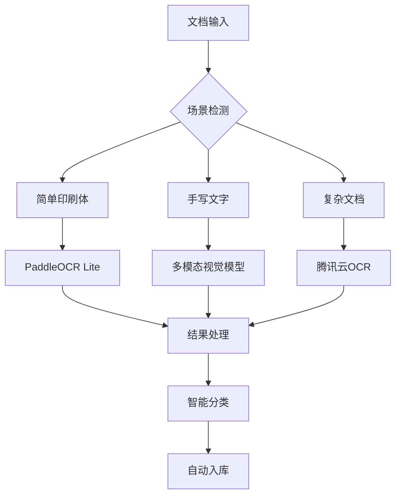

**AI 服务配置**：
```yaml
ai_services:
  ocr:
    default: "paddleocr"
    fallback: ["tencent_ocr", "baidu_ocr"]
    multimodal:
      - provider: "qwen"
        model: "qwen2.5-vl"
      - provider: "openai" 
        model: "gpt-4-vision"
  
  embedding:
    provider: "openai"
    model: "text-embedding-3-large"
    
  reranker:
    provider: "cohere"
    model: "rerank-multilingual-v3.0"
```

### 5.3 微信小程序开发

基于微信生态打造企业级小程序，提供完整的移动办公解决方案：

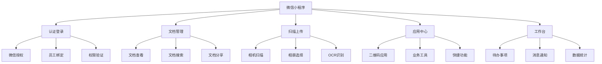

**小程序技术架构**：

```javascript
// 小程序目录结构
miniprogram/
├── pages/                  // 页面目录
│   ├── index/             // 首页
│   ├── login/             // 登录页
│   ├── documents/         // 文档管理
│   ├── scan/              // 扫描功能
│   ├── apps/              // 应用中心
│   └── profile/           // 个人中心
├── components/            // 组件库
│   ├── document-card/     // 文档卡片
│   ├── scan-camera/       // 扫描相机
│   └── app-grid/          // 应用网格
├── utils/                 // 工具函数
│   ├── request.js         // 网络请求
│   ├── auth.js            // 认证管理
│   └── storage.js         // 本地存储
├── services/              // 业务服务
│   ├── document.service.js
│   ├── scan.service.js
│   └── app.service.js
└── app.js                 // 应用入口
```

**核心页面设计**：

```javascript
// 1. 登录页面 (pages/login/login.js)
Page({
  data: {
    userInfo: null,
    employeeId: '',
    loading: false
  },
  
  // 微信授权登录
  onWechatLogin() {
    wx.getUserProfile({
      desc: '用于员工身份验证',
      success: (res) => {
        this.bindEmployee(res.userInfo);
      }
    });
  },
  
  // 绑定员工身份
  async bindEmployee(userInfo) {
    try {
      this.setData({ loading: true });
      
      const result = await wx.request({
        url: `${app.globalData.apiBase}/api/v1/wechat/bind`,
        method: 'POST',
        data: {
          userInfo: userInfo,
          employeeId: this.data.employeeId
        }
      });
      
      if (result.data.success) {
        wx.setStorageSync('token', result.data.token);
        wx.setStorageSync('userInfo', result.data.user);
        wx.redirectTo({ url: '/pages/index/index' });
      }
    } catch (error) {
      wx.showToast({ title: '登录失败', icon: 'error' });
    } finally {
      this.setData({ loading: false });
    }
  }
});

// 2. 文档扫描页面 (pages/scan/scan.js)
Page({
  data: {
    imageList: [],
    scanResult: null,
    processing: false
  },
  
  // 拍照扫描
  onCameraClick() {
    wx.chooseMedia({
      count: 5,
      mediaType: ['image'],
      sourceType: ['camera'],
      success: (res) => {
        this.processImages(res.tempFiles);
      }
    });
  },
  
  // 从相册选择
  onAlbumClick() {
    wx.chooseMedia({
      count: 5,
      mediaType: ['image'],
      sourceType: ['album'],
      success: (res) => {
        this.processImages(res.tempFiles);
      }
    });
  },
  
  // 处理图片
  async processImages(files) {
    this.setData({ processing: true });
    
    try {
      // 上传图片到服务器进行OCR
      const uploadPromises = files.map(file => 
        wx.uploadFile({
          url: `${app.globalData.apiBase}/api/v1/documents/scan`,
          filePath: file.tempFilePath,
          name: 'image',
          header: {
            'Authorization': `Bearer ${wx.getStorageSync('token')}`
          }
        })
      );
      
      const results = await Promise.all(uploadPromises);
      const scanResult = JSON.parse(results[0].data);
      
      this.setData({ 
        scanResult: scanResult,
        imageList: files.map(f => f.tempFilePath)
      });
      
    } catch (error) {
      wx.showToast({ title: 'OCR识别失败', icon: 'error' });
    } finally {
      this.setData({ processing: false });
    }
  },
  
  // 提交扫描结果
  async submitScan() {
    try {
      await wx.request({
        url: `${app.globalData.apiBase}/api/v1/documents/scan/submit`,
        method: 'POST',
        data: {
          scanId: this.data.scanResult.scanId,
          title: this.data.title,
          tags: this.data.tags
        },
        header: {
          'Authorization': `Bearer ${wx.getStorageSync('token')}`
        }
      });
      
      wx.showToast({ title: '提交成功，等待审批', icon: 'success' });
      wx.navigateBack();
    } catch (error) {
      wx.showToast({ title: '提交失败', icon: 'error' });
    }
  }
});

// 3. 文档管理页面 (pages/documents/documents.js)
Page({
  data: {
    documentList: [],
    searchKeyword: '',
    currentTab: 'all', // all, team_public, my_uploads
    loading: false
  },
  
  onLoad() {
    this.loadDocuments();
  },
  
  // 加载文档列表
  async loadDocuments() {
    try {
      this.setData({ loading: true });
      
      const result = await wx.request({
        url: `${app.globalData.apiBase}/api/v1/documents`,
        method: 'GET',
        data: {
          type: this.data.currentTab,
          keyword: this.data.searchKeyword
        },
        header: {
          'Authorization': `Bearer ${wx.getStorageSync('token')}`
        }
      });
      
      this.setData({ documentList: result.data.documents });
    } catch (error) {
      wx.showToast({ title: '加载失败', icon: 'error' });
    } finally {
      this.setData({ loading: false });
    }
  },
  
  // 文档预览
  onDocumentTap(e) {
    const doc = e.currentTarget.dataset.doc;
    
    // 检查权限
    if (this.canPreview(doc)) {
      wx.navigateTo({
        url: `/pages/document-detail/document-detail?id=${doc.id}`
      });
    } else {
      wx.showToast({ title: '无权限访问', icon: 'error' });
    }
  },
  
  // 权限检查
  canPreview(doc) {
    const userInfo = wx.getStorageSync('userInfo');
    return doc.visibility === 'system_public' || 
           doc.visibility === 'team_public' || 
           doc.creator_id === userInfo.id;
  }
});
```

### 5.4 移动端应用开发预留

为未来可能的原生移动应用开发预留技术条件：

**技术栈选择**：

| 方案 | 优势 | 适用场景 |
|------|------|----------|
| React Native | 跨平台、代码复用率高 | 快速开发、功能丰富 |
| Flutter | 性能优秀、UI一致性好 | 复杂UI、高性能要求 |
| 原生开发 | 最佳性能和体验 | 特定平台深度集成 |
| Uniapp | 小程序转移动应用 | 已有小程序基础 |

**架构预留设计**：

```typescript
// 统一的API接口层
interface MobileApiService {
  // 认证相关
  auth: {
    wechatLogin(code: string): Promise<LoginResult>;
    logout(): Promise<void>;
    refreshToken(): Promise<string>;
  };
  
  // 文档相关
  document: {
    list(params: DocumentListParams): Promise<DocumentList>;
    upload(file: File): Promise<UploadResult>;
    download(id: string): Promise<Blob>;
    scan(images: File[]): Promise<ScanResult>;
  };
  
  // 应用相关
  application: {
    list(): Promise<Application[]>;
    execute(appId: string, params: any): Promise<any>;
  };
}

// 离线存储策略
interface OfflineStorage {
  // 文档缓存
  cacheDocument(doc: Document): Promise<void>;
  getCachedDocuments(): Promise<Document[]>;
  
  // 离线操作队列
  addOfflineOperation(operation: OfflineOperation): Promise<void>;
  syncOfflineOperations(): Promise<void>;
}

// 推送通知
interface PushNotification {
  register(): Promise<string>;
  onMessage(callback: (message: NotificationMessage) => void): void;
  handleNotificationClick(data: any): void;
}
```

**移动端特性支持**：

```javascript
// 设备能力调用
class DeviceCapabilities {
  // 相机功能
  static async openCamera(options = {}) {
    if (this.isWeChat()) {
      return wx.chooseMedia(options);
    } else if (this.isReactNative()) {
      return ImagePicker.openCamera(options);
    } else {
      return navigator.mediaDevices.getUserMedia({ video: true });
    }
  }
  
  // 文件系统
  static async saveFile(filePath, data) {
    if (this.isWeChat()) {
      return wx.saveFile({ tempFilePath: filePath });
    } else if (this.isReactNative()) {
      return RNFS.writeFile(filePath, data);
    } else {
      return this.downloadFile(data, filePath);
    }
  }
  
  // 生物识别
  static async checkBiometric() {
    if (this.isReactNative()) {
      return TouchID.isSupported();
    }
    return false;
  }
  
  // 平台检测
  static isWeChat() {
    return typeof wx !== 'undefined';
  }
  
  static isReactNative() {
    return typeof navigator !== 'undefined' && navigator.product === 'ReactNative';
  }
}

// 响应式布局适配
class ResponsiveLayout {
  static getScreenSize() {
    if (this.isWeChat()) {
      return wx.getSystemInfoSync();
    } else {
      return {
        screenWidth: window.screen.width,
        screenHeight: window.screen.height,
        pixelRatio: window.devicePixelRatio
      };
    }
  }
  
  static adaptLayout() {
    const { screenWidth } = this.getScreenSize();
    
    if (screenWidth < 768) {
      return 'mobile';
    } else if (screenWidth < 1024) {
      return 'tablet';
    } else {
      return 'desktop';
    }
  }
}
```

**数据同步策略**：

```javascript
// 离线优先的数据同步
class DataSyncManager {
  constructor() {
    this.offlineQueue = [];
    this.syncInProgress = false;
  }
  
  // 添加离线操作
  async addOperation(operation) {
    // 尝试在线执行
    if (navigator.onLine) {
      try {
        return await this.executeOperation(operation);
      } catch (error) {
        // 在线执行失败，加入离线队列
        this.offlineQueue.push(operation);
        throw error;
      }
    } else {
      // 离线状态，直接加入队列
      this.offlineQueue.push(operation);
      await this.saveToLocalStorage();
    }
  }
  
  // 网络恢复时同步
  async syncWhenOnline() {
    if (!navigator.onLine || this.syncInProgress) {
      return;
    }
    
    this.syncInProgress = true;
    
    try {
      for (const operation of this.offlineQueue) {
        await this.executeOperation(operation);
      }
      
      this.offlineQueue = [];
      await this.saveToLocalStorage();
    } catch (error) {
      console.error('同步失败:', error);
    } finally {
      this.syncInProgress = false;
    }
  }
  
  // 监听网络状态
  startNetworkMonitoring() {
    if (typeof wx !== 'undefined') {
      wx.onNetworkStatusChange((res) => {
        if (res.isConnected) {
          this.syncWhenOnline();
        }
      });
    } else {
      window.addEventListener('online', () => {
        this.syncWhenOnline();
      });
    }
  }
}
```

替换 CDK 的 Linux.do OAuth2 认证，采用微信生态认证：

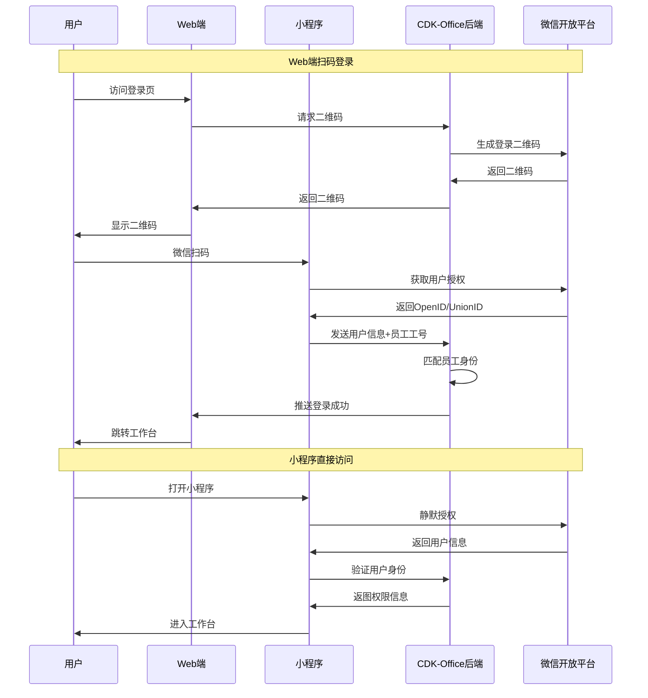

**认证流程优化**：

```go
// 微信认证服务（轻量版）
type WechatAuthService struct {
    appID     string
    appSecret string
    redis     *redis.Client
    db        *gorm.DB
}

func (s *WechatAuthService) GenerateQRCode() (*QRCodeResponse, error) {
    // 生成二维码scene值
    scene := fmt.Sprintf("login_%d", time.Now().Unix())
    
    // 调用微信API生成二维码
    qrCode, err := s.createWechatQRCode(scene)
    if err != nil {
        return nil, err
    }
    
    // 缓存二维码状态
    s.redis.Set(fmt.Sprintf("qr_%s", scene), "pending", 5*time.Minute)
    
    return &QRCodeResponse{
        Scene:    scene,
        QRCodeURL: qrCode.URL,
        ExpireIn: 300,
    }, nil
}

func (s *WechatAuthService) HandleMiniProgramAuth(openID, scene, employeeID string) error {
    // 1. 验证员工身份
    employee, err := s.validateEmployee(employeeID)
    if err != nil {
        return err
    }
    
    // 2. 绑定微信账号
    user, err := s.bindWechatUser(openID, employee)
    if err != nil {
        return err
    }
    
    // 3. 更新二维码状态
    token := s.generateJWT(user)
    s.redis.Set(fmt.Sprintf("qr_%s", scene), token, time.Hour)
    
    return nil
}
```

## 6. 存储架构

### 6.1 混合云存储方案

设计智能存储切换机制，优化成本和性能：

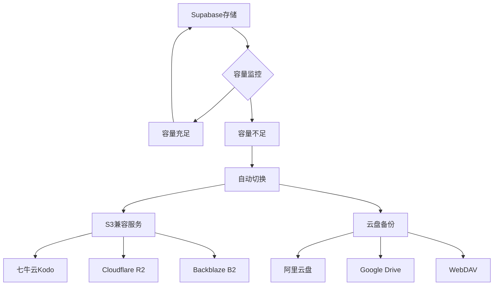

**存储抽象层设计**：
```go
type StorageProvider interface {
    Upload(file io.Reader, key string) (*UploadResult, error)
    Download(key string) (io.Reader, error)
    Delete(key string) error
    GetURL(key string) (string, error)
}

type StorageManager struct {
    primary   StorageProvider  // Supabase Storage
    secondary []StorageProvider // S3兼容服务
    monitor   *CapacityMonitor
}

func (sm *StorageManager) Upload(file io.Reader, key string) error {
    // 检查主存储容量
    if sm.monitor.ShouldSwitch() {
        return sm.switchToSecondary(file, key)
    }
    return sm.primary.Upload(file, key)
}
```

### 6.2 数据迁移策略

提供可视化迁移工具：

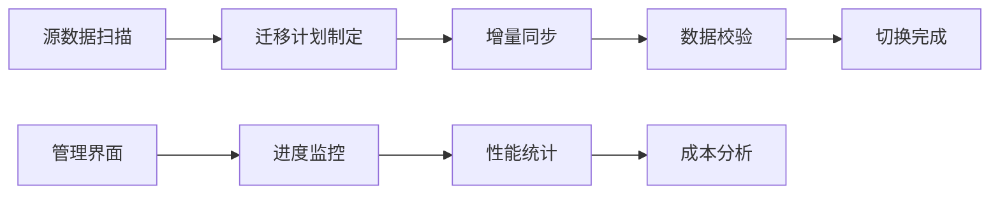

## 7. 安全设计

### 7.1 数据安全

继承 CDK 的安全机制并增强：

**认证安全**：
- 微信 OpenID + UnionID 双重认证
- JWT Token + 刷新机制
- 员工工号绑定验证

**数据隔离**：
- 团队级数据隔离
- RLS 行级安全策略
- 敏感数据加密存储

**访问控制**：
```go
// 基于微信认证的访问控制
type WechatAccessPolicy struct {
    ResourceType string                 `json:"resource_type"`
    Actions      []string               `json:"actions"`
    TeamID       string                 `json:"team_id"`
    Conditions   map[string]interface{} `json:"conditions"`
}

func (p *WechatAccessPolicy) Check(user *WechatUser, resource interface{}) bool {
    // 检查团队权限
    if user.TeamID != p.TeamID {
        return false
    }
    
    // 检查角色权限
    if !p.checkRoleAccess(user.Role, p.Actions) {
        return false
    }
    
    // 检查微信绑定状态
    if !user.IsWechatBound {
        return false
    }
    
    return true
}
```

### 7.2 审计日志

```go
type AuditLog struct {
    ID         UUID      `json:"id" gorm:"type:uuid;primary_key;default:gen_random_uuid()"`
    UserID     UUID      `json:"user_id" gorm:"type:uuid"`
    WechatOpenID string  `json:"wechat_openid"`
    Action     string    `json:"action"`
    Resource   string    `json:"resource"`
    TeamID     UUID      `json:"team_id" gorm:"type:uuid"`
    Details    string    `json:"details"`
    IP         string    `json:"ip"`
    UserAgent  string    `json:"user_agent"`
    CreatedAt  time.Time `json:"created_at" gorm:"autoCreateTime"`
}

// 轻量级审计日志记录
func LogUserAction(userID UUID, action, resource string, details interface{}) {
    // 异步记录，避免影响主流程
    go func() {
        log := &AuditLog{
            UserID:   userID,
            Action:   action,
            Resource: resource,
            Details:  fmt.Sprintf("%+v", details),
            IP:       getCurrentIP(),
        }
        
        // 批量写入，减少数据库请求
        auditBuffer.Add(log)
    }()
}
```

## 8. 性能优化

### 8.1 面向 2C2G VPS 的架构优化

**内存优化**：
```go
// 轻量级缓存管理
type LightCache struct {
    local  *cache.Cache          // 128MB 本地缓存
    redis  *redis.Client         // Redis 远程缓存
    config *CacheConfig
}

type CacheConfig struct {
    MaxLocalSize    int           // 128MB
    LocalTTL       time.Duration  // 5分钟
    RedisTTL       time.Duration  // 1小时
    CompressionEnabled bool       // 启用压缩
}

func (c *LightCache) Get(key string) (interface{}, error) {
    // 1. 先查本地缓存
    if val, found := c.local.Get(key); found {
        return val, nil
    }
    
    // 2. 查Redis
    val, err := c.redis.Get(key).Result()
    if err == nil {
        // 解压缩并缓存到本地
        decompressed := c.decompress(val)
        c.local.Set(key, decompressed, c.config.LocalTTL)
        return decompressed, nil
    }
    
    return nil, err
}
```

**数据库连接优化**：
```go
// Supabase 连接池优化
func InitSupabaseDB() *gorm.DB {
    config := &gorm.Config{
        Logger: logger.Default.LogMode(logger.Silent), // 生产环境关闭日志
        PrepareStmt: true,                            // 预编译SQL
        DisableForeignKeyConstraintWhenMigrating: true,
    }
    
    dsn := fmt.Sprintf("host=%s user=%s password=%s dbname=%s port=%s sslmode=require",
        os.Getenv("SUPABASE_DB_HOST"),
        os.Getenv("SUPABASE_DB_USER"),
        os.Getenv("SUPABASE_DB_PASSWORD"),
        os.Getenv("SUPABASE_DB_NAME"),
        os.Getenv("SUPABASE_DB_PORT"),
    )
    
    db, err := gorm.Open(postgres.Open(dsn), config)
    if err != nil {
        log.Fatal("Failed to connect to Supabase:", err)
    }
    
    sqlDB, _ := db.DB()
    sqlDB.SetMaxOpenConns(10)          // 最大连接数限制
    sqlDB.SetMaxIdleConns(5)           // 空闲连接数
    sqlDB.SetConnMaxLifetime(time.Hour) // 连接生命周期
    
    return db
}
```

### 8.2 Supabase 免费层限制优化

**数据库操作优化**：
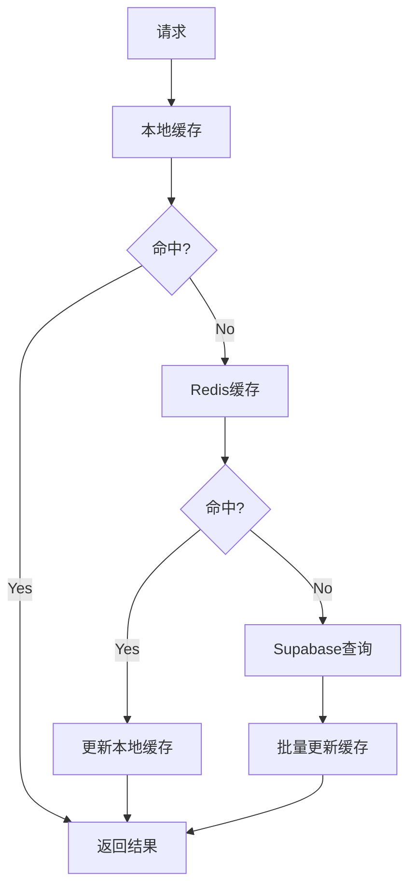

**限制监控**：
```go
type SupabaseLimitMonitor struct {
    rowCount    int64
    bandwidth   int64
    storage     int64
    maxRows     int64  // 50w行
    maxBandwidth int64 // 2GB/月
    maxStorage  int64  // 500MB
}

func (m *SupabaseLimitMonitor) CheckLimits() *LimitStatus {
    return &LimitStatus{
        RowsUsage:      float64(m.rowCount) / float64(m.maxRows),
        BandwidthUsage: float64(m.bandwidth) / float64(m.maxBandwidth),
        StorageUsage:   float64(m.storage) / float64(m.maxStorage),
        ShouldAlert:    m.rowCount > m.maxRows*0.8, // 80%警告
    }
}
```

### 8.3 缓存策略优化

基于 CDK 的 Redis 缓存架构，针对轻量环境优化：

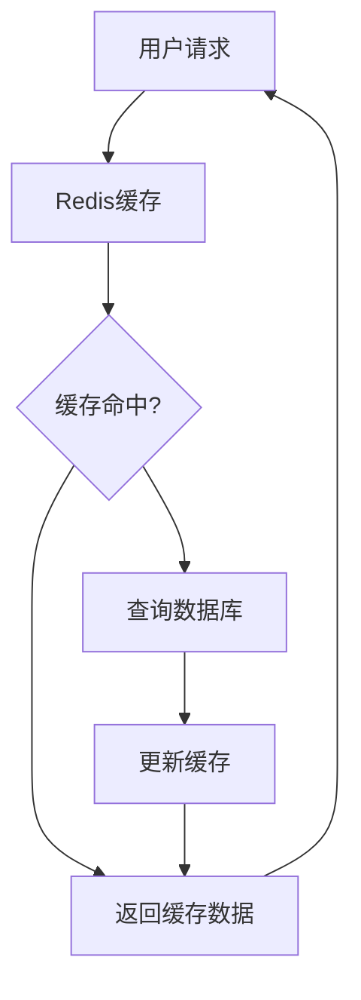

**缓存层级**：
- L1: 浏览器缓存 (静态资源)
- L2: CDN 缓存 (公共文档)
- L3: Redis 缓存 (热点数据)
- L4: Supabase 数据库缓存

### 8.2 搜索优化

```go
// GoFound 全文检索集成
type SearchService struct {
    gofound *gofound.Engine
    redis   *redis.Client
}

func (s *SearchService) Search(query string, team string) (*SearchResult, error) {
    // 1. 检查缓存
    cacheKey := fmt.Sprintf("search:%s:%s", team, query)
    if cached := s.redis.Get(cacheKey); cached != nil {
        return cached, nil
    }
    
    // 2. 执行搜索
    result := s.gofound.Search(query, team)
    
    // 3. 缓存结果
    s.redis.Set(cacheKey, result, 5*time.Minute)
    
    return result, nil
}
```

## 9. 部署架构

### 9.1 2C2G VPS 优化部署

**轻量化 Docker 配置**：
```dockerfile
# 多阶段构建，减小镜像体积
FROM golang:1.24-alpine AS backend-builder
WORKDIR /app
COPY go.mod go.sum ./
RUN go mod download
COPY . .
RUN CGO_ENABLED=0 GOOS=linux go build -ldflags="-w -s" -o cdk-office main.go

FROM node:18-alpine AS frontend-builder
WORKDIR /app
COPY frontend/package*.json ./
RUN npm ci --only=production
COPY frontend/ .
RUN npm run build

# 生产镜像
FROM alpine:latest
RUN apk --no-cache add ca-certificates tzdata
WORKDIR /root/

# 复制后端文件
COPY --from=backend-builder /app/cdk-office .
COPY --from=frontend-builder /app/dist ./static

# 优化配置
COPY config.prod.yaml ./config.yaml

# 设置内存限制
ENV GOGC=100
ENV GOMEMLIMIT=1536MiB

EXPOSE 8000
CMD ["./cdk-office", "api"]
```

**内存优化配置**：
```yaml
# config.prod.yaml - 2C2G VPS 优化配置
app:
  app_name: "cdk-office"
  env: "production"
  addr: ":8000"
  session_cookie_name: "cdk_office_session"
  session_age: 86400
  max_request_size: 10MB  # 限制请求大小

# Supabase 配置
supabase:
  url: "${SUPABASE_URL}"
  anon_key: "${SUPABASE_ANON_KEY}"
  service_role_key: "${SUPABASE_SERVICE_ROLE_KEY}"
  max_connections: 8      # 限制数据库连接数
  connection_timeout: 30s

# Redis 配置（内存优化）
redis:
  host: "127.0.0.1"
  port: 6379
  password: ""
  db: 0
  pool_size: 20           # 减少连接池
  min_idle_conn: 5
  max_memory: "256mb"     # 限制Redis内存
  eviction_policy: "allkeys-lru"

# 微信配置
wechat:
  app_id: "${WECHAT_APP_ID}"
  app_secret: "${WECHAT_APP_SECRET}"
  mini_program_app_id: "${WECHAT_MINI_APP_ID}"
  mini_program_secret: "${WECHAT_MINI_SECRET}"

# 日志配置（减少IO）
log:
  level: "warn"           # 生产环境减少日志
  format: "json"
  output: "stdout"
  max_size: 50            # 减小日志文件

# 性能优化
performance:
  enable_gzip: true
  max_goroutines: 1000    # 限制协程数
  read_timeout: 30s
  write_timeout: 30s
  gc_percent: 100         # 调整GC触发条件
```

### 9.2 CI/CD 流水线

```yaml
# .github/workflows/deploy.yml
name: Deploy CDK-Office
on:
  push:
    branches: [main]

jobs:
  deploy:
    runs-on: ubuntu-latest
    steps:
      - uses: actions/checkout@v3
      - name: Build Backend
        run: |
          cd backend
          go build -o cdk-office
      - name: Build Frontend  
        run: |
          cd frontend
          pnpm build
      - name: Deploy to Production
        env:
          SUPABASE_URL: ${{ secrets.SUPABASE_URL }}
          SUPABASE_ANON_KEY: ${{ secrets.SUPABASE_ANON_KEY }}
        run: |
          docker build -t cdk-office .
          docker push ${{ secrets.REGISTRY }}/cdk-office
```

## 10. 监控运维

### 10.1 可观测性

继承 CDK 的 OpenTelemetry 架构：

```go
// 基于CDK的链路追踪
import (
    "go.opentelemetry.io/otel"
    "go.opentelemetry.io/otel/trace"
)

func (s *DocumentService) ProcessDocument(ctx context.Context, doc *Document) error {
    ctx, span := otel.Tracer("document-service").Start(ctx, "process_document")
    defer span.End()
    
    // 业务逻辑
    span.SetAttributes(
        attribute.String("document.id", doc.ID),
        attribute.String("document.type", doc.Type),
    )
    
    return nil
}
```

### 10.2 性能指标

| 指标类型 | 目标值 | 监控方式 |
|---------|--------|----------|
| API 响应时间 | <200ms | OpenTelemetry |
| 文档处理时间 | <5s | 自定义指标 |
| OCR 识别精度 | >90% | AI 服务监控 |
| 系统可用性 | >99.9% | 健康检查 |

## 11. 扩展规划

### 11.1 业务中心扩展

为后续功能集成预留标准化接口：

```go
type BusinessModule interface {
    Name() string
    GetRoutes() []Route
    GetMenuItems() []MenuItem
    Initialize() error
}

// 计算器工具模块示例
type CalculatorModule struct {
    router *gin.RouterGroup
}

func (m *CalculatorModule) Name() string {
    return "calculator"
}

func (m *CalculatorModule) GetRoutes() []Route {
    return []Route{
        {Path: "/api/v1/tools/calculator", Method: "POST", Handler: m.Calculate},
        {Path: "/api/v1/tools/calculator/history", Method: "GET", Handler: m.GetHistory},
    }
}

func (m *CalculatorModule) GetMenuItems() []MenuItem {
    return []MenuItem{
        {Name: "财务计算器", Path: "/tools/calculator", Icon: "calculator"},
    }
}
```

### 11.2 预留工具模块

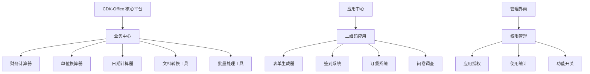

**预留扩展空间**：

**业务中心工具**：
- 财务相关计算工具
- 文档格式转换工具
- 数据批量处理工具
- 办公效率小工具
- 团队协作工具

**二维码应用中心**：
- 动态表单生成器
- 员工签到系统
- 在线订餐系统
- 问卷调查系统
- 访客登记系统

## 12. 仪表板智能检索与问答系统

### 12.1 功能概述

仪表板作为**系统登录后的默认主页**（/dashboard），集成基于GOFOUND的全文检索和AI驱动的智能问答功能，为不同权限用户提供分级的文档搜索和智能问答服务。

**核心特性**：
- 登录后默认进入仪表板页面
- 显示用户基本信息：姓名、所在团队、工号
- 用户个人信息面板，支持个性化设置
- 团队管理员员工使用情况监控
- 基于权限的分级搜索范围控制
- GOFOUND全文检索 + 语义搜索双引擎
- AI驱动的智能问答系统
- 超级管理员团队切换功能
- 实时搜索建议和历史记录

**仪表板布局设计**：

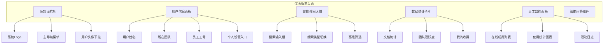

**权限分级架构**：

| 用户角色 | 搜索范围 | 问答数据源 | 特殊功能 |
|---------|----------|------------|----------|
| 超级管理员 | 全局/指定团队所有数据 | 全平台文档库 | 团队切换 |
| 团队管理员 | 本团队所有数据 | 本团队文档库 | 团队数据管理 |
| 协作用户 | 本团队+公开文档 | 本团队+公开数据 | 部门级搜索 |
| 普通用户 | 仅公开文档 | 公开知识库 | 基础搜索 |

### 12.2 技术架构

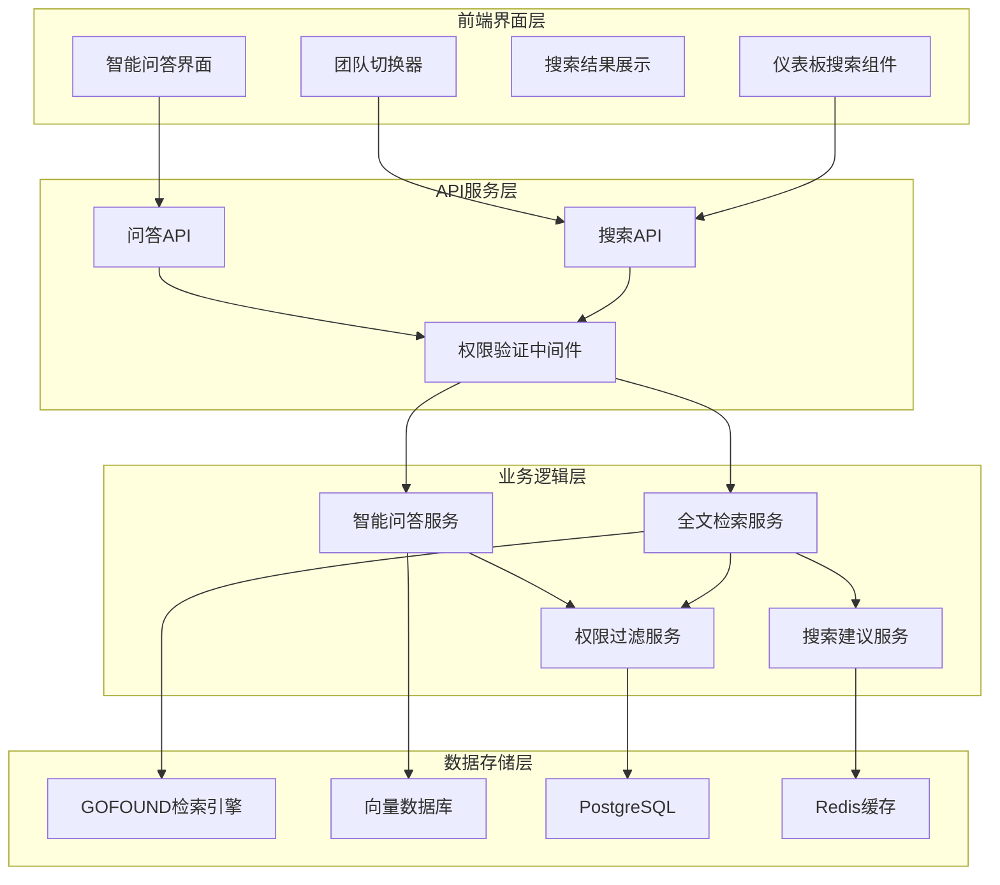

### 12.3 用户个人信息面板设计

**功能特性**：
- 登录后显示用户基本信息：姓名、所在团队、工号
- 个性化设置：头像、昵称、个人简介、联系方式
- 系统偏好设置：主题、语言、时区、通知设置
- 安全设置：密码修改、登录日志、双因子认证

```go
// 用户个人信息模型扩展
type UserProfile struct {
    ID          UUID      `json:"id" gorm:"type:uuid;primary_key;default:gen_random_uuid()"`
    UserID      UUID      `json:"user_id" gorm:"type:uuid;unique;not null"`
    
    // 基本信息
    Avatar      string    `json:"avatar" gorm:"size:500"`          // 头像 URL
    Nickname    string    `json:"nickname" gorm:"size:50"`         // 昵称
    Biography   string    `json:"biography" gorm:"size:500"`       // 个人简介
    Phone       string    `json:"phone" gorm:"size:20"`            // 手机号
    Email       string    `json:"email" gorm:"size:100"`           // 邮箱
    
    // 系统偏好
    Theme       string    `json:"theme" gorm:"size:20;default:'auto'"` // 主题：light/dark/auto
    Language    string    `json:"language" gorm:"size:10;default:'zh-CN'"`
    Timezone    string    `json:"timezone" gorm:"size:50;default:'Asia/Shanghai'"`
    
    // 通知设置
    EmailNotification  bool `json:"email_notification" gorm:"default:true"`
    SmsNotification    bool `json:"sms_notification" gorm:"default:false"`
    PushNotification   bool `json:"push_notification" gorm:"default:true"`
    
    // 仪表板个性化
    DashboardLayout    string `json:"dashboard_layout" gorm:"type:text"` // JSON格式的仪表板布局
    QuickAccessApps    string `json:"quick_access_apps" gorm:"type:text"` // 快速访问应用列表
    
    CreatedAt   time.Time `json:"created_at" gorm:"autoCreateTime"`
    UpdatedAt   time.Time `json:"updated_at" gorm:"autoUpdateTime"`
}

// 用户活动日志
type UserActivityLog struct {
    ID          UUID      `json:"id" gorm:"type:uuid;primary_key;default:gen_random_uuid()"`
    UserID      UUID      `json:"user_id" gorm:"type:uuid;not null"`
    TeamID      UUID      `json:"team_id" gorm:"type:uuid"`
    
    ActivityType string   `json:"activity_type"` // login, logout, search, upload, download, share, view, edit
    Description  string   `json:"description" gorm:"size:500"`
    ResourceID   UUID     `json:"resource_id,omitempty" gorm:"type:uuid"` // 相关资源ID
    ResourceType string   `json:"resource_type,omitempty"`               // document, application, etc
    IPAddress    string   `json:"ip_address" gorm:"size:45"`
    UserAgent    string   `json:"user_agent" gorm:"size:500"`
    Duration     int64    `json:"duration,omitempty"` // 活动持续时间（秒）
    SessionID    string   `json:"session_id" gorm:"size:100"`
    
    // 跨团队操作记录
    CrossTeam      bool   `json:"cross_team" gorm:"default:false"`        // 是否为跨团队操作
    TargetTeamID   UUID   `json:"target_team_id,omitempty" gorm:"type:uuid"` // 目标团队ID
    ApprovedBy     UUID   `json:"approved_by,omitempty" gorm:"type:uuid"`    // 审批人
    
    CreatedAt    time.Time `json:"created_at" gorm:"autoCreateTime"`
}

// 系统使用日志查看权限服务
type SystemLogService struct {
    db *gorm.DB
}

// 获取系统使用日志（按权限过滤）
func (s *SystemLogService) GetSystemUsageLogs(requesterID UUID, filters *LogFilters) (*UsageLogResponse, error) {
    user, err := s.getUserWithPermissions(requesterID)
    if err != nil {
        return nil, err
    }
    
    var logs []UserActivityLog
    query := s.db.Model(&UserActivityLog{})
    
    // 根据用户角色过滤查看权限
    switch user.Role {
    case "super_admin":
        // 超级管理员：可查看所有团队的使用日志
        if filters.TeamID != uuid.Nil {
            query = query.Where("team_id = ?", filters.TeamID)
        }
        // 无额外限制
        
    case "team_manager":
        // 团队管理员：仅可查看本团队的使用日志
        query = query.Where("team_id = ?", user.TeamID)
        
    default:
        // 其他用户无权限查看系统使用日志
        return nil, errors.New("无权限查看系统使用日志")
    }
    
    // 应用其他过滤条件
    if filters.UserID != uuid.Nil {
        query = query.Where("user_id = ?", filters.UserID)
    }
    
    if filters.ActivityType != "" {
        query = query.Where("activity_type = ?", filters.ActivityType)
    }
    
    if filters.StartDate != "" && filters.EndDate != "" {
        query = query.Where("created_at BETWEEN ? AND ?", filters.StartDate, filters.EndDate)
    }
    
    if filters.CrossTeamOnly {
        query = query.Where("cross_team = ?", true)
    }
    
    // 执行查询
    if err := query.Order("created_at DESC").Limit(filters.Limit).Offset(filters.Offset).Find(&logs).Error; err != nil {
        return nil, err
    }
    
    // 获取总数
    var totalCount int64
    query.Count(&totalCount)
    
    return &UsageLogResponse{
        Logs:       logs,
        TotalCount: totalCount,
        Filters:    filters,
        ViewerRole: user.Role,
    }, nil
}

// 记录用户活动日志
func (s *SystemLogService) LogUserActivity(log *UserActivityLog) error {
    // 自动设置活动时间
    log.CreatedAt = time.Now()
    
    // 异步写入日志，避免影响主业务性能
    go func() {
        if err := s.db.Create(log).Error; err != nil {
            // 日志记录失败时的处理
            log.Printf("记录用户活动日志失败: %v", err)
        }
    }()
    
    return nil
}

// 跨团队文档分享权限验证
func (s *SystemLogService) ValidateCrossTeamSharePermission(userID UUID, targetTeamID UUID) error {
    user, err := s.getUserWithPermissions(userID)
    if err != nil {
        return err
    }
    
    // 仅超级管理员可以进行跨团队文档分享
    if user.Role != "super_admin" {
        return errors.New("仅超级管理员可以进行跨团队文档分享")
    }
    
    return nil
}

type LogFilters struct {
    TeamID        UUID   `json:"team_id,omitempty"`
    UserID        UUID   `json:"user_id,omitempty"`
    ActivityType  string `json:"activity_type,omitempty"`
    StartDate     string `json:"start_date,omitempty"`
    EndDate       string `json:"end_date,omitempty"`
    CrossTeamOnly bool   `json:"cross_team_only,omitempty"`
    Limit         int    `json:"limit" default:"50"`
    Offset        int    `json:"offset" default:"0"`
}

type UsageLogResponse struct {
    Logs       []UserActivityLog `json:"logs"`
    TotalCount int64             `json:"total_count"`
    Filters    *LogFilters       `json:"filters"`
    ViewerRole string            `json:"viewer_role"`
}

// 用户在线状态
type UserOnlineStatus struct {
    UserID       UUID      `json:"user_id" gorm:"type:uuid;primary_key"`
    TeamID       UUID      `json:"team_id" gorm:"type:uuid"`
    Status       string    `json:"status"` // online, away, busy, offline
    LastActivity time.Time `json:"last_activity"`
    SessionID    string    `json:"session_id" gorm:"size:100"`
    IPAddress    string    `json:"ip_address" gorm:"size:45"`
    Location     string    `json:"location" gorm:"size:100"` // 登录地点
    Device       string    `json:"device" gorm:"size:100"`   // 设备信息
    
    UpdatedAt    time.Time `json:"updated_at" gorm:"autoUpdateTime"`
}
```

**个人信息面板服务**：

```go
// 用户个人信息服务
type UserProfileService struct {
    db *gorm.DB
}

// 获取用户个人信息
func (s *UserProfileService) GetUserProfile(userID UUID) (*UserProfileResponse, error) {
    var user User
    var profile UserProfile
    var team Team
    
    // 获取用户基本信息
    if err := s.db.First(&user, userID).Error; err != nil {
        return nil, err
    }
    
    // 获取用户个人资料
    s.db.Where("user_id = ?", userID).FirstOrCreate(&profile, UserProfile{UserID: userID})
    
    // 获取团队信息
    if user.TeamID != uuid.Nil {
        s.db.First(&team, user.TeamID)
    }
    
    return &UserProfileResponse{
        UserID:      user.ID,
        Username:    user.Username,
        RealName:    user.RealName,
        EmployeeID:  user.EmployeeID,
        TeamName:    team.Name,
        TeamRole:    user.Role,
        Profile:     &profile,
    }, nil
}

// 更新用户个人信息
func (s *UserProfileService) UpdateUserProfile(userID UUID, updates *UserProfileUpdate) error {
    var profile UserProfile
    
    // 获取或创建用户资料
    if err := s.db.Where("user_id = ?", userID).FirstOrCreate(&profile, UserProfile{UserID: userID}).Error; err != nil {
        return err
    }
    
    // 更新字段
    if updates.Nickname != "" {
        profile.Nickname = updates.Nickname
    }
    if updates.Biography != "" {
        profile.Biography = updates.Biography
    }
    if updates.Avatar != "" {
        profile.Avatar = updates.Avatar
    }
    if updates.Theme != "" {
        profile.Theme = updates.Theme
    }
    
    return s.db.Save(&profile).Error
}

type UserProfileResponse struct {
    UserID      UUID         `json:"user_id"`
    Username    string       `json:"username"`
    RealName    string       `json:"real_name"`
    EmployeeID  string       `json:"employee_id"`
    TeamName    string       `json:"team_name"`
    TeamRole    string       `json:"team_role"`
    Profile     *UserProfile `json:"profile"`
}

type UserProfileUpdate struct {
    Nickname    string `json:"nickname,omitempty"`
    Biography   string `json:"biography,omitempty"`
    Avatar      string `json:"avatar,omitempty"`
    Phone       string `json:"phone,omitempty"`
    Email       string `json:"email,omitempty"`
    Theme       string `json:"theme,omitempty"`
    Language    string `json:"language,omitempty"`
    Timezone    string `json:"timezone,omitempty"`
}
```

### 12.4 团队管理员员工监控功能

**功能特性**：
- 查看在线成员列表和状态
- 员工系统使用情况统计
- 活动日志查看和分析
- 实时监控仪表板
- **本团队系统使用日志查看权限**

**系统使用日志查看权限**：
- **超级管理员**：具有所有团队的使用日志查看权限
- **团队管理员**：仅具有本团队使用日志的查看权限
- **协作用户和普通用户**：无系统使用日志查看权限

```go
// 团队管理员监控服务
type TeamManagementService struct {
    db    *gorm.DB
    redis *redis.Client
}

// 获取在线成员列表
func (s *TeamManagementService) GetOnlineMembers(teamManagerID UUID) (*OnlineMembersResponse, error) {
    // 验证团队管理员权限
    manager, err := s.getUserWithTeam(teamManagerID)
    if err != nil || manager.Role != "team_manager" {
        return nil, errors.New("无权限访问")
    }
    
    var onlineUsers []OnlineUserInfo
    
    // 获取团队在线成员
    query := `
        SELECT u.id, u.username, u.real_name, u.employee_id, 
               uos.status, uos.last_activity, uos.location, uos.device
        FROM users u
        JOIN user_online_status uos ON u.id = uos.user_id
        WHERE u.team_id = ? AND uos.status IN ('online', 'away', 'busy')
        ORDER BY uos.last_activity DESC
    `
    
    if err := s.db.Raw(query, manager.TeamID).Scan(&onlineUsers).Error; err != nil {
        return nil, err
    }
    
    // 统计信息
    var totalMembers int64
    s.db.Model(&User{}).Where("team_id = ?", manager.TeamID).Count(&totalMembers)
    
    onlineCount := len(onlineUsers)
    
    return &OnlineMembersResponse{
        OnlineMembers: onlineUsers,
        Statistics: OnlineStatistics{
            TotalMembers:  int(totalMembers),
            OnlineCount:   onlineCount,
            OfflineCount:  int(totalMembers) - onlineCount,
            ActiveRate:    float64(onlineCount) / float64(totalMembers) * 100,
        },
    }, nil
}

// 获取团队使用统计（增加系统日志查看功能）
func (s *TeamManagementService) GetTeamUsageStatisticsWithLogs(teamManagerID UUID, dateRange DateRange) (*UsageStatisticsResponse, error) {
    manager, err := s.getUserWithTeam(teamManagerID)
    if err != nil || (manager.Role != "team_manager" && manager.Role != "super_admin") {
        return nil, errors.New("无权限访问")
    }
    
    // 获取日期范围内的活动统计
    var dailyStats []DailyUsageStats
    
    query := `
        SELECT DATE(created_at) as date,
               COUNT(*) as total_activities,
               COUNT(DISTINCT user_id) as active_users,
               COUNT(CASE WHEN activity_type = 'login' THEN 1 END) as logins,
               COUNT(CASE WHEN activity_type = 'search' THEN 1 END) as searches,
               COUNT(CASE WHEN activity_type = 'upload' THEN 1 END) as uploads,
               COUNT(CASE WHEN activity_type = 'download' THEN 1 END) as downloads,
               COUNT(CASE WHEN activity_type = 'share' THEN 1 END) as shares,
               COUNT(CASE WHEN cross_team = true THEN 1 END) as cross_team_activities
        FROM user_activity_logs 
        WHERE team_id = ? AND created_at BETWEEN ? AND ?
        GROUP BY DATE(created_at)
        ORDER BY date DESC
    `
    
    var targetTeamID UUID
    if manager.Role == "super_admin" {
        // 超级管理员可以查看指定团队或所有团队
        targetTeamID = manager.TeamID // 可以通过参数传入指定团队ID
    } else {
        // 团队管理员只能查看本团队
        targetTeamID = manager.TeamID
    }
    
    if err := s.db.Raw(query, targetTeamID, dateRange.StartDate, dateRange.EndDate).Scan(&dailyStats).Error; err != nil {
        return nil, err
    }
    
    // 获取用户活动排行
    var userActivity []UserActivityRank
    userQuery := `
        SELECT u.real_name, u.employee_id,
               COUNT(ual.id) as activity_count,
               MAX(ual.created_at) as last_activity,
               COUNT(CASE WHEN ual.cross_team = true THEN 1 END) as cross_team_count
        FROM users u
        LEFT JOIN user_activity_logs ual ON u.id = ual.user_id 
            AND ual.created_at BETWEEN ? AND ?
        WHERE u.team_id = ?
        GROUP BY u.id, u.real_name, u.employee_id
        ORDER BY activity_count DESC
        LIMIT 20
    `
    
    if err := s.db.Raw(userQuery, dateRange.StartDate, dateRange.EndDate, targetTeamID).Scan(&userActivity).Error; err != nil {
        return nil, err
    }
    
    // 获取跨团队操作日志（仅超级管理员可见）
    var crossTeamLogs []CrossTeamActivityLog
    if manager.Role == "super_admin" {
        crossTeamQuery := `
            SELECT ual.id, ual.user_id, u.real_name, u.employee_id,
                   ual.activity_type, ual.description, ual.target_team_id,
                   t.name as target_team_name, ual.created_at
            FROM user_activity_logs ual
            JOIN users u ON ual.user_id = u.id
            LEFT JOIN teams t ON ual.target_team_id = t.id
            WHERE ual.cross_team = true AND ual.created_at BETWEEN ? AND ?
            ORDER BY ual.created_at DESC
            LIMIT 50
        `
        if err := s.db.Raw(crossTeamQuery, dateRange.StartDate, dateRange.EndDate).Scan(&crossTeamLogs).Error; err != nil {
            return nil, err
        }
    }
    
    return &UsageStatisticsResponse{
        DailyStats:     dailyStats,
        UserActivity:   userActivity,
        CrossTeamLogs:  crossTeamLogs,
        DateRange:      dateRange,
        ViewerRole:     manager.Role,
        TargetTeamID:   targetTeamID,
    }, nil
}

type OnlineUserInfo struct {
    UserID       UUID      `json:"user_id"`
    Username     string    `json:"username"`
    RealName     string    `json:"real_name"`
    EmployeeID   string    `json:"employee_id"`
    Status       string    `json:"status"`
    LastActivity time.Time `json:"last_activity"`
    Location     string    `json:"location"`
    Device       string    `json:"device"`
}

type OnlineStatistics struct {
    TotalMembers int     `json:"total_members"`
    OnlineCount  int     `json:"online_count"`
    OfflineCount int     `json:"offline_count"`
    ActiveRate   float64 `json:"active_rate"`
}

type OnlineMembersResponse struct {
    OnlineMembers []OnlineUserInfo `json:"online_members"`
    Statistics    OnlineStatistics `json:"statistics"`
}

type DailyUsageStats struct {
    Date            string `json:"date"`
    TotalActivities int    `json:"total_activities"`
    ActiveUsers     int    `json:"active_users"`
    Logins          int    `json:"logins"`
    Searches        int    `json:"searches"`
    Uploads         int    `json:"uploads"`
    Downloads       int    `json:"downloads"`
    Shares          int    `json:"shares"`
    CrossTeamActivities int `json:"cross_team_activities"`
}

type UserActivityRank struct {
    RealName      string    `json:"real_name"`
    EmployeeID    string    `json:"employee_id"`
    ActivityCount int       `json:"activity_count"`
    LastActivity  time.Time `json:"last_activity"`
    CrossTeamCount int      `json:"cross_team_count"`
}

type CrossTeamActivityLog struct {
    ID             UUID      `json:"id"`
    UserID         UUID      `json:"user_id"`
    RealName       string    `json:"real_name"`
    EmployeeID     string    `json:"employee_id"`
    ActivityType   string    `json:"activity_type"`
    Description    string    `json:"description"`
    TargetTeamID   UUID      `json:"target_team_id"`
    TargetTeamName string    `json:"target_team_name"`
    CreatedAt      time.Time `json:"created_at"`
}

type UsageStatisticsResponse struct {
    DailyStats     []DailyUsageStats      `json:"daily_stats"`
    UserActivity   []UserActivityRank     `json:"user_activity"`
    CrossTeamLogs  []CrossTeamActivityLog `json:"cross_team_logs,omitempty"`
    DateRange      DateRange              `json:"date_range"`
    ViewerRole     string                 `json:"viewer_role"`
    TargetTeamID   UUID                   `json:"target_team_id"`
}
```

### 12.5 数据模型设计

```go
// 搜索请求结构
type SearchRequest struct {
    Query      string    `json:"query"`
    UserID     UUID      `json:"user_id"`
    TeamID     UUID      `json:"team_id,omitempty"` // 超级管理员切换团队时使用
    SearchType string    `json:"search_type"`       // full_text, semantic, hybrid
    Filters    SearchFilters `json:"filters,omitempty"`
    Pagination Pagination    `json:"pagination"`
}

type SearchFilters struct {
    FileTypes   []string    `json:"file_types,omitempty"`
    DateRange   DateRange   `json:"date_range,omitempty"`
    Tags        []string    `json:"tags,omitempty"`
    Departments []string    `json:"departments,omitempty"`
}

type DateRange struct {
    StartDate string `json:"start_date,omitempty"`
    EndDate   string `json:"end_date,omitempty"`
}

type Pagination struct {
    Page     int `json:"page" default:"1"`
    PageSize int `json:"page_size" default:"20"`
}

// 搜索响应结构
type SearchResponse struct {
    Results      []SearchResult `json:"results"`
    TotalCount   int64         `json:"total_count"`
    SearchTime   string        `json:"search_time"`
    Suggestions  []string      `json:"suggestions,omitempty"`
    Pagination   Pagination    `json:"pagination"`
}

type SearchResult struct {
    DocumentID   UUID            `json:"document_id"`
    Title        string          `json:"title"`
    Content      string          `json:"content"`
    Highlights   []string        `json:"highlights"`
    FileType     string          `json:"file_type"`
    TeamName     string          `json:"team_name"`
    Department   string          `json:"department,omitempty"`
    CreatedAt    time.Time       `json:"created_at"`
    Relevance    float64         `json:"relevance"`
    Permissions  []string        `json:"permissions"`
}
```

### 12.4 全文检索服务实现

```go
// 全文检索服务
type FullTextSearchService struct {
    db             *gorm.DB
    gofoundClient  *gofound.Client
    aiService      *AIService
    permissionService *PermissionService
}

// 执行搜索
func (s *FullTextSearchService) PerformSearch(req *SearchRequest) (*SearchResponse, error) {
    start := time.Now()
    
    // 1. 权限验证和范围确定
    searchScope, err := s.determineSearchScope(req.UserID, req.TeamID)
    if err != nil {
        return nil, err
    }
    
    // 2. 构建GOFOUND搜索查询
    query, err := s.buildGofoundQuery(req, searchScope)
    if err != nil {
        return nil, err
    }
    
    // 3. 执行GOFOUND查询
    searchResult, err := s.executeGofoundQuery(query)
    if err != nil {
        return nil, err
    }
    
    // 4. 解析搜索结果
    results := s.parseSearchResults(searchResult)
    
    // 5. 应用权限过滤
    filteredResults := s.applyPermissionFilter(results, searchScope)
    
    // 6. 生成搜索建议
    suggestions := s.generateSearchSuggestions(req.Query, searchScope)
    
    response := &SearchResponse{
        Results:     filteredResults,
        TotalCount:  int64(len(filteredResults)),
        SearchTime:  time.Since(start).String(),
        Suggestions: suggestions,
        Pagination:  req.Pagination,
    }
    
    return response, nil
}

// 确定搜索范围
func (s *FullTextSearchService) determineSearchScope(userID, teamID UUID) (*SearchScope, error) {
    user, err := s.permissionService.GetUserWithPermissions(userID)
    if err != nil {
        return nil, err
    }
    
    scope := &SearchScope{
        UserID:   userID,
        UserRole: user.Role,
        TeamID:   user.TeamID,
    }
    
    switch user.Role {
    case "super_admin":
        // 超级管理员：可以切换团队或搜索全局
        if teamID != uuid.Nil {
            scope.AccessLevel = "team_all"
            scope.TargetTeamID = teamID
        } else {
            scope.AccessLevel = "global_all"
        }
        
    case "team_manager":
        // 团队管理员：只能搜索本团队
        scope.AccessLevel = "team_all"
        scope.TargetTeamID = user.TeamID
        
    case "collaborator":
        // 协作用户：本团队 + 公开文档
        scope.AccessLevel = "team_plus_public"
        scope.TargetTeamID = user.TeamID
        scope.Departments = user.Departments
        
    default: // normal_user
        // 普通用户：仅公开文档
        scope.AccessLevel = "public_only"
    }
    
    return scope, nil
}

type SearchScope struct {
    UserID       UUID     `json:"user_id"`
    UserRole     string   `json:"user_role"`
    TeamID       UUID     `json:"team_id"`
    TargetTeamID UUID     `json:"target_team_id,omitempty"`
    AccessLevel  string   `json:"access_level"`
    Departments  []string `json:"departments,omitempty"`
}
```

### 12.5 智能问答服务实现

```go
// 智能问答服务
type IntelligentQAService struct {
    db                *gorm.DB
    aiService         *AIService
    searchService     *FullTextSearchService
    permissionService *PermissionService
    vectorDB          *VectorDBClient
}

// 问答请求结构
type QARequest struct {
    Question   string `json:"question"`
    UserID     UUID   `json:"user_id"`
    TeamID     UUID   `json:"team_id,omitempty"` // 超级管理员切换团队时使用
    Context    string `json:"context,omitempty"`  // 对话上下文
    Language   string `json:"language" default:"zh-CN"`
}

// 问答响应结构
type QAResponse struct {
    Answer       string            `json:"answer"`
    Sources      []DocumentSource  `json:"sources"`
    Confidence   float64           `json:"confidence"`
    Suggestions  []string          `json:"suggestions,omitempty"`
    Context      string            `json:"context"`
    ResponseTime string            `json:"response_time"`
}

type DocumentSource struct {
    DocumentID   UUID   `json:"document_id"`
    Title        string `json:"title"`
    Snippet      string `json:"snippet"`
    Relevance    float64 `json:"relevance"`
    DocumentType string `json:"document_type"`
}

// 执行智能问答
func (s *IntelligentQAService) ProcessQuestion(req *QARequest) (*QAResponse, error) {
    start := time.Now()
    
    // 1. 权限验证和范围确定
    searchScope, err := s.searchService.determineSearchScope(req.UserID, req.TeamID)
    if err != nil {
        return nil, err
    }
    
    // 2. 检索相关文档
    relevantDocs, err := s.retrieveRelevantDocuments(req.Question, searchScope)
    if err != nil {
        return nil, err
    }
    
    // 3. 构建AI问答上下文
    context := s.buildQAContext(relevantDocs, req.Context)
    
    // 4. 调用AI服务生成答案
    answer, confidence, err := s.generateAnswer(req.Question, context)
    if err != nil {
        return nil, err
    }
    
    // 5. 生成相关建议
    suggestions := s.generateSuggestions(req.Question, relevantDocs)
    
    response := &QAResponse{
        Answer:       answer,
        Sources:      s.formatDocumentSources(relevantDocs),
        Confidence:   confidence,
        Suggestions:  suggestions,
        Context:      context,
        ResponseTime: time.Since(start).String(),
    }
    
    // 6. 记录问答历史
    s.recordQAHistory(req, response)
    
    return response, nil
}

// 检索相关文档
func (s *IntelligentQAService) retrieveRelevantDocuments(question string, scope *SearchScope) ([]*Document, error) {
    // 1. 向量搜索（语义相似度）
    vectorResults, err := s.vectorDB.SimilaritySearch(question, scope, 20)
    if err != nil {
        return nil, err
    }
    
    // 2. 全文搜索（关键词匹配）
    searchReq := &SearchRequest{
        Query:      question,
        UserID:     scope.UserID,
        TeamID:     scope.TargetTeamID,
        SearchType: "full_text",
        Pagination: Pagination{Page: 1, PageSize: 20},
    }
    
    textResults, err := s.searchService.PerformSearch(searchReq)
    if err != nil {
        return nil, err
    }
    
    // 3. 合并和排序结果
    combinedResults := s.combineAndRankResults(vectorResults, textResults.Results)
    
    // 4. 限制返回数量（前10个最相关的文档）
    if len(combinedResults) > 10 {
        combinedResults = combinedResults[:10]
    }
    
    return combinedResults, nil
}

// 生成AI答案
func (s *IntelligentQAService) generateAnswer(question, context string) (string, float64, error) {
    prompt := fmt.Sprintf(`
基于以下提供的文档内容，回答用户的问题。如果文档中没有相关信息，请明确说明。

问题：%s

%s

请提供准确、有用的答案，并在答案末尾标注主要参考的文档。
    `, question, context)
    
    response, err := s.aiService.ChatCompletion(prompt)
    if err != nil {
        return "", 0, err
    }
    
    // 计算置信度
    confidence := s.calculateConfidence(response, context)
    
    return response.Content, confidence, nil
}
```

### 12.9 前端组件实现

**仪表板主页组件**：

```typescript
// 仪表板主页（登录默认页）
const DashboardHomePage: React.FC = () => {
  const { user, userProfile } = useAuth();
  
  useEffect(() => {
    // 设置登录后默认跳转到 /dashboard
    if (window.location.pathname === '/') {
      router.push('/dashboard');
    }
  }, []);
  
  return (
    <div className="dashboard-home">
      <UserInfoHeader user={user} profile={userProfile} />
      <div className="dashboard-content grid grid-cols-1 lg:grid-cols-3 gap-6">
        <div className="lg:col-span-2 space-y-6">
          <DashboardSearchComponent />
          <IntelligentQAComponent />
        </div>
        <div className="space-y-6">
          <UserPersonalPanel user={user} profile={userProfile} />
          {user?.role === 'team_manager' && (
            <TeamManagementPanel teamId={user.teamId} />
          )}
        </div>
      </div>
    </div>
  );
};

// 用户信息头部
const UserInfoHeader: React.FC<{user: User, profile: UserProfile}> = ({ user, profile }) => {
  return (
    <div className="bg-white shadow-sm border-b px-6 py-4">
      <div className="flex items-center justify-between">
        <div className="flex items-center space-x-4">
          <Avatar className="h-12 w-12">
            <AvatarImage src={profile?.avatar} alt={user.realName} />
            <AvatarFallback>{user.realName?.charAt(0)}</AvatarFallback>
          </Avatar>
          <div>
            <h2 className="text-xl font-semibold">{user.realName}</h2>
            <div className="flex items-center space-x-4 text-sm text-gray-600">
              <span>🏢 {user.teamName || '未分配团队'}</span>
              <span>🏧 工号: {user.employeeId || '未设置'}</span>
            </div>
          </div>
        </div>
      </div>
    </div>
  );
};

// 用户个人信息面板
const UserPersonalPanel: React.FC<{user: User, profile: UserProfile}> = ({ user, profile }) => {
  const [isEditMode, setIsEditMode] = useState(false);
  
  return (
    <Card>
      <CardHeader>
        <CardTitle>个人信息</CardTitle>
        <Button variant="ghost" onClick={() => setIsEditMode(!isEditMode)}>
          {isEditMode ? '保存' : '编辑'}
        </Button>
      </CardHeader>
      <CardContent>
        {isEditMode ? (
          <ProfileEditForm profile={profile} onSave={() => setIsEditMode(false)} />
        ) : (
          <ProfileDisplayInfo profile={profile} />
        )}
      </CardContent>
    </Card>
  );
};

// 团队管理员监控面板（增加系统日志查看）
const TeamManagementPanel: React.FC<{teamId: string}> = ({ teamId }) => {
  const [onlineMembers, setOnlineMembers] = useState<OnlineUserInfo[]>([]);
  const [statistics, setStatistics] = useState<OnlineStatistics | null>(null);
  const [systemLogs, setSystemLogs] = useState<UsageLogResponse | null>(null);
  const [showSystemLogs, setShowSystemLogs] = useState(false);
  const { user } = useAuth();
  
  useEffect(() => {
    fetchOnlineMembers();
    if (user?.role === 'team_manager' || user?.role === 'super_admin') {
      fetchSystemLogs();
    }
    const interval = setInterval(fetchOnlineMembers, 30000);
    return () => clearInterval(interval);
  }, [teamId, user?.role]);
  
  const fetchSystemLogs = async () => {
    try {
      const endpoint = user?.role === 'super_admin' 
        ? '/api/v1/admin/system-logs?limit=20'
        : '/api/v1/team/system-logs?limit=20';
      const response = await fetch(endpoint);
      const data = await response.json();
      setSystemLogs(data);
    } catch (error) {
      console.error('获取系统日志失败:', error);
    }
  };
  
  const fetchOnlineMembers = async () => {
    const response = await fetch('/api/v1/team/online-members');
    const data = await response.json();
    setOnlineMembers(data.online_members);
    setStatistics(data.statistics);
  };
  
  return (
    <div className="space-y-4">
      <Card>
        <CardHeader>
          <CardTitle className="flex items-center justify-between">
            <span>👥 在线成员</span>
            {/* 系统日志查看按钮 */}
            {(user?.role === 'team_manager' || user?.role === 'super_admin') && (
              <Button
                variant="outline"
                size="sm"
                onClick={() => setShowSystemLogs(!showSystemLogs)}
              >
                📄 系统日志
              </Button>
            )}
          </CardTitle>
        </CardHeader>
        <CardContent>
          {statistics && (
            <div className="grid grid-cols-3 gap-4 mb-4">
              <div className="text-center">
                <div className="text-2xl font-bold text-green-600">{statistics.onlineCount}</div>
                <div className="text-sm text-gray-600">在线</div>
              </div>
              <div className="text-center">
                <div className="text-2xl font-bold text-gray-600">{statistics.offlineCount}</div>
                <div className="text-sm text-gray-600">离线</div>
              </div>
              <div className="text-center">
                <div className="text-2xl font-bold text-blue-600">{statistics.activeRate.toFixed(1)}%</div>
                <div className="text-sm text-gray-600">活跃率</div>
              </div>
            </div>
          )}
          <OnlineMembersList members={onlineMembers} />
        </CardContent>
      </Card>
      
      {/* 系统使用日志面板 */}
      {showSystemLogs && systemLogs && (
        <Card>
          <CardHeader>
            <CardTitle className="flex items-center justify-between">
              <span>📈 系统使用日志</span>
              <Badge variant={user?.role === 'super_admin' ? 'default' : 'secondary'}>
                {user?.role === 'super_admin' ? '超级管理员' : '团队管理员'}
              </Badge>
            </CardTitle>
          </CardHeader>
          <CardContent>
            <div className="space-y-2 max-h-60 overflow-y-auto">
              {systemLogs.logs.map((log) => (
                <div key={log.id} className="flex items-center justify-between p-2 bg-gray-50 rounded text-sm">
                  <div className="flex-1">
                    <div className="font-medium">{log.description}</div>
                    <div className="text-gray-600 flex items-center space-x-2">
                      <span>{log.activityType}</span>
                      <span>|</span>
                      <span>IP: {log.ipAddress}</span>
                      {log.crossTeam && (
                        <>
                          <span>|</span>
                          <Badge variant="outline" className="text-xs">跨团队</Badge>
                        </>
                      )}
                    </div>
                  </div>
                  <div className="text-xs text-gray-500">
                    {formatDistanceToNow(new Date(log.createdAt), { addSuffix: true })}
                  </div>
                </div>
              ))}
            </div>
            
            {/* 跨团队操作提醒 */}
            {user?.role === 'super_admin' && systemLogs.logs.some(log => log.crossTeam) && (
              <div className="mt-4 p-3 bg-yellow-50 border border-yellow-200 rounded">
                <div className="text-sm font-medium text-yellow-800">⚠️ 跨团队操作提醒</div>
                <div className="text-xs text-yellow-600 mt-1">
                  发现跨团队操作记录，此类操作仅超级管理员可执行
                </div>
              </div>
            )}
            
            {/* 权限说明 */}
            <div className="mt-4 p-2 bg-blue-50 border border-blue-200 rounded">
              <div className="text-xs text-blue-600">
                ℹ️ 权限说明：
                {user?.role === 'super_admin' 
                  ? '您可以查看所有团队的系统使用日志' 
                  : '您只能查看本团队的系统使用日志'
                }
              </div>
            </div>
          </CardContent>
        </Card>
      )}
    </div>
  );
};
``` className="qa-component">
      <div className="conversation-list">
        {conversation.map((item, index) => (
          <QAItem key={index} item={item} />
        ))}
      </div>
      
      <div className="question-input">
        <textarea
          placeholder="请输入您的问题..."
          value={question}
          onChange={(e) => setQuestion(e.target.value)}
          onKeyDown={(e) => e.key === 'Enter' && !e.shiftKey && handleAskQuestion()}
        />
        <button onClick={handleAskQuestion} disabled={isAsking}>
          {isAsking ? <Loader2 className="animate-spin" /> : <Send />}
        </button>
      </div>
    </div>
  );
};
```

### 12.10 API路由设计

```go
// 智能检索和问答路由
func RegisterSearchRoutes(router *gin.RouterGroup) {
    // 用户个人信息路由
    userGroup := router.Group("/user")
    userGroup.Use(oauth.LoginRequired())
    {
        userGroup.GET("/profile", handleGetUserProfile)
        userGroup.PUT("/profile", handleUpdateUserProfile)
        userGroup.GET("/activity-logs", handleGetUserActivityLogs)
    }
    
    // 搜索路由
    searchGroup := router.Group("/search")
    searchGroup.Use(oauth.LoginRequired())
    {
        searchGroup.POST("/", handleGofoundSearch)
        searchGroup.GET("/suggestions", handleSearchSuggestions)
        searchGroup.GET("/history", handleSearchHistory)
    }
    
    // 智能问答路由
    qaGroup := router.Group("/qa")
    qaGroup.Use(oauth.LoginRequired())
    {
        qaGroup.POST("/", handleIntelligentQA)
        qaGroup.GET("/history", handleQAHistory)
    }
    
    // 团队管理路由
    teamGroup := router.Group("/team")
    teamGroup.Use(oauth.LoginRequired(), middleware.TeamManagerRequired())
    {
        teamGroup.GET("/online-members", handleGetOnlineMembers)
        teamGroup.GET("/usage-statistics", handleGetUsageStatistics)
        teamGroup.GET("/activity-logs", handleGetTeamActivityLogs)
        teamGroup.GET("/system-logs", handleGetSystemUsageLogs) // 新增系统使用日志查看
    }
    
    // 超级管理员专用路由
    adminGroup := router.Group("/admin")
    adminGroup.Use(oauth.LoginRequired(), middleware.SuperAdminRequired())
    {
        adminGroup.GET("/system-logs", handleGetAllSystemLogs)      // 查看所有团队日志
        adminGroup.GET("/cross-team-logs", handleGetCrossTeamLogs)  // 查看跨团队操作日志
        adminGroup.POST("/cross-team-share", handleCrossTeamShare)  // 跨团队文档分享
    }
}

// GOFOUND搜索处理器
func handleGofoundSearch(c *gin.Context) {
    var req SearchRequest
    if err := c.ShouldBindJSON(&req); err != nil {
        c.JSON(400, gin.H{"error": "请求参数错误"})
        return
    }
    
    req.UserID = getUserID(c)
    
    searchService := GetSearchService()
    result, err := searchService.PerformGofoundSearch(&req)
    if err != nil {
        c.JSON(500, gin.H{"error": "搜索失败"})
        return
    }
    
    c.JSON(200, result)
}

// 用户个人信息处理器
func handleGetUserProfile(c *gin.Context) {
    userID := getUserID(c)
    profileService := GetUserProfileService()
    
    profile, err := profileService.GetUserProfile(userID)
    if err != nil {
        c.JSON(500, gin.H{"error": "获取用户信息失败"})
        return
    }
    
    c.JSON(200, profile)
}

// 系统使用日志查看处理器（团队管理员）
func handleGetSystemUsageLogs(c *gin.Context) {
    userID := getUserID(c)
    
    var filters LogFilters
    if err := c.ShouldBindQuery(&filters); err != nil {
        c.JSON(400, gin.H{"error": "参数错误"})
        return
    }
    
    logService := GetSystemLogService()
    logs, err := logService.GetSystemUsageLogs(userID, &filters)
    if err != nil {
        c.JSON(403, gin.H{"error": err.Error()})
        return
    }
    
    c.JSON(200, logs)
}

// 所有团队系统日志查看处理器（超级管理员）
func handleGetAllSystemLogs(c *gin.Context) {
    userID := getUserID(c)
    
    var filters LogFilters
    if err := c.ShouldBindQuery(&filters); err != nil {
        c.JSON(400, gin.H{"error": "参数错误"})
        return
    }
    
    logService := GetSystemLogService()
    logs, err := logService.GetSystemUsageLogs(userID, &filters)
    if err != nil {
        c.JSON(403, gin.H{"error": err.Error()})
        return
    }
    
    c.JSON(200, logs)
}

// 跨团队文档分享处理器（仅超级管理员）
func handleCrossTeamShare(c *gin.Context) {
    userID := getUserID(c)
    
    var req CrossTeamShareRequest
    if err := c.ShouldBindJSON(&req); err != nil {
        c.JSON(400, gin.H{"error": "请求参数错误"})
        return
    }
    
    logService := GetSystemLogService()
    
    // 验证跨团队分享权限
    if err := logService.ValidateCrossTeamSharePermission(userID, req.TargetTeamID); err != nil {
        c.JSON(403, gin.H{"error": err.Error()})
        return
    }
    
    // 执行跨团队分享逻辑
    documentService := GetDocumentService()
    result, err := documentService.ShareDocumentCrossTeam(userID, &req)
    if err != nil {
        c.JSON(500, gin.H{"error": "跨团队分享失败"})
        return
    }
    
    // 记录跨团队操作日志
    activityLog := &UserActivityLog{
        UserID:       userID,
        ActivityType: "cross_team_share",
        Description:  fmt.Sprintf("跨团队分享文档: %s 到团队: %s", req.DocumentID, req.TargetTeamID),
        ResourceID:   req.DocumentID,
        ResourceType: "document",
        CrossTeam:    true,
        TargetTeamID: req.TargetTeamID,
        ApprovedBy:   userID,
    }
    logService.LogUserActivity(activityLog)
    
    c.JSON(200, result)
}

type CrossTeamShareRequest struct {
    DocumentID   UUID   `json:"document_id" binding:"required"`
    TargetTeamID UUID   `json:"target_team_id" binding:"required"`
    ShareType    string `json:"share_type"` // view_only, download, edit
    ExpiresAt    string `json:"expires_at,omitempty"`
    Message      string `json:"message,omitempty"`
}
```

### 12.11 性能优化策略

**GOFOUND搜索优化**：
- GOFOUND索引配置优化
- 搜索结果缓存（Redis）
- 分页加载和虚拟滚动
- 搜索关键词预处理
- 分词和同义词处理

**用户状态管理**：
- Redis存储在线状态
- WebSocket实时状态更新
- 心跳机制监控在线状态
- 活动日志异步写入

**数据库优化**：
- 用户信息表索引优化
- 活动日志分表存储
- 统计数据预计算
- 数据存档和清理策略

## 13. 测试策略

### 13.1 测试体系

```go
// GOFOUND搜索服务测试
func TestGofoundSearchService_PerformSearch(t *testing.T) {
    service := &FullTextSearchService{
        db: setupTestDB(),
        gofoundClient: setupTestGofound(),
        permissionService: &mockPermissionService{},
    }
    
    req := &SearchRequest{
        Query: "测试文档",
        UserID: testUserID,
        SearchType: "hybrid",
        Pagination: Pagination{Page: 1, PageSize: 10},
    }
    
    result, err := service.PerformGofoundSearch(req)
    assert.NoError(t, err)
    assert.NotEmpty(t, result.Results)
    assert.True(t, result.TotalCount > 0)
}

// 用户个人信息服务测试
func TestUserProfileService_GetUserProfile(t *testing.T) {
    service := &UserProfileService{
        db: setupTestDB(),
    }
    
    profile, err := service.GetUserProfile(testUserID)
    assert.NoError(t, err)
    assert.NotNil(t, profile)
    assert.Equal(t, testUserID, profile.UserID)
}

// 团队管理员监控功能测试
func TestTeamManagementService_GetOnlineMembers(t *testing.T) {
    service := &TeamManagementService{
        db: setupTestDB(),
        redis: setupTestRedis(),
    }
    
    result, err := service.GetOnlineMembers(testTeamManagerID)
    assert.NoError(t, err)
    assert.NotNil(t, result.Statistics)
    assert.GreaterOrEqual(t, result.Statistics.TotalMembers, 0)
}

// 智能问答服务测试
func TestIntelligentQAService_ProcessQuestion(t *testing.T) {
    service := &IntelligentQAService{
        db: setupTestDB(),
        aiService: &mockAIService{},
        searchService: &mockGofoundSearchService{},
        vectorDB: &mockVectorDB{},
    }
    
    req := &QARequest{
        Question: "什么是CDK-Office？",
        UserID: testUserID,
    }
    
    result, err := service.ProcessQuestion(req)
    assert.NoError(t, err)
    assert.NotEmpty(t, result.Answer)
    assert.True(t, result.Confidence > 0.5)
    assert.NotEmpty(t, result.Sources)
}

// 跨团队文档分享权限测试
func TestCrossTeamSharePermission(t *testing.T) {
    service := &SystemLogService{
        db: setupTestDB(),
    }
    
    tests := []struct {
        userRole     string
        expectError  bool
        description  string
    }{
        {"super_admin", false, "超级管理员应该允许跨团队分享"},
        {"team_manager", true, "团队管理员不应该允许跨团队分享"},
        {"collaborator", true, "协作用户不应该允许跨团队分享"},
        {"normal_user", true, "普通用户不应该允许跨团队分享"},
    }
    
    for _, tt := range tests {
        t.Run(tt.description, func(t *testing.T) {
            userID := createTestUser(tt.userRole)
            err := service.ValidateCrossTeamSharePermission(userID, testTargetTeamID)
            
            if tt.expectError {
                assert.Error(t, err)
            } else {
                assert.NoError(t, err)
            }
        })
    }
}

// 系统日志查看权限测试
func TestSystemLogViewPermission(t *testing.T) {
    service := &SystemLogService{
        db: setupTestDB(),
    }
    
    tests := []struct {
        userRole    string
        expectError bool
        canViewAll bool
        description string
    }{
        {"super_admin", false, true, "超级管理员可查看所有团队日志"},
        {"team_manager", false, false, "团队管理员只能查看本团队日志"},
        {"collaborator", true, false, "协作用户无权查看系统日志"},
        {"normal_user", true, false, "普通用户无权查看系统日志"},
    }
    
    for _, tt := range tests {
        t.Run(tt.description, func(t *testing.T) {
            userID := createTestUser(tt.userRole)
            filters := &LogFilters{Limit: 10}
            
            result, err := service.GetSystemUsageLogs(userID, filters)
            
            if tt.expectError {
                assert.Error(t, err)
                assert.Nil(t, result)
            } else {
                assert.NoError(t, err)
                assert.NotNil(t, result)
                assert.Equal(t, tt.userRole, result.ViewerRole)
            }
        })
    }
}

// 用户活动日志记录测试
func TestUserActivityLogging(t *testing.T) {
    service := &SystemLogService{
        db: setupTestDB(),
    }
    
    log := &UserActivityLog{
        UserID:       testUserID,
        TeamID:       testTeamID,
        ActivityType: "document_share",
        Description:  "用户分享了文档",
        ResourceID:   testDocumentID,
        ResourceType: "document",
        CrossTeam:    true,
        TargetTeamID: testTargetTeamID,
        IPAddress:    "192.168.1.100",
        UserAgent:    "Mozilla/5.0 Test Browser",
        SessionID:    "test-session-123",
    }
    
    err := service.LogUserActivity(log)
    assert.NoError(t, err)
    
    // 验证日志是否被正确记录
    var savedLog UserActivityLog
    err = service.db.Where("user_id = ? AND activity_type = ?", testUserID, "document_share").First(&savedLog).Error
    assert.NoError(t, err)
    assert.True(t, savedLog.CrossTeam)
    assert.Equal(t, testTargetTeamID, savedLog.TargetTeamID)
}
```

### 13.2 性能测试

```bash
# GOFOUND搜索压力测试
go test -bench=BenchmarkGofoundSearch -benchtime=30s ./internal/apps/search/

# 用户信息处理性能测试
go test -bench=BenchmarkUserProfile -benchtime=30s ./internal/apps/user/

# 团队监控功能性能测试
go test -bench=BenchmarkTeamManagement -benchtime=30s ./internal/apps/team/

# 系统日志查看性能测试
go test -bench=BenchmarkSystemLogs -benchtime=30s ./internal/apps/system/

# 跨团队操作性能测试
go test -bench=BenchmarkCrossTeamOperations -benchtime=30s ./internal/apps/admin/

# API 压测
hey -n 10000 -c 100 http://localhost:8000/api/v1/search
hey -n 5000 -c 50 http://localhost:8000/api/v1/qa
hey -n 3000 -c 30 http://localhost:8000/api/v1/user/profile
hey -n 2000 -c 20 http://localhost:8000/api/v1/team/system-logs
hey -n 1000 -c 10 http://localhost:8000/api/v1/admin/system-logs

# GOFOUND 性能测试
gofound -bench -queries=test_queries.txt

# 系统日志存储性能测试
# 模拟大量用户活动日志写入
for i in {1..10000}; do
  curl -X POST http://localhost:8000/api/v1/internal/log-activity \
    -H "Content-Type: application/json" \
    -d '{"user_id":"test","activity_type":"test","description":"performance test"}'
done

# 日志查询性能测试
time curl "http://localhost:8000/api/v1/team/system-logs?limit=100&start_date=2024-01-01&end_date=2024-12-31"
```

**性能指标目标**：

| 功能模块 | 响应时间目标 | 并发处理能力 | 资源使用 |
|----------|------------|------------|----------|
| GOFOUND搜索 | <500ms | 100并发 | CPU<70% |
| 系统日志查看 | <200ms | 50并发 | 内存<80% |
| 跨团队操作 | <1s | 10并发 | 数据库连接<90% |
| 用户状态更新 | <100ms | 200并发 | Redis<60% |
| 日志写入 | <50ms | 500并发 | 异步处理 |

## 14. 数据库性能优化策略

### 14.1 分库分表架构

**水平分片策略**：
- 用户活动日志：按时间分片（按月）
- 文档表：按team_id进行hash分片
- GOFOUND索引：按document_id进行hash分片
- 读写分离：主库写入，从库读取

### 14.2 连接池动态调整

**智能连接池管理**：
- 最小连接数：10
- 最大连接数：200
- 自动扩缩容阈值：80%/30%
- 5分钟检查周期动态调整

### 14.3 索引优化策略

**高效索引设计**：
```sql
-- 用户活动日志复合索引
CREATE INDEX CONCURRENTLY idx_user_activity_logs_user_time 
    ON user_activity_logs (user_id, created_at DESC);

-- 文档表复合索引
CREATE INDEX CONCURRENTLY idx_documents_team_visibility_time 
    ON documents (team_id, visibility, created_at DESC);

-- 条件索引优化
CREATE INDEX CONCURRENTLY idx_documents_pending_approval 
    ON documents (team_id, created_at DESC) 
    WHERE status = 'pending_approval';
```

## 15. 前端性能优化

### 15.1 Next.js 15 优化配置

**构建优化**：
- 启用 Turbo 构建加速
- React Compiler 编译优化
- Partial Prerendering (PPR)
- 图片自动优化为 WebP/AVIF
- 代码分割和懒加载

### 15.2 PWA 移动端优化

**离线功能**：
- Service Worker 缓存策略
- 离线数据同步
- 背景同步未读消息
- 智能缓存管理

### 15.3 组件性能优化

**虚拟列表优化**：
- 文档列表虚拟滚动
- 分页加载优化
- 组件懒加载和预加载
- React.memo 和 useMemo 优化

## 16. 监控运维系统

### 16.1 指标采集

**业务指标**：
- HTTP 请求数量和延迟
- 文档上传/下载数量
- 搜索查询和 AI 问答次数
- 跨团队操作数量
- 审批流程时间

**系统指标**：
- 数据库连接池使用率
- Redis 缓存命中率
- GOFOUND 搜索性能
- 在线用户数量

### 16.2 告警系统

**关键告警规则**：
- HTTP 5xx 错误率 > 10%
- 响应时间 95% > 2秒
- 数据库连接池 > 80%
- Redis 内存使用 > 85%
- 磁盘空间 > 90%

### 16.3 日志管理

**结构化日志**：
- 使用 structured logging
- 关键业务操作全链路跟踪
- 错误日志聚合分析
- 安全审计日志

## 17. 安全性增强

### 17.1 数据安全

**Row Level Security (RLS)**：
- 按团队隔离数据访问
- 用户权限级别控制
- 敏感数据加密存储

### 17.2 API 安全

**防护机制**：
- JWT Token 过期管理
- API 限流和防爆库
- CORS 和 CSP 安全策略
- 输入验证和 SQL 注入防护

### 17.3 权限控制

**细粒度权限**：
- 资源级别权限控制
- 操作级别权限验证
- 审计日志全记录
- 敏感操作二次确认